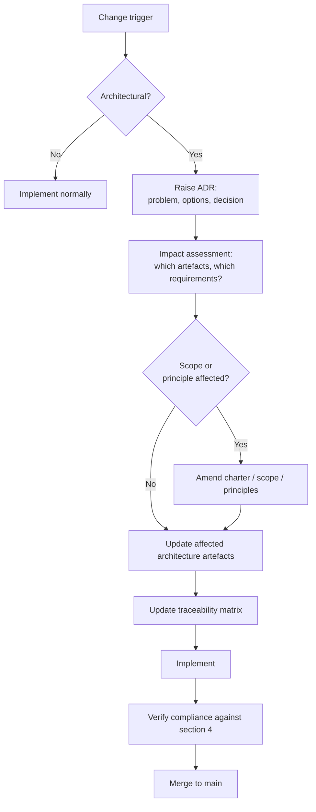

# Architecture Governance

| | |
|---|---|
| **Document version** | 1.0 |
| **Status** | Baseline |
| **Applies to** | All architecture and implementation work in this repository |

---

## 1. The problem this model has to solve

Architecture governance normally works by separation: an architect proposes, a board reviews, and the gap between the two people is where errors are caught. This project has one person. That separation does not exist and cannot be manufactured by pretending it does.

So the governance model here is built on a different premise. It cannot prevent a bad decision at the moment it is made. What it can do is guarantee that every decision is **visible, attributable, reversible-by-supersession, and testable against a stated rule** — so that a bad decision is discoverable afterwards, by the author on a later reading or by a reviewer in an interview.

This is weaker than real governance. Saying so is part of the model.

## 2. Decision types and their controls

| Decision type | Control | Evidence |
|---|---|---|
| Architectural (expensive to reverse, constrains later work) | ADR with options and rejected alternatives | `docs/05-architecture-decisions/` |
| Technology selection | ADR citing the requirement that justifies it (P-10) | ADR naming `FR-` / `NFR-` |
| Requirement change | Traceability matrix updated in the same commit | Matrix diff |
| Assumption about the fictional environment | Registered before dependent code exists (P-5) | Assumptions register |
| Scope change | Charter and scope documents amended, with reason | Document version history |
| Architecture change driven by implementation | Full feedback-loop sequence (P-11) | ADR + impact assessment + traceability update |
| Implementation detail with no architectural consequence | None; ordinary commit | Commit history |

The last row matters as much as the others. A governance model that requires ceremony for every decision is one that gets bypassed. Most decisions in this repository are not architectural, and the model should say so explicitly rather than leaving authors to guess.

## 3. The four structural controls

Each of these substitutes, imperfectly, for an absent reviewer.

### C-1 — Immutable decisions

An accepted ADR is never edited. To change a decision, write a new ADR that supersedes it and set the old one's status to `Superseded by ADR-nnn`.

*What this catches:* retroactive rationalisation. If decisions can be edited, a design that turned out badly quietly becomes a design that was always intended. Immutability makes the change of mind itself a visible artefact, which is usually the more interesting thing.

### C-2 — The Stage One / Stage Two boundary

Implementation does not amend architecture. Divergence is a defect with a defined resolution path (P-11).

*What this catches:* the architecture collapsing into a description of the code. This control is the weakest of the four, because it is enforced by the same person it constrains, and its effectiveness rests on discipline alone.

### C-3 — Bidirectional traceability

The traceability matrix must have no orphans in either direction. A requirement with no test is untested. A component with no requirement is unjustified.

*What this catches:* scope creep and dead architecture, mechanically rather than by inspection. This is the strongest control in the model, because it is the only one that can be checked automatically.

### C-4 — Mandatory classification

No claim about the operating environment is unclassified; no unregistered assumption is load-bearing (P-5).

*What this catches:* the gradual drift from "let us suppose the fleet system exposes this" to "the fleet system exposes this."

## 4. Architecture compliance

A Stage Two change is compliant when all of the following hold:

1. It realises a requirement that exists in the traceability matrix.
2. It does not contradict an accepted ADR, or it supersedes one.
3. It does not violate a principle, or it records the violation with justification in an ADR.
4. It depends on no unregistered assumption.
5. It respects the component boundaries defined in Phase C, or it changes them through the feedback loop first.

Non-compliance is recorded rather than silently corrected. A dispensation — a deliberate, justified, time-bound violation — is a legitimate outcome; an undocumented violation is not.

| Outcome | Meaning |
|---|---|
| **Compliant** | All five conditions hold |
| **Compliant with dispensation** | A condition is violated deliberately, with recorded justification and a review trigger |
| **Non-compliant** | A condition is violated without justification. Resolved before merge. |

## 5. Change control



Change triggers recognised by this model:

| Trigger | Typical origin |
|---|---|
| Implementation learning | Stage Two build reveals the design does not hold |
| Assumption invalidated | An assumption is found to be wrong or unnecessary |
| Constraint change | A dependency, licence or hosting option changes |
| Requirement discovered | A later phase surfaces a requirement an earlier phase missed |
| Principle conflict | Two principles conflict in a case not previously encountered |

## 6. Requirements management

Requirements are governed continuously rather than at a phase boundary.

| Rule | |
|---|---|
| Identifiers are stable | Never reused, never renumbered after publication |
| Every requirement has a source | A stakeholder concern, a business requirement, a constraint, or an ADR |
| Every requirement has a verification | A test case, or an explicit statement that it is unverifiable in this project and why |
| Superseded requirements are retained | Marked superseded, not deleted, so history stays legible |
| The matrix is updated with the change | Not afterwards, and not in a separate commit |

The traceability chain the matrix must sustain:

```
Business Requirement → Business Capability → Architecture Requirement
  → Application Component → Technical Component → User Story
  → Implementation → Test Case → Evidence
```

## 7. Review points

With no review board, reviews are attached to milestones instead. At each milestone tag, before the tag is applied:

| Check | |
|---|---|
| Internal consistency | Do the phase's artefacts contradict each other or any earlier phase? |
| Traceability | Any orphans in either direction? |
| Classification | Any unclassified claim, any unregistered assumption in use? |
| Principle adherence | Any violation without a recorded dispensation? |
| Honesty | Does the limitations section still reflect what is actually true? |

The last check is the one most likely to be skipped and most worth keeping. A project's stated limitations tend to be written early, when they are hypothetical, and quietly stop matching reality as the work proceeds.

## 8. What this model does not do

- It does not catch a wrong decision at the time it is made.
- It does not provide independent challenge.
- It does not prevent the author from being consistently wrong in the same direction throughout.
- It has no enforcement mechanism beyond the author's own adherence, except for traceability, which can be checked automatically.

Automating the traceability check in CI is a planned improvement precisely because it is the only control here that does not depend on the person it governs.
