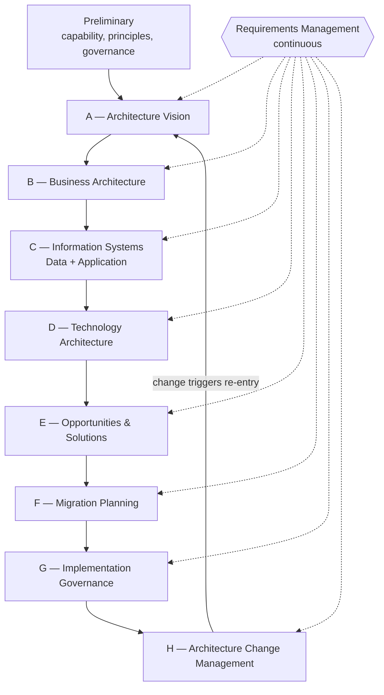
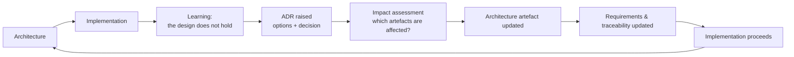

# Architecture Method

| | |
|---|---|
| **Document version** | 1.0 |
| **Status** | Baseline |
| **Applies to** | Stage One, and the governance of Stage Two's relationship to it |

---

## 1. Statement on TOGAF

The method used here is **inspired by the TOGAF Architecture Development Method**. It is an independently written, tailored lifecycle. No proprietary TOGAF text, template, metamodel or reference model is reproduced in this repository, and nothing here should be taken as a substitute for, or an authoritative account of, TOGAF itself.

The ADM is used because its phase structure is a well-understood shorthand for the order in which architectural questions become answerable, and because a reader from an enterprise architecture background will recognise the shape immediately. Those are the reasons it is borrowed. It is not borrowed to signal method compliance.

## 2. Why a method at all

A single author building a portfolio project could reasonably skip straight to a design. The method earns its place for three reasons specific to this project:

1. **It forces the questions into a decidable order.** Application boundaries cannot be argued about sensibly before the business capabilities they serve are named. Technology cannot be chosen before the application components that will run on it exist. The phase order is a dependency order.
2. **It creates a place for things to be written down.** The most common failure in architecture work is not bad reasoning but unrecorded reasoning. The phases are containers.
3. **It makes the architecture governable.** Without a defined lifecycle there is no meaningful notion of an architecture *change*, because there is no baseline to change from.

## 3. Tailoring

The ADM is designed for an enterprise architecture function operating continuously across a large organisation. This project is one person, one capability, one pass. The method is tailored accordingly:

| Aspect | Standard intent | Tailoring here | Reason |
|---|---|---|---|
| Iteration | Multiple cycles across capability increments | One primary cycle, with targeted re-entry driven by implementation learning | Single capability, single author |
| Architecture Board | Standing body with review authority | Structural controls substituting for an absent reviewer — see [governance](architecture-governance.md) | No second person exists |
| Architecture Repository | Tooled, versioned, federated | This Git repository | Proportionate; also makes the architecture diffable |
| Business Transformation Readiness | Full organisational assessment | Omitted | No organisation is being transformed |
| Capability-Based Planning | Enterprise portfolio planning | Reduced to capability modelling within one domain | Out of scope |
| Contracts and agreements | Formal architecture contracts between parties | Replaced by the Stage One / Stage Two boundary rule | No second party exists |

Omissions are listed rather than silently dropped, because the fact that something has been left out — and why — is itself architecturally interesting.

## 4. The lifecycle

Requirements Management is drawn as a continuous activity touching every phase rather than as a step in the sequence. That is not decoration. Requirements are discovered in every phase — a technology constraint discovered in Phase D can generate a new non-functional requirement that invalidates an application boundary drawn in Phase C — and a method that treats requirements as an early-phase activity will not survive contact with that.

## 5. Phase definitions

Each phase has defined inputs, activities, outputs and an exit condition. A phase is not complete when its documents exist; it is complete when its exit condition holds.

### Preliminary

| | |
|---|---|
| **Question** | Are we set up to do architecture work here at all? |
| **Inputs** | Baseline concept proposal; project charter |
| **Outputs** | Architecture method (this document); architecture principles; governance model; scope; assumptions framework |
| **Exit condition** | Principles are stated and non-trivial; the governance model names a control for every decision type; the fact/assumption classification scheme is defined and usable |

### Phase A — Architecture Vision

| | |
|---|---|
| **Question** | What are we trying to achieve, for whom, and how will we know? |
| **Inputs** | Charter, scope, principles |
| **Outputs** | Problem statement; vision; measurable objectives; stakeholder map with concerns; high-level architecture vision; business outcomes |
| **Exit condition** | Every stakeholder group has at least one named concern, and every concern is addressed by a stated objective or explicitly deferred |

### Phase B — Business Architecture

| | |
|---|---|
| **Question** | What does the business need to be able to do, and how does it do it today? |
| **Inputs** | Vision, stakeholder concerns |
| **Outputs** | Business capability map; business actors; value streams; as-is process; to-be process; business requirements (`BR-nnn`); business scenarios |
| **Exit condition** | Every capability traces to at least one business requirement; the to-be process differs from the as-is in ways attributable to a named capability |

### Phase C — Information Systems Architecture

Developed as two interlocking sub-phases. Data first, because application boundaries that cut across data ownership are the most expensive kind of boundary to get wrong.

**Data Architecture**

| | |
|---|---|
| **Question** | What information does this capability depend on, who owns it, and how does it move? |
| **Outputs** | Data domains; conceptual data model; logical data model; data flow diagrams; data lifecycle; data governance and protection approach |
| **Exit condition** | Every data entity has a named owning domain; every flow has a source, a sink and a classification |

**Application Architecture**

| | |
|---|---|
| **Question** | What components exist, where are the boundaries, and how do they interact? |
| **Outputs** | Application landscape; components; service boundaries; API definitions; integration architecture; interaction diagrams |
| **Exit condition** | Every business capability is realised by at least one component; no component spans two data domains without a recorded justification |

### Phase D — Technology Architecture

| | |
|---|---|
| **Question** | What does this run on, and how is it secured, observed and deployed? |
| **Outputs** | Infrastructure, runtime, network, security, observability and deployment architecture; technology standards |
| **Exit condition** | Every application component has a runtime target; the security architecture addresses every trust boundary identified in Phase C; every KPI in the operations design has a defined source |

### Phase E — Opportunities & Solutions

| | |
|---|---|
| **Question** | What do we actually build, in what order, and what is the smallest thing worth building first? |
| **Outputs** | Solution building blocks; MVP definition; transition architectures; candidate solution evaluation |
| **Exit condition** | The MVP delivers a complete business outcome rather than a complete technical layer |

That exit condition is the substantive one in this phase. An MVP consisting of "the data layer" is not a minimum viable product; it is a horizontal slice that demonstrates nothing to anyone.

### Phase F — Migration Planning

| | |
|---|---|
| **Question** | How do we get from nothing to the target, and what could stop us? |
| **Outputs** | Implementation roadmap; release plan; dependency map; risk register; migration strategy |
| **Exit condition** | Every transition architecture in Phase E has a release; every risk has an owner and a response |

### Phase G — Implementation Governance

| | |
|---|---|
| **Question** | How do we know the thing being built is the thing that was designed? |
| **Outputs** | Architecture governance model; compliance approach; technical governance; requirements traceability matrix; change control process |
| **Exit condition** | The traceability matrix is complete in both directions — no requirement without a test, no component without a requirement |

### Phase H — Architecture Change Management

| | |
|---|---|
| **Question** | What do we do when we learn we were wrong? |
| **Outputs** | Change management process; architecture review process; continuous improvement approach; evolution strategy |
| **Exit condition** | The process has been exercised at least once on a real change originating from implementation |

Phase H is usually the phase that exists only on paper. In this project its exit condition requires a genuine worked example, because demonstrating the feedback loop is objective O-5 of the charter.

## 6. The architecture / implementation feedback loop

Stage Two will contradict Stage One. This is expected and is the most valuable thing the project can surface. The rule is that the contradiction is resolved *formally*, in this direction:

What is prohibited is the shortcut: changing the code, and later adjusting the architecture document to describe what the code does. That produces an architecture that is always correct and never useful.

## 7. Artefact conventions

| Convention | Rule |
|---|---|
| Identifiers | Stable, never reused, never renumbered after publication |
| Diagrams | Mermaid, inline in the document that depends on them |
| Decisions | ADR, immutable once accepted, superseded rather than edited |
| Traceability | Updated in the same commit as the artefact that changes it |
| Classification | Every Stage Two claim carries FACT / ASSUMPTION / DESIGN DECISION / FUTURE CONSIDERATION |

## 8. Known weaknesses of this method as applied

Stated because an honest method description includes the parts that do not work:

- **No independent review.** Every structural control described in the governance model is a substitute for a reviewer, and none of them is as good as a reviewer.
- **One pass, not many.** Real architecture is iterative over years. A single pass will contain decisions that a second pass would have caught.
- **The architect is also the implementer.** The Stage One / Stage Two boundary is enforced by the same person it constrains. Its effectiveness depends entirely on discipline, which is the weakest kind of control.
- **No real stakeholders.** Stakeholder concerns in Phase A are inferred from the domain, not elicited from people. Inferred concerns are systematically tidier than real ones.
