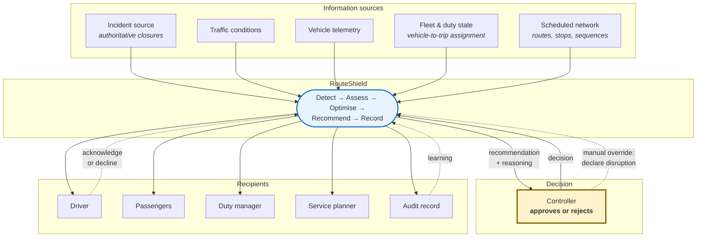
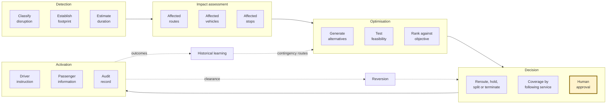

# Architecture Vision

| | |
|---|---|
| **Phase** | A — Architecture Vision |
| **Document version** | 1.0 |
| **Status** | Baseline |

---

## 1. Vision

> RouteShield turns disruption response from something a controller assembles by hand into something they **decide about**.

The system does the spatial reasoning, the option generation, the ranking and the distribution. The controller does the judging. That division is the architecture's central commitment, and every subsequent decision either serves it or is in tension with it.

What changes for each party:

| | Today | With RouteShield |
|---|---|---|
| **Controller** | Works out what is affected, invents options, contacts drivers individually | Evaluates a ranked recommendation with its reasoning, and decides |
| **Driver** | Waits for a call that may not come, receives instruction late | Receives a revised sequence before the diversion point, and may decline |
| **Waiting passenger** | Learns nothing; waits for a bus that will not come | Learns their stop is affected while alternatives still exist |
| **Duty manager** | Route-by-route picture assembled from conversations | Network-wide view of what is affected and what was decided |
| **Afterwards** | Diversions happened; the reasoning left with the shift | Every decision reconstructable from the record, including what was unknown |

## 2. System context

Three things in this diagram are load-bearing.

**The controller is on the critical path, not beside it.** Every arrow to a recipient passes through the decision. This is [P-1](../methodology/architecture-principles.md#p-1--the-human-decides) expressed structurally: there is no path from input to output that bypasses a human.

**The manual override is an input, not an administrative function.** A controller can declare a disruption the system has not detected. This is the floor the whole design stands on — it is the one input that is architecturally mandatory ([P-3](../methodology/architecture-principles.md#p-3--degrade-do-not-fail), OBJ-7), because it is the only one that remains available when every automated source has failed.

**The driver can decline.** The dotted return from the driver is not an acknowledgement receipt. It is a refusal path, and it exists because the driver is the only participant who can see the road (SC-011).

> **Fictional systems.** In Stage Two, every box in *Information sources* and every recipient except the audit record is realised by a [fictional reference system](../../02-stage-two-reference-implementation/fictional-operating-model.md). None of them describes any real operator's systems.

## 3. Conceptual architecture

The baseline concept's four engine capabilities, arranged as the lifecycle they actually form:

Two departures from the baseline concept, both deliberate:

**Impact assessment is separated from optimisation.** The proposal folds "which services are affected" into route optimisation. They are different problems with different inputs and different failure modes — assessment is a spatial query over live state, optimisation is a search over a graph — and separating them means assessment still works when optimisation cannot find an answer. A controller told "these eight services are affected, no viable diversion found" is far better served than one told nothing.

**Reversion is a first-class step.** The proposal does not mention it. It is added because a diversion that never ends is a permanent network change made by accident (SC-022, SC-024, OBJ-8).

## 4. Architectural commitments

Positions taken at vision level that constrain every later phase. Each is a real choice with a real cost.

### 4.1 Automate the analysis; do not automate the authority

Resolves the baseline concept's internal tension between "without relying on manual intervention" and its own control-room override. Analysis is automated. Authority is not.

*Cost:* the system can never be faster than a human can decide. OBJ-1 is written around this rather than against it.

*Exception:* pre-approved contingency routes, where the human decision was made in advance and recorded. The autonomy model in Phase B defines the boundary precisely.

### 4.2 Optimise for service continuity, not travel time

The defining commitment ([P-6](../methodology/architecture-principles.md#p-6--minimise-service-loss-not-travel-time)), and what separates this from applying a mapping application to a bus.

*Cost:* a materially harder optimisation problem, and an objective function whose weights are a value judgement that must be defended rather than tuned.

### 4.3 The recommendation carries its reasoning

A recommendation is not a route. It is a route, its ranking against alternatives, what was given up, and what the system did not know.

*Cost:* significant additional design in the presentation and data model. But without it, approval is ceremonial — the failure SC-018 names, where accountability exists in form and not in substance.

### 4.4 Degradation is visible, not silent

The system continues when inputs fail, and says so. A recommendation made on thirty-minute-old traffic data is labelled as such.

*Cost:* every component acquires a degraded-state branch, and confidence must be propagated through the whole chain rather than computed at the edge.

### 4.5 The record is the product

The audit trail is not a compliance by-product. It is what makes decisions defensible (BO-3) and what makes learning possible (BO-4). It is designed first, not added last.

*Cost:* monotonic storage growth, and the discipline of capturing decision-time context that is normally discarded.

### 4.6 Recommendation volume is bounded by human capacity

Breadth of assessment and volume of approval are decoupled. Assess everything; present what can be evaluated; escalate the rest.

*Cost:* deliberately withholding recommendations a faster system would surface. This is the correct trade: OBJ-1 and OBJ-2 create the risk that OBJ-9 manages, and without the bound the metrics would show improvement while accountability quietly became ceremony.

## 5. Boundaries

What the vision explicitly does not include, and why:

| Not included | Reason |
|---|---|
| Automatic activation of novel routes | §4.1 |
| Scheduled network planning | Different time horizon; RouteShield consumes the plan |
| Driving decisions | The system instructs; the driver executes and may decline |
| Multimodal coordination | Out of scope; named as future development |
| Predicting disruptions before they occur | Not the gap — the gap is the response once one has occurred |

## 6. What success looks like

Concretely, at Stage Two: a disruption is declared on a Dublin corridor, and within seconds a controller sees which services are affected, what each could do instead, what each option costs in stops and passengers, and how confident the system is given its inputs. They approve one. Drivers receive revised sequences; stop-level information publishes; the whole chain is written to a record that reconstructs the decision including what was unknown at the time. The disruption clears, and the system prompts for reversion rather than waiting to be noticed.

What would count as failure is not the system being wrong. It is the controller approving without reading — because at that point the architecture's central commitment has been defeated while every metric still shows improvement.

## 7. Traceability

| Vision element | Objectives | Principles |
|---|---|---|
| Automate analysis, not authority (§4.1) | OBJ-5, OBJ-10 | P-1 |
| Optimise for continuity (§4.2) | OBJ-3 | P-6, P-7 |
| Reasoning accompanies recommendation (§4.3) | OBJ-5 | P-1, P-2 |
| Degradation is visible (§4.4) | OBJ-7 | P-3 |
| The record is the product (§4.5) | OBJ-6 | P-2 |
| Volume bounded by capacity (§4.6) | OBJ-9 | P-1 |
| Impact assessment separated (§3) | OBJ-2 | P-8 |
| Reversion is first-class (§3) | OBJ-8 | — |
