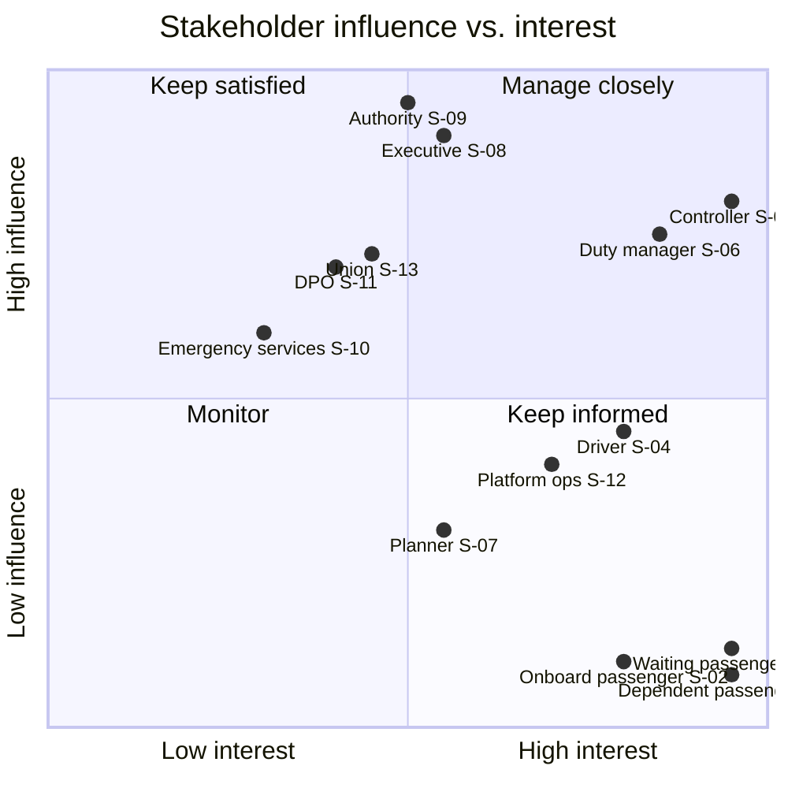

# Stakeholder Map

| | |
|---|---|
| **Phase** | A — Architecture Vision |
| **Document version** | 1.0 |
| **Status** | Baseline |

---

> **Method note.** These stakeholders and concerns are **inferred from the domain, not elicited from people.** No real passenger, driver, controller or regulator was consulted. Inferred concerns are systematically tidier, better-articulated and more mutually consistent than real ones — real stakeholders contradict themselves, want incompatible things, and care most about something nobody thought to ask about. This is a known weakness of the method as applied here, recorded in [architecture-method.md §8](../methodology/architecture-method.md#8-known-weaknesses-of-this-method-as-applied). Treat the map as a structured hypothesis about who cares about what.

---

## 1. Stakeholders

Concerns carry identifiers `SC-nnn` and are traced to objectives in [`objectives.md`](objectives.md#4-concern-coverage).

### S-01 · Passenger waiting at an affected stop

The stakeholder with the most time-critical need and the least access to information. Their alternatives — walk, another route, a taxi, abandon the journey — expire while they wait. Twenty minutes of not knowing converts a minor disruption into a missed appointment.

| | Concern |
|---|---|
| **SC-001** | Knowing that my stop will not be served, in time to do something else |
| **SC-002** | Being told what the alternative is, not merely that there is a problem |
| **SC-003** | Not being told to wait for a service that is not coming |

### S-02 · Passenger on board a rerouted vehicle

Already committed to the journey. Cannot reconsider the mode, only the remaining route.

| | Concern |
|---|---|
| **SC-004** | Knowing before my stop is skipped, not as it is passed |
| **SC-005** | Being set down somewhere from which I can complete the journey |

### S-03 · Passenger with reduced mobility, or dependent on this specific service

A skipped stop is an inconvenience for one passenger and a journey-ending event for another. Someone who cannot walk the four hundred metres to the diverted stop, or for whom this route is the only accessible connection, is not served by a decision that counts heads.

| | Concern |
|---|---|
| **SC-006** | That the decision to skip a stop accounts for who depends on it, not only how many use it |
| **SC-007** | That an alternative offered is actually usable by me |
| **SC-008** | That the same stops are not repeatedly the ones sacrificed |

> SC-008 identifies a cumulative effect that no single decision creates. If the objective function systematically favours the same trade-off, the same communities absorb the cost every time, and no individual decision will ever look unfair. This is the strongest argument for [P-7](../methodology/architecture-principles.md#p-7--stop-skipping-is-not-neutral) and the reason it is stated as a principle despite currently being unachievable for want of data.

### S-04 · Driver

Operating a vehicle in traffic, in an area now containing an incident, while being asked to absorb a route change.

| | Concern |
|---|---|
| **SC-009** | Receiving a clear, unambiguous revised sequence, in time to act on it |
| **SC-010** | Not being asked to interact with a screen while driving |
| **SC-011** | Being able to decline an instruction that is unsafe or infeasible from where I am |
| **SC-012** | Not being held responsible for a decision I did not make and could not evaluate |
| **SC-013** | Knowing what to tell passengers who ask |

> SC-011 and SC-012 are the concerns most likely to be underweighted by a system designed around the control room. The driver is the last human in the chain and the one physically present at the point of execution. A design in which their only permitted response is compliance has moved accountability to someone who cannot see the road.

### S-05 · Control room controller

The accountable decision-maker under [P-1](../methodology/architecture-principles.md#p-1--the-human-decides), and the person whose working conditions the system most directly changes.

| | Concern |
|---|---|
| **SC-014** | Handling several simultaneously affected routes without the response becoming sequential |
| **SC-015** | Understanding *why* a recommendation was made, well enough to stand behind it |
| **SC-016** | Knowing what the system did not know — which inputs were stale, missing or uncertain |
| **SC-017** | Being able to override, adjust or reject without fighting the system |
| **SC-018** | Not being made accountable for decisions I had no realistic capacity to evaluate |
| **SC-019** | Not having my judgement displaced by a system whose reasoning I cannot inspect |

> SC-018 is the sharpest tension in this architecture. P-1 places accountability with the controller. If the system generates recommendations faster than a human can meaningfully evaluate them, approval degrades into rubber-stamping — accountability in form, absent in substance, and arguably worse than automation because it distributes blame without distributing understanding. The volume the system produces and the evaluation capacity of the person approving it must be designed against each other, not independently.

### S-06 · Duty manager / operations manager

Accountable for network performance across the shift; escalation point for the controller.

| | Concern |
|---|---|
| **SC-020** | Network-wide visibility during a disruption, not route-by-route |
| **SC-021** | Knowing which decisions were taken, by whom, on what basis |
| **SC-022** | The network returning to plan promptly once the disruption clears |

> SC-022 names the half of the problem that designs of this kind routinely forget. Reversion is operationally as hard as diversion and has no dramatic trigger to prompt it.

### S-07 · Service planner

Owns the scheduled network. Consumes disruption history to improve it.

| | Concern |
|---|---|
| **SC-023** | Learning which corridors are repeatedly disrupted and how the network behaved |
| **SC-024** | That live rerouting does not silently become de facto permanent network change |

### S-08 · Operator executive

Accountable for the operator's performance and reputation.

| | Concern |
|---|---|
| **SC-025** | Service continuity during the events most visible to the public |
| **SC-026** | Being able to explain publicly why services did what they did |
| **SC-027** | That the capability does not introduce a new category of failure or liability |

### S-09 · Transport authority (regulator and funder)

Contracts and oversees the service. In the Irish context this is the National Transport Authority, which the baseline proposal treats as peripheral although it is the accountable body for service provision.

| | Concern |
|---|---|
| **SC-028** | That contracted service obligations are met or that deviation is justified and recorded |
| **SC-029** | That decisions affecting the public are auditable and explicable |
| **SC-030** | That the capability does not disadvantage particular communities systematically |
| **SC-031** | That automated decision-making over a public service is governed and accountable |

### S-10 · Emergency services and local authority

Sources of authoritative incident information; also parties whose operations a rerouting decision can affect.

| | Concern |
|---|---|
| **SC-032** | That rerouted services do not interfere with an incident scene or emergency access |
| **SC-033** | That incident information shared is used within its intended scope |

> SC-032 is a concern the baseline proposal does not raise. It treats emergency services purely as a data source. They are also an affected party: a diversion that routes forty buses down the street an incident command post has just been established on is a problem the system created.

### S-11 · Data protection officer

| | Concern |
|---|---|
| **SC-034** | That passenger notification has a lawful basis and that journey inference is assessed |
| **SC-035** | That vehicle telemetry, which is also employee monitoring data, is handled proportionately |
| **SC-036** | That audit retention is bounded by a policy rather than by available storage |

### S-12 · IT and platform operations

Runs the thing at three in the morning.

| | Concern |
|---|---|
| **SC-037** | That the system degrades predictably when a dependency fails, rather than failing opaquely |
| **SC-038** | That the state of the system is observable well enough to diagnose it under pressure |
| **SC-039** | That there is a defined manual fallback when the system itself is unavailable |

> SC-039 is easy to overlook in a design about handling failure. RouteShield is itself a system that can fail, and it will occasionally fail during a disruption — the period of highest load and highest dependency stress. The manual process it replaces must remain available, which means it must remain practised.

### S-13 · Driver representative body

| | Concern |
|---|---|
| **SC-040** | That changes to driver instruction and in-cab interaction are agreed, not imposed |
| **SC-041** | That telemetry is not repurposed as individual performance monitoring |

## 2. Influence and interest

The shape of this chart is the finding. **The stakeholders with the highest interest have the least influence.** Passengers — especially S-03, whose journeys are most at risk — sit at the extreme of interest and the bottom of influence. They are not consulted, cannot escalate, and have no representation in the decision.

An architecture that responds to influence will optimise for the control room and the executive. The passengers' concerns have to be carried deliberately, by the architecture itself, because nothing in the stakeholder structure will carry them otherwise. That is the specific job of [P-6](../methodology/architecture-principles.md#p-6--minimise-service-loss-not-travel-time) and [P-7](../methodology/architecture-principles.md#p-7--stop-skipping-is-not-neutral), and it is why both are stated as binding principles rather than as desirable qualities.

## 3. Conflicts between concerns

Real conflicts, with the resolution named. Unresolved conflicts are recorded as unresolved rather than averaged away.

| Conflict | Resolution |
|---|---|
| **SC-014** (handle many routes at once) vs. **SC-018** (do not make me accountable for what I cannot evaluate) | Not resolvable by throughput. The system must bound recommendation volume to what a controller can genuinely assess, and escalate or batch beyond it. Carried into the autonomy model in Phase B. |
| **SC-009** (drivers need instructions fast) vs. **SC-010** (do not make drivers read screens while driving) | Instructions delivered at natural stopping points where possible; acknowledgement required before the diversion point, not immediately. Constrains the latency budget. |
| **SC-001** (tell passengers early) vs. **SC-034** (lawful basis for notification) | Broadcast, stop-level information carries no personal-data burden; individually targeted notification does. Design for the former, treat the latter as a separately governed capability. |
| **SC-025** (executive: continuity) vs. **SC-006** (dependent passengers: who bears the loss) | Directly opposed under load. Continuity metrics count passengers; SC-006 concerns which ones. Resolved in favour of SC-006 by P-7 — but P-7 is currently unachievable for want of data, so **this conflict is live and unresolved**, and is declared as such rather than closed on paper. |
| **SC-023** (learn from history) vs. **SC-041** (do not repurpose telemetry as performance monitoring) | Analytics operate on service and decision outcomes, not individual driver behaviour. Enforced by the data architecture in Phase C, not by policy alone. |
| **SC-031** (authority: govern automated decisions) vs. the concept's "without manual intervention" | Resolved by P-1 and by the clarification in [problem-statement §4](problem-statement.md#4-the-core-challenge): analysis is automated, authority is not. |

## 4. Deliberately absent stakeholders

| Absent | Why |
|---|---|
| Other operators (rail, light rail, commercial bus) | Multimodal coordination is out of scope; recorded in [scope](../../00-project/scope.md) |
| Advertisers, commercial partners | No commercial estate interaction |
| Vehicle manufacturers | In-cab hardware is treated as a fictional reference system ([A-005](../../02-stage-two-reference-implementation/assumptions.md#a-005)) |
| Passengers who never travel during disruption | Unaffected; named to make the boundary explicit |
