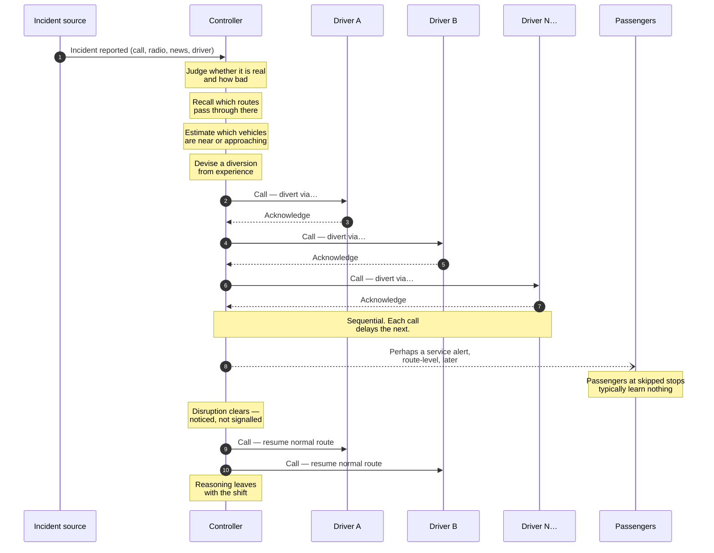
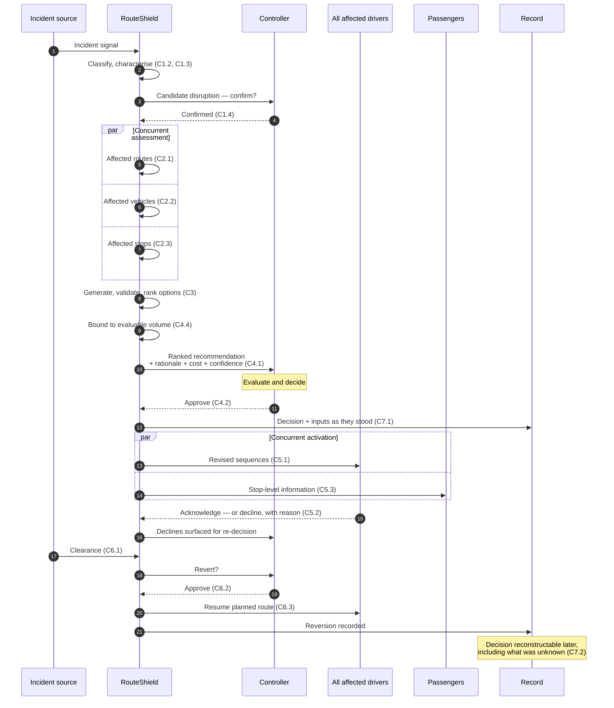
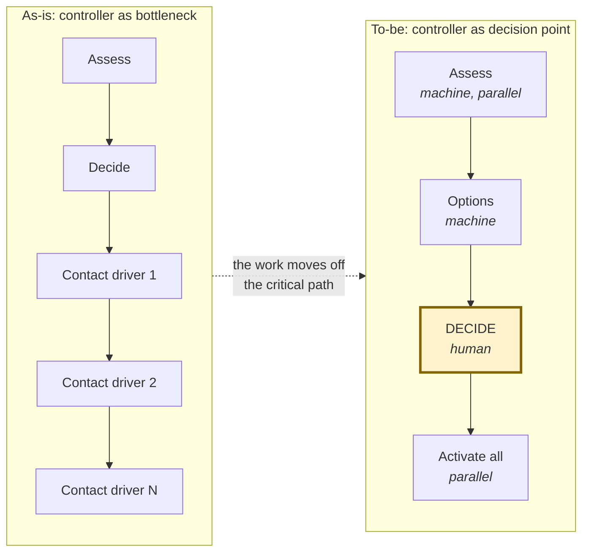

# As-Is and To-Be Process

| | |
|---|---|
| **Phase** | B — Business Architecture |
| **Document version** | 1.0 |
| **Status** | Baseline |

---

> **Classification note.** The as-is process is a **reconstruction from the domain**, not an observed process. No real control room was studied. It is built from what the baseline proposal says about current response, from how disruption handling generally works in transit operations, and from what the capability gaps imply. Treat it as a structured hypothesis. Under the [Fact / Assumption Model](../../02-stage-two-reference-implementation/fact-vs-assumption-model.md) it is an `ASSUMPTION` about the current state, and a real engagement would begin by correcting it.

---

## 1. As-is

### Where the time goes

| Step | Bounded by | Scales with |
|---|---|---|
| Confirmation | Human judgement | Constant |
| Impact assessment | Controller recall | Network complexity |
| Option generation | Controller experience | Constant |
| **Driver contact** | **One conversation at a time** | **Number of affected vehicles** |
| Passenger information | Whatever capacity remains | Not performed |
| Reversion | Noticing, then contacting again | Number of affected vehicles |

The controller is the whole process. Every step passes through one person, and two of them scale with the size of the disruption. **The response takes longest exactly when it matters most** — the defining property of the current state and the one thing any solution must change.

### What the as-is does well

Worth stating, because a change programme that treats the current state as uniformly deficient will replace strengths with risks:

- **Confirmation (C1.4).** Humans are good at judging whether a report is credible. Automated detection is not.
- **Feasibility (C3.2).** Controllers know which streets their buses can physically use. This knowledge is extensive, tacit, and not written down anywhere.
- **Refusal handling (C5.2).** A driver saying "I can't do that from here" is a conversation, and conversations handle exceptions well.
- **Escalation (C4.3).** Organisational authority is clear and works.

## 2. To-be

### Where the time goes now

| Step | Bounded by | Scales with |
|---|---|---|
| Confirmation | Human judgement | Constant *(unchanged — a strength retained)* |
| Impact assessment | Machine | **Flat** to ~20 routes |
| Option generation | Machine | Flat |
| **Decision** | **Human deliberation** | **Bounded by C4.4** |
| Driver contact | Concurrent | **Flat** |
| Passenger information | Concurrent | **Flat** |
| Reversion | Prompted, then concurrent | Flat |

## 3. What changed, and which capability changed it

The Phase B exit condition requires every difference to be attributable to a named capability.

| # | Difference | Capability | Objective |
|---|---|---|---|
| 1 | Impact assessment is computed from live data, not recalled | C2.1, C2.2, C2.3 | OBJ-2 |
| 2 | All affected services assessed at once, not in sequence | C2 (as a whole) | OBJ-2 |
| 3 | Options are generated, validated and ranked explicitly | C3.1, C3.2, C3.4 | OBJ-3 |
| 4 | Skipped stops are checked against following services | C3.3 | OBJ-3 |
| 5 | The recommendation carries its reasoning and its uncertainty | C4.1, C8.2 | OBJ-5 |
| 6 | Recommendation volume is bounded to what a human can evaluate | C4.4 | OBJ-9 |
| 7 | Drivers are contacted concurrently, not one at a time | C5.1 | OBJ-1 |
| 8 | Refusal is a recorded outcome that re-enters the decision | C5.2 | OBJ-5 |
| 9 | Passengers receive stop-level information as a normal step | C5.3 | OBJ-4 |
| 10 | Clearance prompts a reversion decision rather than being noticed | C6.1, C6.2 | OBJ-8 |
| 11 | Every decision and its inputs are recorded immutably | C7.1, C7.2 | OBJ-6 |
| 12 | Degraded inputs produce degraded output, declared as such | C8.1, C8.2, C8.3 | OBJ-7 |

**Exit condition satisfied:** twelve differences, each attributable to a named capability.

## 4. What deliberately did not change

| Unchanged | Capability | Why |
|---|---|---|
| A human confirms the disruption is real | C1.4 | Automated detection produces false positives; a false positive here strands people for no reason |
| A human decides the response | C4.2 | [P-1](../methodology/architecture-principles.md#p-1--the-human-decides) |
| A driver may decline | C5.2 | They are the only participant who can see the road |
| Organisational authority and escalation | C4.3 | Works; not an architectural problem |
| The manual process remains available | C8.4 | RouteShield can fail, and will sometimes fail mid-disruption |

## 5. The shape of the change

The controller does not disappear and does not do less that matters. They stop doing the work that scales — recall, enumeration, sequential contact — and keep the work that does not: judging whether this is real, and judging whether the proposed response is right.

## 6. Risks the to-be introduces

The as-is has one dominant failure mode: it is too slow. The to-be is faster and introduces failure modes the as-is does not have. Naming them is the point of doing this comparison.

| # | Risk | Mechanism | Response |
|---|---|---|---|
| **BR-R1** | **Approval becomes ceremonial** | Volume exceeds evaluation capacity; the controller approves without reading, and every metric improves | C4.4; OBJ-9's rubber-stamping detector |
| **BR-R2** | **Tacit knowledge is lost** | Controllers' unwritten feasibility knowledge is not captured; when they retire it goes with them, and the system never had it | C3.2 must ingest operator network-constraint data, not infer it ([A-008](../../02-stage-two-reference-implementation/assumptions.md#a-008)) |
| **BR-R3** | **The manual fallback atrophies** | C8.4 is rarely exercised, so it stops being practised and is unavailable when needed | Fallback must be periodically exercised, not merely documented |
| **BR-R4** | **Automation bias** | Controllers stop scrutinising because the system is usually right; errors pass through precisely because they are rare | C4.1 must present uncertainty prominently, not only conclusions |
| **BR-R5** | **Confident wrongness at scale** | A single bad assessment now diverts twenty services concurrently instead of one at a time | Concurrency amplifies error as well as throughput; C8.2 confidence must gate breadth of activation |

BR-R5 deserves emphasis. The as-is is slow, and slowness is a form of error containment — a controller working through drivers one at a time will notice a wrong assumption at driver three. The to-be removes that containment. **Speed and blast radius are the same property.**
