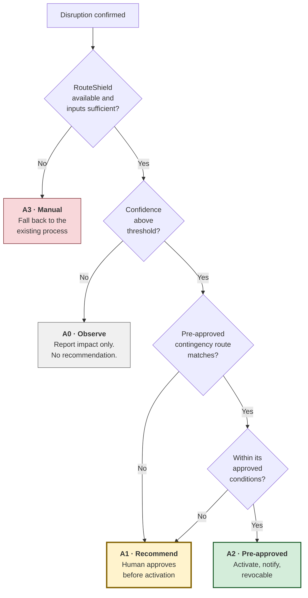

# Autonomy Model

| | |
|---|---|
| **Phase** | B — Business Architecture |
| **Document version** | 1.0 |
| **Status** | Baseline |
| **Resolves** | The contradiction identified in [problem statement §4](../phase-a-architecture-vision/problem-statement.md#4-the-core-challenge) |

---

## 1. The question this settles

The baseline concept promises disruption response "without relying on manual intervention" and, four paragraphs later, specifies a control-room override with a human in the loop. Phase A resolved the headline tension — *analysis is automated, authority is not* — and deferred the boundary to here.

The boundary matters because the headline resolution is not quite sufficient. [P-1](../methodology/architecture-principles.md#p-1--the-human-decides) already admits one exception: a pre-approved contingency route may activate without a human in the moment, because the human decision was made in advance and recorded. That exception needs to be defined precisely, or it becomes the hole through which full automation arrives by increments.

## 2. The principle underneath

**Automation is not a property of the system. It is a property of a decision.**

The question is never "should RouteShield be autonomous?" It is "for *this* decision, with *this* confidence, affecting *this* many services, has a human already decided?" A pre-approved diversion down a known corridor on a well-understood closure is a different object from a novel route through an area the system has poor data on, and treating both as "automation" collapses a distinction the whole design rests on.

What makes a decision safe to activate without a human in the moment is not that the system is confident. It is that **a human already made this decision, deliberately, with time to think, and recorded it.**

## 3. The four bands

### A0 · Observe

**The system reports impact and makes no recommendation.**

Used when confidence is too low to propose a course of action. The controller still gets the thing that is most valuable and least available today: *which services, vehicles and stops are affected.*

This band exists because a system with nothing useful to say about the response should not stay silent about the situation. Impact assessment is valuable independently of optimisation ([architecture vision §3](../phase-a-architecture-vision/architecture-vision.md#3-conceptual-architecture)), and A0 is where that separation pays.

### A1 · Recommend — the default

**The system produces a ranked recommendation with its reasoning; a controller approves, modifies or rejects; activation follows approval.**

This is the normal operating band and covers every novel route. Nothing reaches a driver or a passenger without a named person having approved it.

### A2 · Pre-approved contingency

**A previously approved route for a known corridor activates immediately, with notification and a revocation window.**

Permitted only when **all** of the following hold:

| # | Condition |
|---|---|
| 1 | The route exists in the contingency library, approved through the process in §5 |
| 2 | The disruption matches the conditions the route was approved for — corridor, type, extent |
| 3 | Input confidence is above the A2 threshold, which is higher than A1's |
| 4 | The approval has not expired |
| 5 | The number of services affected is within the route's approved blast radius |
| 6 | A controller is on duty and reachable |

Condition 6 is not a technicality. A2 is *revocable* activation, and revocation requires somebody present to revoke it. A2 without a controller on duty is A1 with the approval step deleted, which is a different and unauthorised thing.

**What A2 is not:** it is not the system deciding. It is the system executing a decision already made. The distinction is whether a human considered these circumstances and said yes in advance.

### A3 · Manual

**RouteShield is unavailable or too degraded to be useful; the existing manual process runs.**

Entered when the system is down, or when inputs have degraded past the point where even impact assessment is trustworthy. A3 is not a failure state of the design — it is [C8.4](capability-map.md#c8--operational-resilience--cross-cutting), an explicitly retained capability.

The uncomfortable implication: A3 must remain *practised*. A fallback exercised once a year is a fallback in name only, and it will be needed during a disruption — the moment of peak load and peak dependency stress (SC-039, BR-R3).

## 4. What moves a decision between bands

| Factor | Toward more autonomy | Toward less |
|---|---|---|
| **Route novelty** | Pre-approved for this corridor | Never used before |
| **Input confidence** | All inputs fresh and consistent | Stale, missing or contradictory |
| **Disruption type** | Well-characterised, static footprint | Novel, moving or ambiguous ([A-007](../../02-stage-two-reference-implementation/assumptions.md#a-007)) |
| **Blast radius** | One or two services | Many services concurrently |
| **Controller availability** | On duty, low load | Absent or saturated |
| **Reversibility** | Easily reverted | Hard to undo |

Two of these deserve comment.

**Blast radius pushes toward *less* autonomy as scale increases**, which inverts the usual intuition that automation is most valuable when there is most to do. It follows from BR-R5: concurrency amplifies error as well as throughput. The manual process contains errors by being slow — a controller working through drivers one at a time notices a wrong assumption at driver three. Removing slowness removes that containment, so the largest responses need *more* human scrutiny, not less, exactly when the temptation to automate is strongest.

**Controller load cuts both ways**, and this is the model's sharpest tension. High load is the strongest argument for autonomy and the strongest argument against it: a saturated controller most needs the system to act, and is least able to supervise it acting. The model resolves this toward caution — saturation constrains A2 rather than expanding it — and pushes the real answer to [C4.4](capability-map.md#c4--response-decision), which bounds volume rather than relaxing approval. If the system's response to an overloaded human is to take more decisions unsupervised, it has optimised for the metric rather than the outcome.

## 5. Governing the contingency library

A2 is only as sound as the approvals behind it, so the library is governed rather than accumulated.

| Requirement | |
|---|---|
| **Named approver** | A route is approved by an identified person with authority, not by the system proposing it |
| **Explicit conditions** | The corridor, disruption type, extent and blast radius it is approved for |
| **Expiry** | Approvals lapse. The network changes; an approval from three years ago is about a different network |
| **Re-approval on change** | Any change to the route or the underlying network invalidates the approval |
| **Recorded provenance** | Who approved it, when, on what basis, and what it superseded |
| **Revocable in life** | A route can be withdrawn from the library immediately |
| **Usage visible** | Every A2 activation is recorded and reviewed; a route activating unexpectedly often is a signal, not a success |

> The failure mode this guards against: the library grows, approvals are never reviewed, coverage broadens, and A2 quietly becomes the normal path. Nobody decides to automate the system. It automates by accretion, each step defensible on its own. Expiry is the control that makes this require an active decision rather than mere inattention.

## 6. What is never automatic

Regardless of band, confidence or approval:

| | Never automatic |
|---|---|
| 1 | Activating a route not in the contingency library |
| 2 | Overriding a driver's refusal |
| 3 | Terminating a service |
| 4 | Any decision while no controller is on duty |
| 5 | Adding a route to the contingency library |
| 6 | Changing the autonomy thresholds themselves |

Item 6 is the one that makes the rest durable. A system that can widen its own autonomy has no autonomy model, only an initial condition.

## 7. Autonomy and accountability

| Band | Decides | Accountable | When |
|---|---|---|---|
| A0 | Nobody | Controller, for the response they construct | At the time |
| A1 | Controller | Controller | At the time |
| A2 | Approver of the contingency route | Approver, for the route; controller, for not revoking | In advance / at the time |
| A3 | Controller | Controller | At the time |

Accountability never rests with the system in any band. Under A2 it is *displaced in time* rather than removed — which is precisely why §5's governance exists. An approval nobody reviews is accountability that has quietly evaporated while appearing intact.

## 8. Relationship to the baseline concept

| Concept says | Model says |
|---|---|
| "Without relying on manual intervention" | Analysis is automated. Authority is not. A1 is the default. |
| "Control room override" | Not an override — the primary decision path, and the one architecturally mandatory input |
| "Determines whether to reroute, hold, or split" | The system *recommends* among these; the controller determines |
| "Pre-builds contingency routes… near-instant activation" | Retained as A2, bounded by six conditions and a governed library |

The concept's ambition is preserved. What changes is that the mechanism by which it is safe — prior human approval, not machine confidence — is made explicit, and the conditions under which it holds are enumerated rather than assumed.

## 9. Open question

The A2 confidence threshold, the blast-radius limits and the approval expiry period are all stated as requirements without values. They cannot be set from a desk: the right numbers depend on observed false-positive rates, real controller capacity ([A-011](../../02-stage-two-reference-implementation/assumptions.md#a-011)) and the operator's own risk appetite.

Recorded here as a **FUTURE CONSIDERATION**: the model's structure is defensible; its parameters are not yet defensible, and this project cannot make them so. Stage Two will pick values to demonstrate the mechanism and will label them as demonstration values rather than recommendations.
