# Business Capability Map

| | |
|---|---|
| **Phase** | B — Business Architecture |
| **Document version** | 1.0 |
| **Status** | Baseline |

---

## 1. What a capability is here

A capability is **something the business must be able to do**, stated independently of who does it, how, or with what. "Determine which vehicles are affected by a disruption" is a capability. "Query the GPS platform" is not — it is one way of realising one.

This distinction is load-bearing. Capabilities are stable; the mechanisms realising them are not. The as-is process and the to-be process in this phase deliver *the same capability map* by different means, and that is what makes them comparable.

## 2. Map

```mermaid
flowchart TB
    subgraph C1["C1 · Disruption Awareness"]
        C11["C1.1 Detection"]
        C12["C1.2 Classification"]
        C13["C1.3 Characterisation"]
        C14["C1.4 Confirmation"]
    end
    subgraph C2["C2 · Network Impact Assessment"]
        C21["C2.1 Route impact"]
        C22["C2.2 Vehicle impact"]
        C23["C2.3 Stop impact"]
        C24["C2.4 Passenger impact"]
    end
    subgraph C3["C3 · Response Option Generation"]
        C31["C3.1 Alternative paths"]
        C32["C3.2 Feasibility validation"]
        C33["C3.3 Coverage analysis"]
        C34["C3.4 Option ranking"]
        C35["C3.5 Contingency retrieval"]
    end
    subgraph C4["C4 · Response Decision"]
        C41["C4.1 Recommendation presentation"]
        C42["C4.2 Decision capture"]
        C43["C4.3 Authority & escalation"]
        C44["C4.4 Decision load management"]
    end
    subgraph C5["C5 · Response Activation"]
        C51["C5.1 Driver instruction"]
        C52["C5.2 Acknowledgement & refusal"]
        C53["C5.3 Passenger information"]
        C54["C5.4 Service state update"]
    end
    subgraph C6["C6 · Disruption Closure"]
        C61["C6.1 Clearance detection"]
        C62["C6.2 Reversion decision"]
        C63["C6.3 Reversion activation"]
    end
    subgraph C7["C7 · Accountability & Learning"]
        C71["C7.1 Decision recording"]
        C72["C7.2 Decision reconstruction"]
        C73["C7.3 Outcome analysis"]
        C74["C7.4 Contingency development"]
    end
    subgraph C8["C8 · Operational Resilience"]
        C81["C8.1 Input health monitoring"]
        C82["C8.2 Confidence determination"]
        C83["C8.3 Degraded operation"]
        C84["C8.4 Manual fallback"]
    end

    C1 --> C2 --> C3 --> C4 --> C5 --> C6
    C5 --> C7
    C6 --> C7
    C7 -.->|contingency routes| C3
    C8 -.->|cross-cutting| C1
    C8 -.-> C3
    C8 -.-> C4

    style C4 fill:#fff3cd,stroke:#856404,stroke-width:2px
    style C8 fill:#f0f0f0,stroke:#666,stroke-dasharray: 4 4
```

C1–C6 form the disruption lifecycle. **C7 is not downstream of it** — it is what makes the lifecycle defensible afterwards and better next time. **C8 is cross-cutting**: it applies to every other capability rather than sitting in the sequence, which is why it is drawn detached.

## 3. Capability definitions

### C1 · Disruption Awareness

*Knowing that something has happened, what kind of thing, where, and for how long.*

| | Capability | Must be able to |
|---|---|---|
| **C1.1** | Detection | Become aware that a disruption exists, from an authoritative source, an inferred signal, or a human declaration |
| **C1.2** | Classification | Determine the kind of disruption, because kind predicts duration and behaviour |
| **C1.3** | Characterisation | Establish geographic extent and expected time window |
| **C1.4** | Confirmation | Establish that a detected disruption is real before acting on it |

> C1.4 is separated from C1.1 deliberately. Detection produces candidates; confirmation produces facts. Collapsing them means every false positive becomes a service change, and in a system that reroutes buses a false positive is not a harmless alert — it strands people at stops for no reason.

### C2 · Network Impact Assessment

*Working out what the disruption means for the network as it currently stands.*

| | Capability | Must be able to |
|---|---|---|
| **C2.1** | Route impact | Identify every route whose path intersects the disruption |
| **C2.2** | Vehicle impact | Identify every in-service vehicle whose remaining trip is affected, distinguishing those already past from those approaching |
| **C2.3** | Stop impact | Identify every stop that would become unservable |
| **C2.4** | Passenger impact | Estimate who is affected — on board, waiting, and dependent on an affected stop |

> C2.2's distinction between *past* and *approaching* is what makes assessment actionable. A vehicle that has already cleared the blockage needs nothing. One approaching it needs a decision before the last point at which it can divert. Those are different problems and the assessment must separate them.

### C3 · Response Option Generation

*Producing and comparing the things that could be done.*

| | Capability | Must be able to |
|---|---|---|
| **C3.1** | Alternative paths | Generate candidate paths around the disruption |
| **C3.2** | Feasibility validation | Establish that a candidate is physically usable by the vehicle |
| **C3.3** | Coverage analysis | Determine whether a skipped stop can be served by a following service |
| **C3.4** | Option ranking | Order candidates against the service-continuity objective |
| **C3.5** | Contingency retrieval | Retrieve a pre-approved route for a known corridor |

> C3.2 exists as a distinct capability because a path that a car can take is not necessarily one a twelve-metre bus can take. Turning circles, bridge heights, weight limits and bus-lane access make feasibility a separate question from connectivity, and a router that does not ask it will confidently produce impossible answers ([A-008](../../02-stage-two-reference-implementation/assumptions.md#a-008)).
>
> C3.3 is what makes a skipped stop a *managed* cost rather than an abandoned one ([P-6](../methodology/architecture-principles.md#p-6--minimise-service-loss-not-travel-time)).

### C4 · Response Decision

*Deciding, accountably.*

| | Capability | Must be able to |
|---|---|---|
| **C4.1** | Recommendation presentation | Present an option with its ranking rationale, its cost, and what was not known |
| **C4.2** | Decision capture | Record approval, rejection or modification, attributed to a person |
| **C4.3** | Authority & escalation | Determine who may decide what, and escalate beyond that |
| **C4.4** | Decision load management | Bound the volume presented to a decision-maker to what can be evaluated |

> C4.4 is the capability the baseline concept does not contain, and the one Phase A's OBJ-9 requires. Without it, the rest of the system's efficiency is converted directly into rubber-stamping.

### C5 · Response Activation

*Making the decision real for the people it affects.*

| | Capability | Must be able to |
|---|---|---|
| **C5.1** | Driver instruction | Deliver a revised stop sequence in time to act on |
| **C5.2** | Acknowledgement & refusal | Receive confirmation of receipt — **and refusal**, with reason |
| **C5.3** | Passenger information | Publish stop-level effect while alternatives still exist |
| **C5.4** | Service state update | Update the authoritative record of what each service is now doing |

> C5.2 includes refusal as a first-class outcome, not an exception. The driver is the only participant physically present at the point of execution (SC-011). A design that cannot represent "no" has decided that the person who can see the road does not get a say.

### C6 · Disruption Closure

*Ending it.*

| | Capability | Must be able to |
|---|---|---|
| **C6.1** | Clearance detection | Become aware that the disruption has ended |
| **C6.2** | Reversion decision | Decide whether and when to restore the planned route |
| **C6.3** | Reversion activation | Restore services and inform everyone again |

> C6 is absent from the baseline concept entirely. Clearance has no dramatic trigger — nobody calls the control room to report that a road has reopened — which is why C6.1 needs system support *more* than detection does, not less.

### C7 · Accountability & Learning

*Making it defensible afterwards, and better next time.*

| | Capability | Must be able to |
|---|---|---|
| **C7.1** | Decision recording | Record every decision with its inputs as they stood at the time |
| **C7.2** | Decision reconstruction | Reproduce, later, what was decided and on what basis — including what was unknown |
| **C7.3** | Outcome analysis | Determine what actually happened as a result |
| **C7.4** | Contingency development | Convert recurring patterns into pre-approved routes |

> C7.2 is the capability, not C7.1. Recording is easy; reconstruction is the thing anyone actually needs, and a record that cannot reproduce a decision's *uncertainty* flatters it (OBJ-6).

### C8 · Operational Resilience — cross-cutting

*Continuing to work when the inputs do not.*

| | Capability | Must be able to |
|---|---|---|
| **C8.1** | Input health monitoring | Know which inputs are healthy, stale or absent |
| **C8.2** | Confidence determination | Derive and propagate a confidence state through the decision chain |
| **C8.3** | Degraded operation | Produce reduced-quality output rather than no output |
| **C8.4** | Manual fallback | Support the disruption response when RouteShield itself is unavailable |

> C8.4 is the uncomfortable one. RouteShield is a system that can fail, and it will occasionally fail during a disruption — the period of peak load and peak dependency stress (SC-039). The manual process it replaces must remain available, which means it must remain *practised*. A capability that atrophies because it is rarely used is not a fallback.

## 4. Business actors

| | Actor | Capabilities exercised |
|---|---|---|
| **BA-1** | Controller | C1.4, C4.1, C4.2, C6.2, C8.4 |
| **BA-2** | Duty manager | C4.3, C6.2, C8.4 |
| **BA-3** | Driver | C5.1, C5.2 |
| **BA-4** | Passenger | C5.3 *(recipient)* |
| **BA-5** | Service planner | C7.3, C7.4 |
| **BA-6** | Platform operations | C8.1, C8.3 |
| **BA-7** | Incident source | C1.1 *(provider)* |
| **BA-8** | Transport authority | C7.2 *(consumer)* |

Passengers exercise no capability. They are acted upon throughout. This is the structural expression of the influence/interest finding in [stakeholder map §2](../phase-a-architecture-vision/stakeholder-map.md#2-influence-and-interest): the group with most at stake has no role in the process, which is precisely why their interests must be carried by the architecture's own commitments rather than by their participation in it.

## 5. Capability heat map

Where capability currently sits, and where the change is concentrated. Assessed against the manual process described in [as-is](as-is-to-be-process.md).

| Capability | Today | Gap | Priority |
|---|---|---|---|
| C1.1 Detection | Adequate — humans report incidents | Low | — |
| C1.2 Classification | Implicit in controller judgement | Medium | 2 |
| C1.3 Characterisation | Informal, verbal | Medium | 2 |
| C1.4 Confirmation | Strong — human judgement is good at this | Low | — |
| **C2.1 Route impact** | **From memory, non-exhaustive** | **High** | **1** |
| **C2.2 Vehicle impact** | **From memory, non-exhaustive** | **High** | **1** |
| **C2.3 Stop impact** | **Largely absent** | **High** | **1** |
| C2.4 Passenger impact | Absent | High | 3 |
| **C3.1 Alternative paths** | **Controller experience** | **Medium** | **1** |
| C3.2 Feasibility validation | Strong — controllers know the network | Low | — |
| **C3.3 Coverage analysis** | **Largely absent** | **High** | **2** |
| C3.4 Option ranking | Implicit, unrecorded | High | 1 |
| C3.5 Contingency retrieval | Informal, in individuals' heads | High | 3 |
| C4.1 Presentation | N/A — no recommendation exists | New | 1 |
| C4.2 Decision capture | Absent | High | 1 |
| C4.3 Authority & escalation | Adequate — organisational | Low | — |
| C4.4 Decision load management | Absent | High | 2 |
| **C5.1 Driver instruction** | **Sequential, slow** | **High** | **1** |
| C5.2 Acknowledgement & refusal | Adequate — it is a conversation | Low | — |
| **C5.3 Passenger information** | **Largely absent** | **High** | **1** |
| C5.4 Service state update | Partial | Medium | 2 |
| C6.1 Clearance detection | Ad hoc | Medium | 3 |
| C6.2 Reversion decision | Ad hoc | Medium | 3 |
| C6.3 Reversion activation | Sequential, slow | Medium | 3 |
| **C7.1 Decision recording** | **Absent** | **High** | **1** |
| C7.2 Decision reconstruction | Absent | High | 1 |
| C7.3 Outcome analysis | Absent | High | 3 |
| C7.4 Contingency development | Informal | High | 3 |
| C8.1–C8.3 Resilience | N/A today | New | 2 |
| C8.4 Manual fallback | This *is* today's process | Low | — |

Three observations from the heat map, each of which shapes later phases:

**The gap is concentrated in C2, C5.3 and C7.** Impact assessment, passenger information, and the decision record. Not, notably, in routing — controllers are good at knowing where a bus can go (C3.2 is a strength). The baseline concept leads with route optimisation; the evidence here suggests optimisation is not the weakest link.

**Several capabilities today are strengths, not gaps.** C1.4, C3.2, C4.3 and C5.2 are all done well by experienced humans. A design that replaces them rather than supporting them would trade a strength for a risk.

**C8.4 is the current process.** The manual fallback is not something to be built; it is what exists. The design must avoid degrading it.

## 6. Traceability

Every capability traces to at least one business requirement in [`business-requirements.md`](business-requirements.md#4-capability-coverage), which is the Phase B exit condition.
