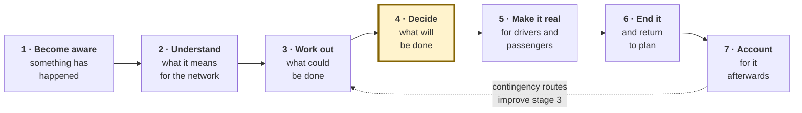

# Value Streams

| | |
|---|---|
| **Phase** | B — Business Architecture |
| **Document version** | 1.0 |
| **Status** | Baseline |

---

## 1. The primary value stream

**Trigger:** a disruption occurs. **Value delivered:** a passenger completes their journey, or learns early enough to choose another way.

The stakeholder receiving the value is the passenger — not the controller and not the operator. Stating it that way is a deliberate corrective. Every efficiency in this system is instrumental; if a controller decides faster and a passenger still stands at an unserved stop with no information, the stream delivered nothing.

| Stage | Value added | Capabilities | Who receives it |
|---|---|---|---|
| 1 · Become aware | A candidate becomes a confirmed fact | C1 | Controller |
| 2 · Understand | Extent becomes known rather than estimated | C2 | Controller, duty manager |
| 3 · Work out | Possibilities become comparable options | C3 | Controller |
| 4 · Decide | An option becomes an accountable commitment | C4 | Operator, authority |
| 5 · Make it real | A commitment becomes a changed journey | C5 | **Driver, passenger** |
| 6 · End it | Temporary stays temporary | C6 | Passenger, planner |
| 7 · Account | An event becomes explicable and reusable | C7 | Authority, planner, executive |

Stage 5 is where value actually lands. Stages 1–4 are preparation; stage 6 prevents the value from decaying into permanent unplanned change; stage 7 converts one event into improved capability for the next.

## 2. Where value is currently lost

Mapping the as-is against the stream shows the loss is not evenly distributed.

| Stage | Loss today | Cost |
|---|---|---|
| 1 | Low — humans confirm well | — |
| **2** | **High — assessment is recalled, sequential, non-exhaustive** | Services missed entirely; the ones missed are invisible |
| 3 | Moderate — options are good but unrecorded and unranked | Reasoning is lost; quality varies with who is on shift |
| 4 | Low — the decision is made, and made competently | — |
| **5** | **High — sequential to drivers; passengers not reached at all** | The value the whole stream exists to deliver is the value not delivered |
| 6 | Moderate — reversion happens when noticed | Diversions outlast their cause |
| **7** | **Total — nothing is retained** | Cannot explain, cannot learn, cannot improve stage 3 |

Stages 2, 5 and 7 carry nearly all the loss. That is the same conclusion the capability heat map reaches from a different direction, which is mild corroboration that both are pointing at something real.

Note where the loss is *not*: stages 1, 3 and 4 — awareness, option generation and deciding — are the ones humans do well. **The baseline concept leads with route optimisation, which sits in stage 3, the stage with the least value loss.** The optimisation is necessary to make stages 2 and 5 work at scale, but it is not itself where the problem is. A design that treated routing as the centrepiece would be solving the part that is not broken.

## 3. Secondary value streams

### Contingency development

**Trigger:** a corridor is disrupted repeatedly. **Value:** the next disruption there is answered in seconds rather than analysed from nothing.

| Stage | Capability |
|---|---|
| Recognise a recurring pattern | C7.3 |
| Propose a candidate route | C7.4 |
| Human approval with conditions and expiry | Autonomy §5 |
| Enter the library | C3.5 |
| Retrieve on match | C3.5 |
| Review usage | Autonomy §5 |

This stream is what converts BO-4 from an aspiration into a mechanism. It is also the stream with the most dangerous failure mode: left ungoverned, the library grows, approvals are never reviewed, and A2 activation quietly becomes the normal path. The value stream and its governance are the same artefact.

### Accountability

**Trigger:** someone asks why a service did what it did. **Value:** an answer from a record rather than from memory.

| Stage | Capability |
|---|---|
| Record the decision and its inputs as they stood | C7.1 |
| Retain immutably | C7.1 |
| Reconstruct on demand | C7.2 |
| Present interpretably to an outside party | C7.2 |

Runs continuously rather than on demand: the value is created at decision time and consumed possibly months later. That asymmetry is why [P-2](../methodology/architecture-principles.md#p-2--every-decision-is-auditable) makes audit a functional concern — nothing at the moment of consumption can compensate for context not captured at the moment of creation.

## 4. Value stream to stakeholder

| Stakeholder | Receives from | Currently receives |
|---|---|---|
| Waiting passenger (S-01) | Stage 5 | Almost nothing |
| Onboard passenger (S-02) | Stage 5 | Late, if at all |
| Dependent passenger (S-03) | Stages 3, 5 | Nothing, and bears the loss |
| Driver (S-04) | Stage 5 | Late, sequential |
| Controller (S-05) | Stages 2, 3 | Produces it themselves, under load |
| Duty manager (S-06) | Stages 2, 7 | Assembled from conversations |
| Planner (S-07) | Stage 7 | Nothing |
| Executive (S-08) | Stages 6, 7 | Nothing systematic |
| Authority (S-09) | Stage 7 | Nothing systematic |

The pattern in the right-hand column is the case for the project. The stakeholders currently receiving the least are, with the exception of the controller, precisely those with the least influence to ask for more — the influence/interest inversion from [Phase A](../phase-a-architecture-vision/stakeholder-map.md#2-influence-and-interest), reappearing as a distribution of value rather than a distribution of concerns.

## 5. Time in the stream

| Stage | As-is | To-be | Bound by |
|---|---|---|---|
| 1 Become aware | Minutes | Minutes | Human confirmation — unchanged by design |
| 2 Understand | Minutes, scaling | Seconds, flat | Machine |
| 3 Work out | Minutes | Seconds | Machine |
| **4 Decide** | Seconds | **Seconds to a minute** | **Human — the intended bottleneck** |
| 5 Make it real | Minutes, scaling | Seconds, flat | Machine, concurrent |
| 6 End it | Whenever noticed | Prompted on clearance | Human decision |
| 7 Account | Not performed | Continuous | Machine |

Two stages remain human-bound, both deliberately. Stage 1 keeps human confirmation because false positives strand real people. Stage 4 keeps human decision because of [P-1](../methodology/architecture-principles.md#p-1--the-human-decides).

After the change, **the human stages dominate the elapsed time** — which is the intended outcome, not a residual inefficiency. It is also the reason OBJ-1 is written as a target on machine time with total time explained, rather than as a target on total time. A design that optimised total elapsed time would find its largest remaining saving in the approval step, and would be correct arithmetically and wrong architecturally.
