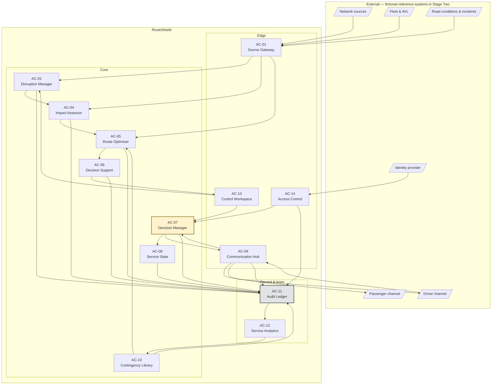

# Application Components

| | |
|---|---|
| **Phase** | C — Application Architecture |
| **Document version** | 1.0 |
| **Status** | Baseline |

---

## 1. Rules applied

Boundaries are drawn from the [data domains](../data-architecture/data-domains.md), not from technology layers or team structure:

1. **One writer per owned domain.** Each owned domain has exactly one component entitled to change it.
2. **Sourced domains are never written.** Components hold read-only cached copies.
3. **Cross-component access is by contract.** No component reads another's store.
4. **Impact assessment and optimisation do not share a failure domain** ([BR-011](../../phase-b-business-architecture/business-requirements.md#impact-assessment), [BR-045](../../phase-b-business-architecture/business-requirements.md#resilience)).

## 2. Two refinements to the data domains

Applying rule 1 and rule 4 against the data domains as first drawn exposed two conflicts. They were resolved inside Phase C, before the baseline was published, and [data-domains.md](../data-architecture/data-domains.md#7-refinements-from-application-architecture) is amended to match.

### 2.1 DD-5 Response is split into three

DD-5 held impact assessments, response options *and* recommendations. Rule 1 would give it one writer. Rule 4 requires assessment and optimisation to fail independently — which a single writer cannot guarantee, because the writer is the failure domain.

Splitting the writer without splitting the domain would create two writers of one domain, violating rule 1. So the domain splits:

| New domain | Contains | Writer |
|---|---|---|
| **DD-5a Impact** | Impact assessments, affected trips, affected stops | Impact Assessor |
| **DD-5b Options** | Response options, option costs | Route Optimiser |
| **DD-5c Recommendation** | Recommendations, confidence states | Decision Support |

The third split was not forced by rule 4, but by the same logic one level up: ranking, applying the autonomy model and bounding controller load are a different job, with different inputs, from generating options.

### 2.2 Authority leaves DD-6 Decision

DD-6 held decisions *and* the actors and authority grants that make them valid. They change on different cadences, by different people, for different reasons: decisions are made in seconds by controllers; authority is administered occasionally by management. [P-8](../../methodology/architecture-principles.md#p-8--boundaries-follow-data-ownership) says that is two owners.

| New domain | Contains | Writer |
|---|---|---|
| **DD-13 Authority** | Actors, roles, authority grants | Access Control |

> This is the architecture method working as intended: a later sub-phase contradicting an earlier one while both are still open, and the earlier one being amended rather than worked around. It is a small instance of the feedback loop that Phase H formalises.

## 3. Landscape

## 4. Component catalogue

| ID | Component | Owns (sole writer) | Reads | Capabilities |
|---|---|---|---|---|
| **AC-01** | Source Gateway | Sourced-data cache, DD-10 Source Health | External sources | C8.1 |
| **AC-02** | Disruption Manager | DD-4 Disruption | Cache (incidents, conditions) | C1.1–C1.4, C6.1 |
| **AC-04** | Impact Assessor | DD-5a Impact | Snapshots, DD-4 | C2.1–C2.4 |
| **AC-05** | Route Optimiser | DD-5b Options | Snapshots, DD-5a, DD-9 | C3.1–C3.5 |
| **AC-06** | Decision Support | DD-5c Recommendation | DD-5a, DD-5b, DD-10, DD-13 | C4.1, C4.4, C8.2 |
| **AC-07** | Decision Manager | DD-6 Decision | DD-5c, DD-9, DD-13 | C4.2, C4.3, C6.2 |
| **AC-08** | Service State | DD-7 Service State | DD-6, DD-1 | C5.4 |
| **AC-09** | Communication Hub | DD-8 Communication | DD-6, DD-7 | C5.1–C5.3, C6.3 |
| **AC-10** | Contingency Library | DD-9 Contingency | DD-12, DD-13 | C3.5, C7.4 |
| **AC-11** | Audit Ledger | DD-11 Audit | Cache, DD-10 (for snapshots) | C7.1, C7.2 |
| **AC-12** | Service Analytics | DD-12 Analytics | DD-11 only | C7.3, C7.4 |
| **AC-13** | Control Workspace | *None* | Via component contracts | C4.1, C4.2 *(presentation)*, C8.4 *(declaration)* |
| **AC-14** | Access Control | DD-13 Authority | Identity provider | C4.3 |

`AC-03` is intentionally unallocated: an early draft had a separate Snapshot Service, merged into the Audit Ledger because snapshots are audit records and a second writer of DD-11 would breach rule 1. Identifiers are not reused.

## 5. Component responsibilities

### AC-01 · Source Gateway
Adapts each external source to an internal contract, maintains the read-only cache, and records freshness and availability in DD-10. It is the **only** component that talks to sourced systems, which makes it the only place a real integration would change. This is how the baseline concept's *Option A — add-on integration* is realised: by replacing adapters, not components.

It does not interpret. It does not decide something is a disruption; it reports what sources said.

### AC-02 · Disruption Manager
Turns incident signals and controller declarations into disruptions, creates versions, manages the lifecycle state machine, and records confirmation. Enforces the `clearing → closed` guard ([INV-08](../data-architecture/logical-data-model.md#14-invariants)) by querying Service State.

### AC-04 · Impact Assessor
Given a disruption version, asks the Audit Ledger to freeze a snapshot, then computes affected trips (with past/approaching/unknown relation), affected stops and estimated passenger impact. **Commits its result before optimisation begins.** That ordering is what makes [BR-011](../../phase-b-business-architecture/business-requirements.md#impact-assessment) true: whatever happens to optimisation, the assessment already exists and can be presented at band A0.

### AC-05 · Route Optimiser
Generates options per affected trip — reroute, hold, split, terminate — validates feasibility against vehicle constraints, finds following-service coverage for skipped stops, retrieves matching contingency routes, and costs every option. Runs under a time budget; on timeout or failure it records what it produced, if anything, and stops.

It does **not** rank against the autonomy model or decide what to show. That is AC-06.

### AC-06 · Decision Support
Composes recommendations: ranks options against the service-continuity objective, derives confidence from snapshot health and footprint age, assigns the autonomy band, checks A2 eligibility, bounds the queue per controller ([BR-023](../../phase-b-business-architecture/business-requirements.md#decision)), and routes overflow to escalation. Hosts the rubber-stamping detector ([BR-024](../../phase-b-business-architecture/business-requirements.md#decision)).

### AC-07 · Decision Manager
Captures approve/modify/reject/escalate, verifies authority at decision time, executes A2 activations when AC-06 has marked a recommendation eligible and all six conditions still hold at execution, creates activations, prompts reversion on clearance, and re-opens decisions on driver refusal.

The re-check at execution matters: A2 eligibility can lapse between recommendation and activation — a controller goes off duty, an approval expires.

### AC-08 · Service State
Holds what each trip is currently doing and which activation put it there. Applies activations; reports deviations from plan that no longer have a live governing decision ([INV-07](../data-architecture/logical-data-model.md#14-invariants)).

### AC-09 · Communication Hub
Issues driver instructions, tracks acknowledgements, refusals and non-response, and publishes and withdraws passenger notices. Refusals go to the Decision Manager as decisions to be made, not as errors.

### AC-10 · Contingency Library
Holds contingency routes and approvals; answers "which approved routes match this corridor, type and extent"; enforces expiry, revocation and network-version validity. Accepts candidates from analytics but **never self-approves** them.

### AC-11 · Audit Ledger
Sole writer of DD-11. Freezes snapshots on request, appends hash-chained events submitted by every other component, and serves reconstruction and export. Its write contract is synchronous with the change being recorded ([FR-D3](../data-architecture/data-flows.md#5-flow-rules)).

### AC-12 · Service Analytics
Derives outcomes, corridor recurrence and decision patterns from de-linked audit events. Proposes contingency candidates. Reads nothing but the audit record.

### AC-13 · Control Workspace
The controller's interface. Owns no data. Presents recommendations with rationale, cost and confidence; captures decisions; allows manual declaration; shows network-wide impact and source health.

It is a component — not merely "the UI" — because [C4.1](../../phase-b-business-architecture/capability-map.md#c4--response-decision) is a capability. How reasoning and uncertainty are presented determines whether approval is evaluation or ceremony.

### AC-14 · Access Control
Maps identities from an external identity provider to actors, roles and authority grants; answers "may this actor decide this, now?".

## 6. Capability realisation

The application architecture exit condition: **every capability is realised by at least one component.**

| Capability | Component | | Capability | Component |
|---|---|---|---|---|
| C1.1 | AC-02 | | C5.1 | AC-09 |
| C1.2 | AC-02 | | C5.2 | AC-09, AC-07 |
| C1.3 | AC-02 | | C5.3 | AC-09 |
| C1.4 | AC-02, AC-13 | | C5.4 | AC-08 |
| C2.1 | AC-04 | | C6.1 | AC-02 |
| C2.2 | AC-04 | | C6.2 | AC-07 |
| C2.3 | AC-04 | | C6.3 | AC-09 |
| C2.4 | AC-04 | | C7.1 | AC-11 |
| C3.1 | AC-05 | | C7.2 | AC-11 |
| C3.2 | AC-05 | | C7.3 | AC-12 |
| C3.3 | AC-05 | | C7.4 | AC-12, AC-10 |
| C3.4 | AC-05, AC-06 | | C8.1 | AC-01 |
| C3.5 | AC-10, AC-05 | | C8.2 | AC-06 |
| C4.1 | AC-06, AC-13 | | C8.3 | All core components |
| C4.2 | AC-07, AC-13 | | C8.4 | AC-13 *(declaration)*, organisational process |
| C4.3 | AC-14, AC-07 | | | |
| C4.4 | AC-06 | | | |

32 of 32 capabilities realised.

## 7. Domain spanning

The exit condition also requires that **no component spans two owned data domains without justification.**

| Component | Domains written | Justification |
|---|---|---|
| AC-01 | Cache + DD-10 | The cache is not a domain; it is a copy of sourced domains. Health is a property of the same ingest act. |
| AC-11 | DD-11 snapshots + events | One domain. |
| All others | One domain each | — |

No unjustified spans.
