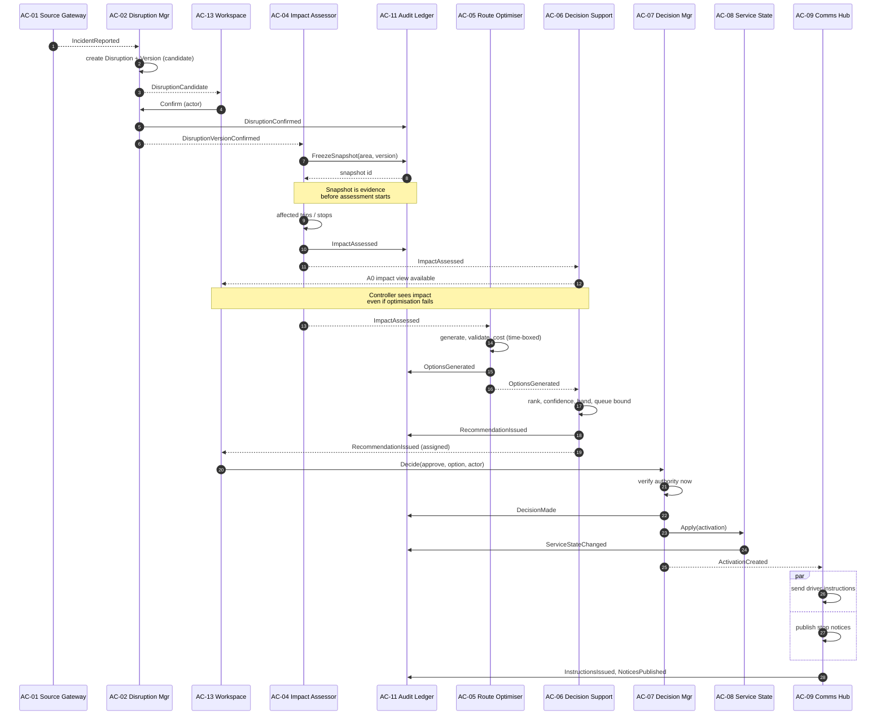
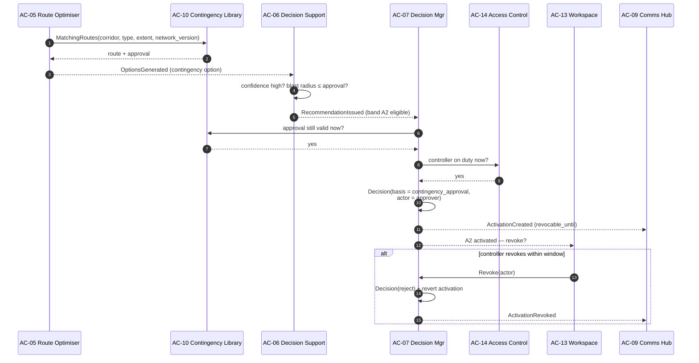
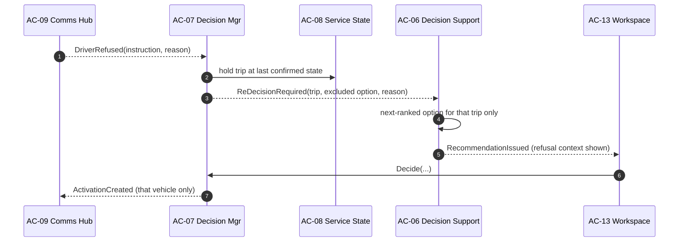
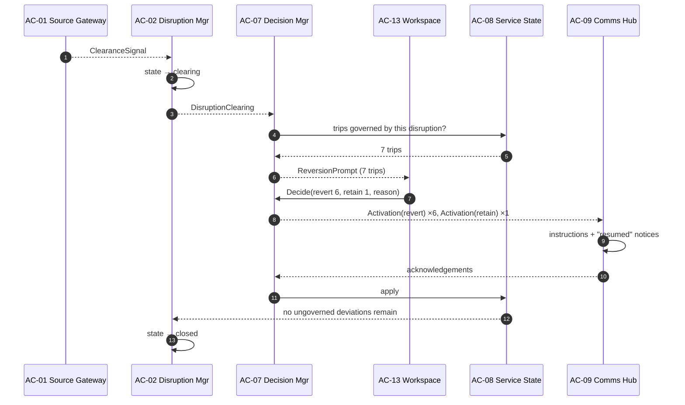

# Component Interactions

| | |
|---|---|
| **Phase** | C — Application Architecture |
| **Document version** | 1.0 |
| **Status** | Baseline |

---

Four interactions, chosen because each one carries a design decision that the others do not. Component identifiers are from the [component catalogue](application-components.md#4-component-catalogue). Every state change also writes to the Audit Ledger (AC-11) synchronously; those calls are shown only where the ordering matters.

## 1. Nominal recommendation and approval — band A1

**Decisions carried**

- **Steps 8–10:** the snapshot is persisted before assessment reads it ([FR-D2](../data-architecture/data-flows.md#5-flow-rules)).
- **Steps 12–14:** impact is committed and made presentable *before* optimisation starts. If AC-05 fails or times out, the controller already has an A0 view ([BR-011](../../phase-b-business-architecture/business-requirements.md#impact-assessment)).
- **Step 20:** authority is checked at decision time, not at recommendation time — grants and duty status can change in between.
- **Steps 21–23:** decision, then state, then communication. A driver is never instructed to do something that is not already recorded as decided.

## 2. Pre-approved contingency — band A2

**Decisions carried**

- **Steps 6–9:** all six A2 conditions ([autonomy model §3](../../phase-b-business-architecture/autonomy-model.md#a2--pre-approved-contingency)) are rechecked at execution, not trusted from the recommendation. Eligibility can lapse in between.
- **Step 10:** the decision's actor is the **contingency approver**, and its basis is the approval. Accountability is displaced in time, not removed ([autonomy §7](../../phase-b-business-architecture/autonomy-model.md#7-autonomy-and-accountability)).
- **Steps 12–15:** revocation is a decision by the on-duty controller, recorded as such.
- If any check fails, the same recommendation is re-issued at band A1 to the controller. A2 never fails silently into inaction.

## 3. Driver refusal

**Decisions carried**

- The refusal is routed to the Decision Manager, not to an error handler ([BR-028](../../phase-b-business-architecture/business-requirements.md#activation), [INV-09](../data-architecture/logical-data-model.md#14-invariants)).
- **Step 2:** service state does not flip to the refused pattern. What the trip is doing is what the driver said, not what the system wished.
- **Step 3:** the refused option is excluded and the reason carried into the next recommendation, so the controller sees *why* the first choice failed.
- `no_response` after the deadline follows the same path. Silence is not consent.

## 4. Clearance and reversion

**Decisions carried**

- **Step 6:** reversion is *prompted*, not waited for ([BR-033](../../phase-b-business-architecture/business-requirements.md#closure)).
- **Step 7:** retaining a diversion is an explicit decision with a reason, not the default of doing nothing ([BR-035](../../phase-b-business-architecture/business-requirements.md#closure)).
- **Steps 12–13:** the disruption closes only when Service State confirms no deviation lacks a live governing decision ([INV-07, INV-08](../data-architecture/logical-data-model.md#14-invariants)).
- A clearance signal can be withdrawn (`clearing → active`); pending reversion prompts are then withdrawn too.

## 5. What the interactions show about coupling

| Pair | Coupling | Kind |
|---|---|---|
| AC-04 → AC-05 | Event | Assessment does not wait on optimisation |
| AC-05 → AC-06 | Event | Optimiser does not know what is shown |
| AC-13 → AC-07 | Command | A decision needs an immediate yes/no |
| AC-07 → AC-08 | Command, same unit of work | Decision and state must agree |
| AC-07 → AC-09 | Event | Delivery is asynchronous with deadlines |
| AC-09 → AC-07 | Event | Responses re-enter decision |
| Any → AC-11 | Command, same unit of work | [FR-D3](../data-architecture/data-flows.md#5-flow-rules) |

Commands where a caller needs a definite answer or where two changes must agree; events everywhere else. [ADR-0007](../../../05-architecture-decisions/adr-0007-in-process-events-with-synchronous-audit.md) records this choice.
