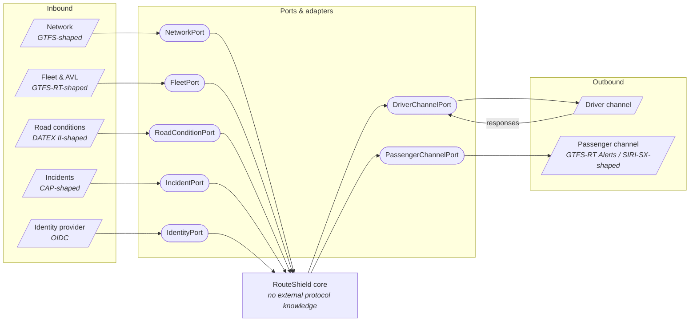

# Integration Architecture

| | |
|---|---|
| **Phase** | C — Application Architecture |
| **Document version** | 1.0 |
| **Status** | Baseline |

---

## 1. Shape

RouteShield has one integration boundary on each side of the core, and nothing else touches the outside world.

The core depends on **ports** — interfaces RouteShield defines in its own terms. **Adapters** translate between a port and a specific external system. The core never knows which adapter is attached.

This is how the baseline concept's two deployment options become one architecture:

| Baseline option | Realisation |
|---|---|
| **A — Add-on integration** | Same core; adapters for the operator's existing systems |
| **B — Standalone platform** | Same core; adapters for open data and RouteShield's own channels |

Stage Two builds the core once, with adapters for open data and fictional reference systems. Moving to Option A would replace adapters and change nothing else — a claim the Stage Two test suite can partially demonstrate by running the core against two different adapter sets.

## 2. Port catalogue

| Port | Direction | Owner component | Contract in RouteShield's terms | Modelled on |
|---|---|---|---|---|
| **NetworkPort** | In | AC-01 | Patterns, stops, sequences, road graph, vehicle constraints, network version | GTFS static; OpenStreetMap |
| **FleetPort** | In | AC-01 | Trips, vehicle-to-trip assignments with `duty_ref`, positions | GTFS-Realtime `VehiclePosition`, `TripUpdate` |
| **RoadConditionPort** | In | AC-01 | Segment speed, congestion, closure flags | DATEX II |
| **IncidentPort** | In | AC-01 | Incident reports with authority level and area | OASIS Common Alerting Protocol |
| **IdentityPort** | In | AC-14 | Authenticated identity and role claims | OpenID Connect |
| **DriverChannelPort** | Out + In | AC-09 | Deliver sequence; receive acknowledge / refuse / timeout | *No public standard — see A-005* |
| **PassengerChannelPort** | Out | AC-09 | Publish / withdraw stop-level notice | GTFS-Realtime `Alert`; SIRI-SX |

> **Why model on standards.** Inventing interface shapes freely would make the fiction arbitrary ([P-4](../../methodology/architecture-principles.md#p-4--open-and-standard-before-proprietary), [fictional operating model](../../../02-stage-two-reference-implementation/fictional-operating-model.md#why-a-fictional-environment)). These are published standards in real use in European transport and traffic information. Modelling on them does **not** imply any operator uses them; it means the fictional systems have plausible, disciplined shapes.
>
> **DriverChannelPort has no standard to follow.** In-cab messaging is typically vendor-specific. Its contract is therefore the most assumption-laden in the architecture and is annotated with [A-005](../../../02-stage-two-reference-implementation/assumptions.md#a-005).

## 3. Integration patterns

| Concern | Pattern | Why |
|---|---|---|
| High-rate sourced data (positions, conditions) | **Poll or subscribe → cache** | The core never calls a source in the decision path. Latency and failure of sources are absorbed at the edge. |
| Low-rate sourced data (network) | **Scheduled import, versioned** | Network changes on a weeks timescale; every import produces a new `network_version`. |
| Incidents | **Subscribe → cache → signal** | AC-01 records; AC-02 decides whether it is a disruption. |
| Driver instruction | **Send with deadline, await response** | A response — including silence — must be recorded before the deadline passes. |
| Passenger notices | **Fire and confirm** | Idempotent publish keyed by activation and stop; withdraw by the same key. |
| Identity | **Token validation at the edge** | The core receives an actor, never a credential. |

**No synchronous call to an external system sits on the path from confirmation to recommendation.** Everything that path needs is already in the cache, frozen into a snapshot. This is what makes [OBJ-1](../../phase-a-architecture-vision/objectives.md#obj-1--compress-the-time-from-disruption-confirmation-to-actionable-driver-instruction)'s five-second machine budget achievable regardless of how slow the real sources are — and it is only possible because of [ADR-0004](../../../05-architecture-decisions/adr-0004-decisions-reference-immutable-input-snapshots.md).

## 4. Anti-corruption

Each adapter is also an anti-corruption layer. External models do not leak inward.

| External concept | Internal concept | Translation concern |
|---|---|---|
| GTFS `route` / `trip` / `shape` | Route / Pattern / Trip | GTFS trips imply patterns; patterns must be derived by grouping identical stop sequences |
| GTFS-RT `vehicle.id` + `trip.trip_id` | TripAssignment | Assignment is inferred from co-occurrence; a real fleet system would state it directly |
| DATEX II situation record | RoadConditionObservation / IncidentReport | Map location referencing to internal road segments; unmatched locations are recorded as unmatched, not discarded |
| CAP `alert.urgency` / `certainty` | `IncidentReport.authority` | Only sources configured as authoritative can produce `authoritative`, whatever the message claims |
| OIDC claims | Actor + role | Role mapping is configuration, not claim trust |

The CAP row encodes a security decision: **authority comes from which source a report arrived on, not from what the report says about itself.** A message claiming certainty from an unconfigured source is `inferred`.

## 5. Failure handling at the boundary

| Failure | Detected by | Effect on core |
|---|---|---|
| Source slow | Freshness against `expected_interval_s` | `stale` in DD-10 → confidence reduced |
| Source absent | No data within threshold | `absent` in DD-10 → degraded mode per [data flows §6](../data-architecture/data-flows.md#6-degraded-flows) |
| Source inconsistent | Adapter validation | `inconsistent` in DD-10; offending records quarantined |
| Malformed message | Adapter schema validation | Rejected at the edge, counted, never enters cache |
| Driver channel down | Send failure or no delivery receipt | Activation flagged; controller told to use voice |
| Passenger channel down | Publish failure | Notices queued; controller informed |
| Identity provider down | Token validation failure | Existing sessions continue to expiry; no new sign-in; declaration by already-authenticated controllers still possible |

The last row is a deliberate trade-off. Failing closed on identity would lock controllers out of the one input that must always work ([BR-002](../../phase-b-business-architecture/business-requirements.md#disruption-awareness)). Failing fully open would remove attribution. Continuing existing sessions is the middle position, and it is revisited in Phase D's security architecture.

## 6. What this architecture assumes about integration

| | Assumption |
|---|---|
| [A-001](../../../02-stage-two-reference-implementation/assumptions.md#a-001) | Assignment data is obtainable in near-real-time |
| [A-002](../../../02-stage-two-reference-implementation/assumptions.md#a-002) | An authoritative incident feed exists at all |
| [A-004](../../../02-stage-two-reference-implementation/assumptions.md#a-004) | Positions arrive at roughly 30-second intervals |
| [A-005](../../../02-stage-two-reference-implementation/assumptions.md#a-005) | A driver channel can carry a sequence and a response |
| [A-012](../../../02-stage-two-reference-implementation/assumptions.md#a-012) | Sources expose request/response or subscription interfaces |

A-012 is largely neutralised by the cache pattern: if a source is batch or file-based, only its adapter and its freshness expectation change. That is the most concrete payoff of the ports-and-adapters decision in [ADR-0006](../../../05-architecture-decisions/adr-0006-modular-monolith-with-ports-and-adapters.md).
