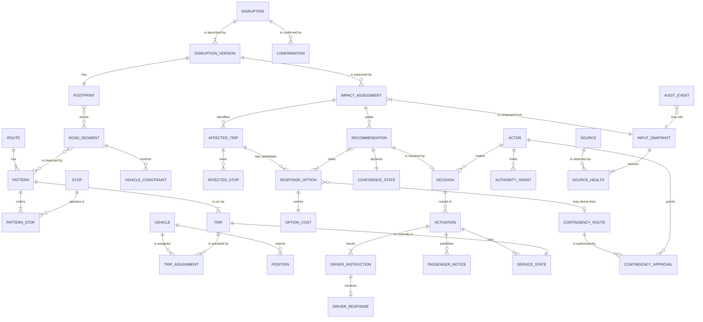

# Conceptual Data Model

| | |
|---|---|
| **Phase** | C — Data Architecture |
| **Document version** | 1.0 |
| **Status** | Baseline |

---

## 1. Purpose

The things the business talks about and how they relate — no attributes beyond what is needed to understand an entity, no keys, no technology. The [logical model](logical-data-model.md) adds structure; this one fixes meaning.

## 2. Model

## 3. Entities by domain

| Domain | Entities |
|---|---|
| DD-1 Network | Route, Pattern, Pattern Stop, Stop, Road Segment, Vehicle Constraint |
| DD-2 Fleet Operations | Vehicle, Trip, Trip Assignment, Position |
| DD-3 Road Conditions | Road Condition Observation, Incident Report *(omitted from diagram for legibility)* |
| DD-4 Disruption | Disruption, Disruption Version, Footprint, Confirmation |
| DD-5a Impact | Impact Assessment, Affected Trip, Affected Stop |
| DD-5b Options | Response Option, Option Cost |
| DD-5c Recommendation | Recommendation, Confidence State |
| DD-6 Decision | Decision, Activation |
| DD-13 Authority | Actor, Authority Grant |
| DD-7 Service State | Service State |
| DD-8 Communication | Driver Instruction, Driver Response, Passenger Notice |
| DD-9 Contingency | Contingency Route, Contingency Approval |
| DD-10 Source Health | Source, Source Health |
| DD-11 Audit | Input Snapshot, Audit Event |

## 4. Definitions that need care

**Pattern, not route.** A route is a public-facing name. A *pattern* is a specific ordered stop sequence; one route has several (directions, short workings, variants). Diversions change patterns. Modelling "route" as the thing that changes would be wrong for every route with more than one variant, which is most of them.

**Trip.** One scheduled journey along a pattern at a time. The unit that is affected, reassigned and notified.

**Disruption vs. Disruption Version.** A disruption is the real-world event and has one identity for its whole life. What is known about it — its extent, type, expected duration — changes. Each change is a new **version**; versions are never edited.

This is how the model accommodates, partially, the moving disruptions [BS-2](../../phase-b-business-architecture/business-scenarios.md#bs-2--moving-protest--the-case-the-model-does-not-handle-well) describes: a march is a disruption with many versions, each a static footprint. It is an approximation and a known weak one — assessments go stale between versions, and nothing in the model represents motion itself. [ADR-0005](../../../05-architecture-decisions/adr-0005-represent-disruptions-as-versioned-static-footprints.md) records the decision and the conditions under which it should be revisited.

**Impact Assessment is tied to a version, not a disruption.** An assessment answers "what does *this* description of the disruption mean for the network *as it stood at this moment*". Both halves are frozen: the version, and the input snapshot. If either changes, a new assessment is produced; the old one remains true about what it described.

**Response Option vs. Recommendation.** An option is one candidate for one trip: reroute via X, hold, split, terminate. A recommendation is a **ranked set** of options presented for decision, with its reasoning and its confidence. Options are cheap and numerous; recommendations are what a human sees and what [C4.4](../../phase-b-business-architecture/capability-map.md#c4--response-decision) bounds.

**Option Cost.** Stops lost, stops covered by a following service, passengers estimated affected, added running time, feasibility margin. Carried explicitly because [BR-019](../../phase-b-business-architecture/business-requirements.md#decision) requires the recommendation to say what it gives up.

**Confidence State.** Derived from source health at snapshot time and from the age of the disruption version. Attached to the recommendation — not computed at display time — so the controller and the audit record see the same value.

**Decision.** The resolution of one recommendation by one actor: approve, reject, modify, or escalate. A decision references the recommendation; it never copies or alters it. An A2 pre-approved activation also produces a decision record, whose actor is the *contingency approver* and whose basis is the approval — consistent with [autonomy model §7](../../phase-b-business-architecture/autonomy-model.md#7-autonomy-and-accountability).

**Activation.** The act of putting a decision into service. One decision may produce several activations — for instance, re-issued after a driver refusal.

**Driver Response.** Acknowledgement **or refusal with reason**. Refusal is a first-class value, not an error ([BR-027](../../phase-b-business-architecture/business-requirements.md#activation)).

**Service State.** The pattern a trip is *currently* running, with the decision that put it there. Exactly one per active trip. The only mutable operational state RouteShield owns.

**Actor.** A person with a role. Controllers, duty managers, contingency approvers. **Drivers are not actors in this model** — driver responses reference a vehicle and duty, not a person (see [data domains §5](data-domains.md#5-ownership-rules)).

**Input Snapshot.** A frozen copy of the sourced data an assessment was computed from, *including* which sources were stale or absent. The object that makes [BR-037](../../phase-b-business-architecture/business-requirements.md#accountability-and-learning) true.

**Audit Event.** An append-only record that something happened: a disruption version was created, a recommendation was issued, a decision was made, a driver refused. Events reference owned entities by immutable identifier and cite snapshots.

## 5. What is deliberately absent

| Absent | Why |
|---|---|
| **Passenger** | No individual passenger is modelled. Passenger impact is an estimate attached to stops and trips, and notices are published to stops, not people. Adding individual passengers would bring journey inference about identifiable people into the model ([A-003](../../../02-stage-two-reference-implementation/assumptions.md#a-003), SC-034). |
| **Driver as a person** | Enforces [BR-042](../../phase-b-business-architecture/business-requirements.md#accountability-and-learning) structurally. |
| **Stop criticality** | Required by [P-7](../../methodology/architecture-principles.md#p-7--stop-skipping-is-not-neutral); no data exists. A placeholder attribute is reserved in the logical model, explicitly marked unpopulated. |
| **Motion of a disruption** | See Disruption Version above and [ADR-0005](../../../05-architecture-decisions/adr-0005-represent-disruptions-as-versioned-static-footprints.md). |
