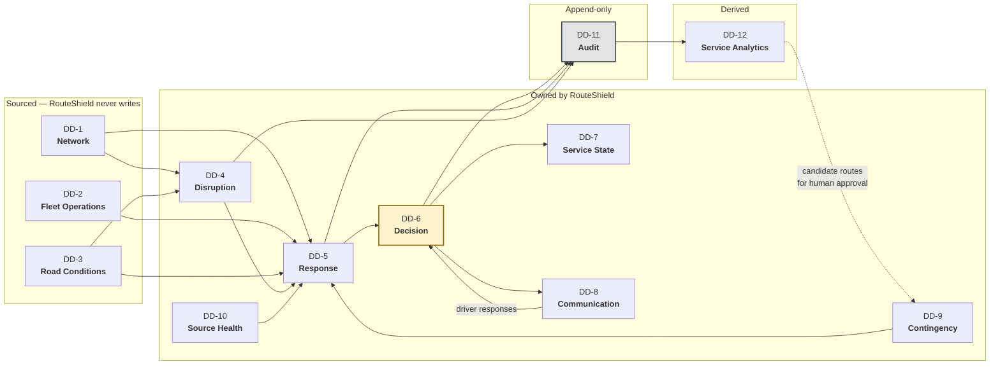

# Data Domains and Ownership

| | |
|---|---|
| **Phase** | C — Data Architecture |
| **Document version** | 1.0 |
| **Status** | Baseline |

---

## 1. Why domains come first

[P-8](../../methodology/architecture-principles.md#p-8--boundaries-follow-data-ownership) says application boundaries follow data ownership. This document is therefore upstream of every component boundary drawn later in Phase C. If a domain here is wrong, the component split built on it will be wrong in the same place.

A **data domain** is a body of data with **one owner** — one authority entitled to create and change it. Everything else reads it through a contract. Ownership is the property that matters; subject matter is secondary. Two entities about the same real-world thing can belong to different domains if different authorities are entitled to change them, and that case turns out to be the most important one in this architecture (see §4).

## 2. Domain map

## 3. Domain definitions

### Sourced domains — RouteShield is a reader

These are owned by other systems. RouteShield never writes to them, and a design in which it does is a defect ([P-8](../../methodology/architecture-principles.md#p-8--boundaries-follow-data-ownership)).

| Domain | Contains | Owner | Change rate |
|---|---|---|---|
| **DD-1 Network** | Routes, patterns, stops, stop sequences, road graph, vehicle constraints on roads | Network planning / published schedule | Weeks |
| **DD-2 Fleet Operations** | Vehicles, trips, vehicle-to-trip assignment, vehicle positions | Fleet management, AVL | Seconds |
| **DD-3 Road Conditions** | Segment speeds, congestion, closure signals, authoritative incident reports | Traffic provider, incident source | Seconds to minutes |

> In Stage Two, every sourced domain is supplied by a [fictional reference system](../../../02-stage-two-reference-implementation/fictional-operating-model.md) except the published parts of DD-1, which come from open GTFS and OpenStreetMap.

**DD-1 has a gap that matters.** Open network data describes where roads go. It does not reliably describe where a twelve-metre bus can go — turning restrictions for large vehicles, bridge heights, bus gates. That knowledge is held by the operator, often tacitly, in controllers' heads ([BR-R2](../../phase-b-business-architecture/as-is-to-be-process.md#6-risks-the-to-be-introduces), [A-008](../../../02-stage-two-reference-implementation/assumptions.md#a-008)). DD-1 therefore has *two* sources: the published network and an operator-maintained constraint set. The second is the one that makes feasibility validation (C3.2) trustworthy, and it is the one open data cannot supply.

### Owned domains — RouteShield is the authority

| Domain | Contains | Capabilities | Mutability |
|---|---|---|---|
| **DD-4 Disruption** | Disruptions, footprints, classifications, confirmations, lifecycle state | C1, C6.1 | Mutable, versioned |
| **DD-5 Response** | Impact assessments, affected trips and stops, candidate options, costs, recommendations | C2, C3, C4.1 | **Immutable once issued** |
| **DD-6 Decision** | Decisions, approvals, rejections, modifications, activations, reversions, authority grants | C4.2–C4.4, C6.2 | **Immutable once made** |
| **DD-7 Service State** | The pattern each trip is *currently* operating | C5.4 | Mutable — the only live operational state RouteShield owns |
| **DD-8 Communication** | Driver instructions, acknowledgements, refusals, passenger notices | C5.1–C5.3, C6.3 | Instructions immutable; delivery status mutable |
| **DD-9 Contingency** | Contingency routes, their approvals, conditions, expiry, usage | C3.5, C7.4 | Versioned; approval-gated |
| **DD-10 Source Health** | Freshness, availability and consistency of each input | C8.1, C8.2 | Mutable, time-series |

### Append-only domain

| Domain | Contains | Capabilities | Mutability |
|---|---|---|---|
| **DD-11 Audit** | Input snapshots and the event record of every recommendation, decision, activation, refusal and reversion | C7.1, C7.2 | **Append-only. No update. No delete.** |

### Derived domain

| Domain | Contains | Capabilities | Constraint |
|---|---|---|---|
| **DD-12 Service Analytics** | Outcomes of disruptions and decisions, corridor recurrence, option performance | C7.3, C7.4 | **Service-level only** — no attribute identifying or ranking an individual driver ([BR-042](../../phase-b-business-architecture/business-requirements.md#accountability-and-learning)) |

## 4. The three splits that carry the design

### 4.1 Response is separate from Decision

A recommendation and the decision taken on it are about the same event. They have different owners — the machine proposes; a person decides — and they have different accountability. Merging them into one "reroute" record produces an object where it is impossible to tell afterwards what was recommended from what was chosen.

That distinction is what [BR-021](../../phase-b-business-architecture/business-requirements.md#decision) (record approve/reject/modify) and [OBJ-9](../../phase-a-architecture-vision/objectives.md#obj-9--bound-the-decision-load-placed-on-a-controller)'s rubber-stamping detector depend on. If recommendation and decision are the same record, "the controller modified it" and "the system proposed it that way" are indistinguishable.

### 4.2 Service State is separate from Network and from Decision

Three different things are all loosely "the route":

| | Domain | Owner | Question it answers |
|---|---|---|---|
| The **planned** pattern | DD-1 Network | Planning | What should this trip do? |
| The **decided** change | DD-6 Decision | Controller | What was it told to do instead? |
| The **current** pattern | DD-7 Service State | RouteShield | What is it doing right now? |

They diverge in normal operation: a decision is made but the driver refuses; a diversion is active but the disruption has cleared; a reversion is decided but not yet acknowledged. A model with one "route" field cannot represent any of those states, and those states are exactly where the operational risk sits.

Keeping DD-7 separate is also what makes [BR-035](../../phase-b-business-architecture/business-requirements.md#closure) enforceable — "no diversion persists without an explicit decision to retain it" is a check that every DD-7 deviation from DD-1 is backed by a live DD-6 decision.

### 4.3 Audit is separate from everything

The obvious design is to make Decision and Response immutable and call that the audit trail. It is not sufficient, for one reason: **[BR-037](../../phase-b-business-architecture/business-requirements.md#accountability-and-learning) requires inputs as they stood at decision time.** Positions, road conditions, source health and assignments are sourced, mutable and continuously overwritten. A decision that references "vehicle 1234's position" by identifier will, when reconstructed next month, find next month's position — or nothing.

So DD-11 holds **input snapshots**: frozen copies of the sourced data a recommendation was computed from, including which inputs were stale or absent. Recommendations and decisions reference snapshots, never live state. That is the single most consequential data decision in this architecture and is recorded as [ADR-0004](../../../05-architecture-decisions/adr-0004-decisions-reference-immutable-input-snapshots.md).

## 5. Ownership rules

| Rule | |
|---|---|
| **One writer per domain** | Exactly one component writes each domain. Established in the [application architecture](../application-architecture/). |
| **Sourced domains are never written** | RouteShield holds cached copies; the cache is not the domain. |
| **Cross-domain access is by contract** | No component reads another domain's store directly. |
| **Audit is written by all, owned by none** | Every owned domain emits events to DD-11; no component may modify it after write. |
| **Analytics reads only from Audit** | DD-12 is derived from DD-11, never from live operational state. That makes the analytics restriction structural: data that never enters the audit record cannot be analysed. |

The last rule is how [BR-042](../../phase-b-business-architecture/business-requirements.md#accountability-and-learning) becomes structural rather than a policy. Driver identity is not captured in audit events at all — only vehicle and duty references, which are resolved outside RouteShield when a human needs them. Analytics cannot rank drivers because the data it is built from does not know who they are.

## 6. Domain-to-capability coverage

| Capability group | Domains |
|---|---|
| C1 Disruption Awareness | DD-3 (read), DD-4 |
| C2 Impact Assessment | DD-1, DD-2 (read), DD-4 (read), DD-5 |
| C3 Option Generation | DD-1, DD-3 (read), DD-5, DD-9 (read) |
| C4 Decision | DD-5 (read), DD-6 |
| C5 Activation | DD-6 (read), DD-7, DD-8 |
| C6 Closure | DD-4, DD-6, DD-7, DD-8 |
| C7 Accountability & Learning | DD-11, DD-12, DD-9 |
| C8 Resilience | DD-10 |

Every capability is served; every owned domain serves at least one capability.
