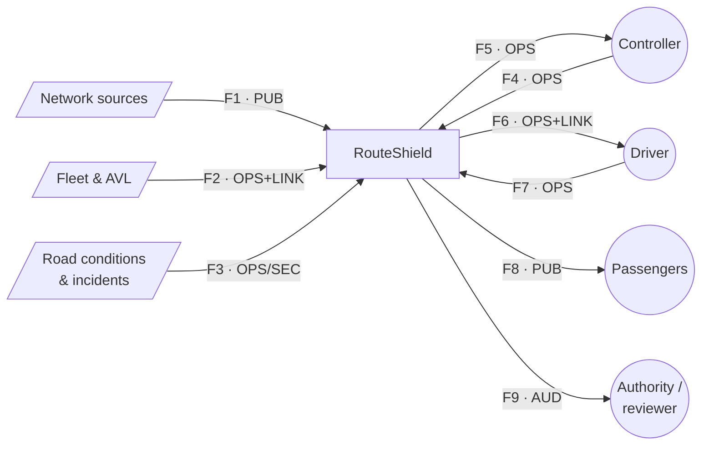
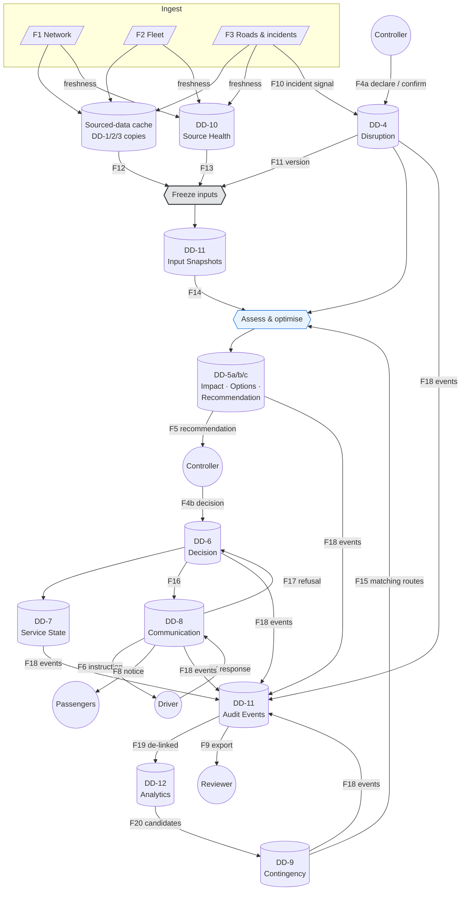

# Data Flows

| | |
|---|---|
| **Phase** | C — Data Architecture |
| **Document version** | 1.0 |
| **Status** | Baseline |

---

## 1. Classification scheme

Every flow carries a classification. The scheme is deliberately small; a scheme with more levels than decisions it drives is decoration.

| Class | Meaning | Example | Handling |
|---|---|---|---|
| **PUB** | Intended for the public | Passenger notices, published schedule | Integrity matters; confidentiality does not |
| **OPS** | Operationally sensitive | Vehicle positions, active diversions, recommendations | Authenticated access; not published live |
| **SEC** | Security- or safety-sensitive | Authoritative incident reports, incident-scene extent | Need-to-know; scope-of-use restricted (SC-033) |
| **LINK** | Linkable to an individual through external resolution | `duty_ref`, `Actor.id` | Kept out of analytics; resolved only outside RouteShield |
| **AUD** | Evidential | Audit events, input snapshots | Integrity above all; retention governed |

No flow carries directly personal data. **LINK** exists because two references — the duty a vehicle is working and the controller who decided — *could* identify a person when combined with systems outside RouteShield. Classifying them separately is what lets [BR-042](../../phase-b-business-architecture/business-requirements.md#accountability-and-learning) be enforced by flow rules rather than good intentions.

Vehicle position is **OPS**, not personal — but it is also, in the hands of the fleet owner, employee monitoring data ([SC-035](../../phase-a-architecture-vision/stakeholder-map.md#s-11--data-protection-officer)). RouteShield receives it stripped of any duty-to-person link and never re-links it.

## 2. Level 0 — context

## 3. Level 1 — inside RouteShield

The load-bearing feature of this diagram is the **freeze step**. Assessment never reads the live cache. It reads a snapshot, and the snapshot is written to the audit domain before assessment begins. Anything the recommendation was based on is therefore already evidence by the time the recommendation exists ([ADR-0004](../../../05-architecture-decisions/adr-0004-decisions-reference-immutable-input-snapshots.md)).

## 4. Flow catalogue

The Phase C data exit condition requires every flow to have a source, a sink and a classification.

| Flow | Source | Sink | Content | Class | Freshness need |
|---|---|---|---|---|---|
| **F1** | Network sources | Cache | Routes, patterns, stops, road graph, constraints | PUB | Per network release |
| **F2** | Fleet & AVL | Cache | Vehicles, trips, assignments (`duty_ref`), positions | OPS + LINK | Seconds ([A-004](../../../02-stage-two-reference-implementation/assumptions.md#a-004)) |
| **F3** | Road & incident sources | Cache | Segment conditions, incident reports | OPS / SEC | Seconds–minutes |
| **F4a** | Controller | Disruption | Declaration, confirmation, dismissal | OPS | Immediate |
| **F4b** | Controller | Decision | Approve, modify, reject, escalate | OPS | Immediate |
| **F5** | Recommendation (DD-5c) | Controller | Ranked recommendation, rationale, cost, confidence | OPS | ≤ 5 s from confirmation ([OBJ-1](../../phase-a-architecture-vision/objectives.md#obj-1--compress-the-time-from-disruption-confirmation-to-actionable-driver-instruction)) |
| **F6** | Communication | Driver | Revised sequence, respond-by time | OPS + LINK | Before diversion point |
| **F7** | Driver | Communication | Acknowledge / refuse + reason | OPS | Before respond-by |
| **F8** | Communication | Passengers | Stop-level effect and alternative | PUB | ≤ 30 s from approval ([OBJ-4](../../phase-a-architecture-vision/objectives.md#obj-4--inform-affected-passengers-while-their-alternatives-still-exist)) |
| **F9** | Audit | Reviewer | Decision reconstruction export | AUD | On demand |
| **F10** | Road & incident cache | Disruption | Candidate disruption signal | OPS / SEC | Seconds |
| **F11** | Disruption | Freeze | Disruption version | OPS | Immediate |
| **F12** | Cache | Freeze | Area-scoped copies of positions, assignments, conditions | OPS + LINK | Immediate |
| **F13** | Source Health | Freeze | Health of every source at freeze time | OPS | Immediate |
| **F14** | Snapshot | Assessment | Frozen inputs | AUD → OPS | Immediate |
| **F15** | Contingency | Assessment | Approved routes matching corridor and type | OPS | Immediate |
| **F16** | Decision | Communication | Activation to deliver | OPS | Immediate |
| **F17** | Communication | Decision (DD-6) | Refusal re-entering decision ([BR-028](../../phase-b-business-architecture/business-requirements.md#activation)) | OPS | Immediate |
| **F18** | All owned domains | Audit | Domain events | AUD | Synchronous with the change |
| **F19** | Audit | Analytics | Events **with LINK fields removed** | OPS | Batch |
| **F20** | Analytics | Contingency | Candidate routes, **unapproved** | OPS | Batch |

## 5. Flow rules

| # | Rule | Enforces |
|---|---|---|
| **FR-D1** | Assessment reads only from a snapshot, never from the live cache | BR-037, ADR-0004 |
| **FR-D2** | A snapshot is persisted before the assessment that uses it starts | BR-038 |
| **FR-D3** | F18 is synchronous with the change it records: a change whose audit write fails does not take effect | P-2 |
| **FR-D4** | F19 strips every LINK-classified field; analytics cannot receive them | BR-042 |
| **FR-D5** | F20 produces candidates only; entry to the library requires a human approval (DD-9) | Autonomy §6 item 5 |
| **FR-D6** | SEC-classified incident detail does not flow to F8; passengers see effect, not cause detail | SC-033 |
| **FR-D7** | F9 exports resolve internal identifiers into meaning, but not LINK fields | BR-039 |
| **FR-D8** | No flow writes to a sourced domain | P-8 |

**FR-D3 is the costly one.** Making the audit write part of the change means an audit store outage stops RouteShield from changing anything. That is intended: a service change that cannot be recorded should not happen, because it could never be explained. It also means the audit store is on the critical path, and its availability becomes an availability requirement for the whole system. The manual fallback ([C8.4](../../phase-b-business-architecture/capability-map.md#c8--operational-resilience--cross-cutting)) is what covers that window — with the audit gap recorded manually, as it is today.

**FR-D6** reflects that the passenger needs to know their stop is not served and what to do instead. They do not need to know an incident's extent, and publishing live cordon geometry can itself be a safety problem.

## 6. Degraded flows

[P-3](../../methodology/architecture-principles.md#p-3--degrade-do-not-fail) applied flow by flow.

| Flow lost | Effect | Continues? |
|---|---|---|
| F1 | Last network release used; recommendations cite the network version | Yes |
| F2 positions | Vehicle relation becomes `unknown`; assessment falls back to schedule inference; A2 disabled | Yes, reduced |
| F2 assignments | Vehicle identity for affected trips unknown; driver instructions cannot be targeted | Assessment yes; activation to drivers no |
| F3 | Detection falls back to declaration only; routing uses base speeds | Yes, reduced |
| F4 (controller absent) | Nothing is activated, including A2 | **No activation** — by design |
| F6 / F7 | Instructions undeliverable; activation flagged; controller informed to use voice | Yes, manual delivery |
| F8 | Notices queued; controller informed | Yes, delayed |
| F18 | **No changes permitted** (FR-D3) | **No** — manual fallback |
| F19 / F20 | Analytics stale | Yes — no operational impact |
