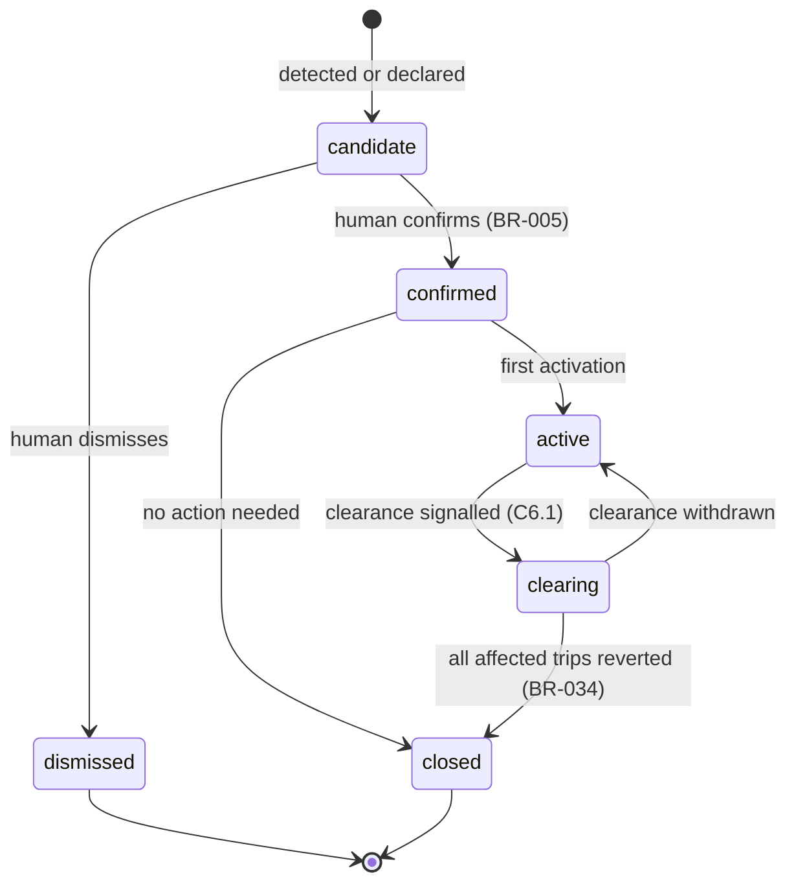

# Logical Data Model

| | |
|---|---|
| **Phase** | C — Data Architecture |
| **Document version** | 1.0 |
| **Status** | Baseline |

---

## 1. Conventions

Technology-neutral. Types are logical, not physical.

| Type | Meaning |
|---|---|
| `id` | Opaque, immutable, globally unique identifier |
| `ref(E)` | Reference to entity E by `id` |
| `ts` | Instant in UTC |
| `geo.point` / `geo.line` / `geo.area` | Geometry in a single stated reference system |
| `enum{…}` | Closed set |
| `?` | Optional |

**Immutable** entities are created once and never modified. **Versioned** entities are replaced by new versions. **Mutable** entities are updated in place, and each update also emits an audit event.

Only attributes that carry architectural meaning are listed. Physical design in Stage Two will add more.

---

## 2. DD-1 Network — sourced

| Entity | Key attributes |
|---|---|
| **Route** | `id`, `public_code`, `name` |
| **Pattern** | `id`, `route: ref(Route)`, `direction`, `path: geo.line`, `network_version` |
| **PatternStop** | `pattern: ref(Pattern)`, `sequence: int`, `stop: ref(Stop)`, `timing_point: bool` |
| **Stop** | `id`, `code`, `name`, `location: geo.point`, `criticality?: enum{…}` |
| **RoadSegment** | `id`, `geometry: geo.line`, `from_node`, `to_node`, `length_m`, `base_speed` |
| **VehicleConstraint** | `segment: ref(RoadSegment)`, `constraint_type: enum{height, weight, length, turn_ban, bus_gate, no_bus}`, `value?`, `source: enum{open_data, operator}` |

> `Stop.criticality` is **reserved and unpopulated**. [P-7](../../methodology/architecture-principles.md#p-7--stop-skipping-is-not-neutral) requires it; no data exists to fill it ([A-010](../../../02-stage-two-reference-implementation/assumptions.md#a-010)). It is present so that the optimisation interface already accepts it, and so its absence is visible in every query rather than invisible in the schema.
>
> `VehicleConstraint.source` distinguishes open-data constraints from operator-supplied ones. The operator set is the one that makes feasibility trustworthy (see [data domains §3](data-domains.md#sourced-domains--routeshield-is-a-reader)); tagging provenance lets a recommendation say which kind it relied on.

## 3. DD-2 Fleet Operations — sourced

| Entity | Key attributes |
|---|---|
| **Vehicle** | `id`, `fleet_number`, `vehicle_class` |
| **Trip** | `id`, `pattern: ref(Pattern)`, `service_date`, `scheduled_start: ts` |
| **TripAssignment** | `trip: ref(Trip)`, `vehicle: ref(Vehicle)`, `duty_ref`, `valid_from: ts` |
| **Position** | `vehicle: ref(Vehicle)`, `observed_at: ts`, `location: geo.point`, `heading?`, `speed?` |

> `duty_ref` is an opaque reference to a crew duty held by the fleet system. RouteShield never resolves it to a person. That resolution happens outside RouteShield, by a human, when needed — which is what makes the driver-analytics restriction structural ([BR-042](../../phase-b-business-architecture/business-requirements.md#accountability-and-learning)).

## 4. DD-3 Road Conditions — sourced

| Entity | Key attributes |
|---|---|
| **RoadConditionObservation** | `segment: ref(RoadSegment)`, `observed_at: ts`, `speed?`, `congestion?: enum{…}`, `closed?: bool`, `source` |
| **IncidentReport** | `id`, `received_at: ts`, `source`, `authority: enum{authoritative, inferred, declared}`, `location: geo.area`, `type?`, `raw_ref` |

## 5. DD-4 Disruption — owned, versioned

| Entity | Key attributes | Mutability |
|---|---|---|
| **Disruption** | `id`, `opened_at: ts`, `state: enum{candidate, confirmed, active, clearing, closed, dismissed}`, `current_version: ref(DisruptionVersion)` | Mutable state |
| **DisruptionVersion** | `id`, `disruption: ref(Disruption)`, `version: int`, `created_at: ts`, `type: enum{closure, protest, flood, collision, public_order, event, other}`, `footprint: geo.area`, `blocked_segments: set<ref(RoadSegment)>`, `window_start: ts`, `window_end_estimate?: ts`, `origin: enum{authoritative, inferred, declared}`, `source_reports: set<ref(IncidentReport)>` | Immutable |
| **Confirmation** | `disruption: ref(Disruption)`, `actor: ref(Actor)`, `at: ts`, `outcome: enum{confirmed, dismissed}` | Immutable |

**State machine**

`clearing → closed` requires **every** trip diverted for this disruption to have been reverted or explicitly retained by decision. That transition guard is where [BR-035](../../phase-b-business-architecture/business-requirements.md#closure) is enforced.

## 6. DD-5 Response — owned, immutable

| Entity | Key attributes |
|---|---|
| **ImpactAssessment** | `id`, `disruption_version: ref(DisruptionVersion)`, `snapshot: ref(InputSnapshot)`, `computed_at: ts`, `completeness: enum{full, partial}` |
| **AffectedTrip** | `assessment: ref(ImpactAssessment)`, `trip: ref(Trip)`, `vehicle?: ref(Vehicle)`, `relation: enum{approaching, within, past, unknown}`, `last_divert_point?: ref(Stop)` |
| **AffectedStop** | `affected_trip: ref(AffectedTrip)`, `stop: ref(Stop)`, `est_waiting?`, `est_onboard_alighting?` |
| **ResponseOption** | `id`, `affected_trip: ref(AffectedTrip)`, `kind: enum{reroute, hold, split, terminate}`, `new_sequence?: list<ref(Stop)>`, `path?: geo.line`, `contingency?: ref(ContingencyRoute)`, `feasibility: enum{verified_operator, verified_open, unverified}` |
| **OptionCost** | `option: ref(ResponseOption)`, `stops_lost: int`, `stops_covered_by_following: int`, `est_passengers_affected?`, `added_minutes`, `criticality_weighted_loss?` |
| **Recommendation** | `id`, `assessment: ref(ImpactAssessment)`, `issued_at: ts`, `ranked_options: list<ref(ResponseOption)>`, `rationale`, `autonomy_band: enum{A0, A1, A2}`, `confidence: ref(ConfidenceState)`, `assigned_to?: ref(Actor)` |
| **ConfidenceState** | `level: enum{high, reduced, low}`, `stale_sources: set<ref(Source)>`, `absent_sources: set<ref(Source)>`, `footprint_age_s`, `explanation` |

> `AffectedTrip.relation` includes `unknown`. When positions are unavailable ([BS-4](../../phase-b-business-architecture/business-scenarios.md#bs-4--telemetry-outage-during-a-disruption--degraded-operation)), the model must say so rather than guess `approaching`.
>
> `ImpactAssessment.completeness = partial` with an empty option list is a valid, useful result — [BR-011](../../phase-b-business-architecture/business-requirements.md#impact-assessment).
>
> `OptionCost.criticality_weighted_loss` is always null in Stage Two. It is carried so that the absence of equity weighting is visible on every recommendation rather than silently omitted.

## 7. DD-6 Decision — owned, immutable

| Entity | Key attributes |
|---|---|
| **Actor** | `id`, `role: enum{controller, duty_manager, contingency_approver, administrator}` |
| **AuthorityGrant** | `actor: ref(Actor)`, `scope`, `max_blast_radius`, `valid_from: ts`, `valid_to?: ts` |
| **Decision** | `id`, `recommendation: ref(Recommendation)`, `actor: ref(Actor)`, `decided_at: ts`, `outcome: enum{approve, modify, reject, escalate}`, `chosen_option?: ref(ResponseOption)`, `modification?`, `basis: enum{in_moment, contingency_approval}`, `contingency_approval?: ref(ContingencyApproval)`, `presented_at: ts`, `reason?` |
| **Activation** | `id`, `decision: ref(Decision)`, `kind: enum{divert, revert, retain}`, `activated_at: ts`, `revocable_until?: ts` |

> `Decision.presented_at` together with `decided_at` is the raw material for the rubber-stamping detector ([BR-024](../../phase-b-business-architecture/business-requirements.md#decision)). The interval between them, compared with the length of the rationale presented, is the evidence.
>
> `modify` requires `modification` to be non-empty and produces a new option record rather than altering the recommended one. What was recommended and what was chosen must remain separately recoverable ([data domains §4.1](data-domains.md#41-response-is-separate-from-decision)).

## 8. DD-7 Service State — owned, mutable

| Entity | Key attributes |
|---|---|
| **ServiceState** | `trip: ref(Trip)`, `current_sequence: list<ref(Stop)>`, `deviates_from_plan: bool`, `governing_activation?: ref(Activation)`, `since: ts` |

## 9. DD-8 Communication — owned

| Entity | Key attributes | Mutability |
|---|---|---|
| **DriverInstruction** | `id`, `activation: ref(Activation)`, `vehicle: ref(Vehicle)`, `duty_ref`, `sequence: list<ref(Stop)>`, `respond_by: ts` | Immutable |
| **DriverResponse** | `instruction: ref(DriverInstruction)`, `at: ts`, `kind: enum{acknowledged, refused, no_response}`, `refusal_reason?: enum{infeasible, unsafe, obstructed, other}`, `note?` | Immutable |
| **PassengerNotice** | `id`, `activation: ref(Activation)`, `stop: ref(Stop)`, `effect: enum{not_served, served_elsewhere, delayed, resumed}`, `alternative?`, `published_at: ts`, `withdrawn_at?: ts` | Withdrawal only |

> `DriverResponse.kind = no_response` is generated when `respond_by` passes. Silence is recorded, not assumed to be acceptance.
>
> `PassengerNotice` targets a **stop**, never a person. That keeps the notice model outside personal-data scope ([objectives §OBJ-4](../../phase-a-architecture-vision/objectives.md#obj-4--inform-affected-passengers-while-their-alternatives-still-exist)).

## 10. DD-9 Contingency — owned, versioned

| Entity | Key attributes |
|---|---|
| **ContingencyRoute** | `id`, `version`, `pattern: ref(Pattern)`, `corridor: geo.area`, `sequence: list<ref(Stop)>`, `network_version`, `origin: enum{authored, proposed_from_analytics}` |
| **ContingencyApproval** | `id`, `route: ref(ContingencyRoute)`, `approver: ref(Actor)`, `approved_at: ts`, `expires_at: ts`, `applies_to_types: set<enum>`, `max_footprint: geo.area`, `max_blast_radius: int`, `min_confidence`, `revoked_at?: ts` |

> `network_version` on the route and on the pattern makes [autonomy §5](../../phase-b-business-architecture/autonomy-model.md#5-governing-the-contingency-library)'s "re-approval on change" mechanically checkable: if the pattern's network version differs from the one the route was built against, the approval does not apply.
>
> `expires_at` is mandatory. There is no representation of a permanent approval.

## 11. DD-10 Source Health — owned, time-series

| Entity | Key attributes |
|---|---|
| **Source** | `id`, `name`, `domain: enum{DD-1, DD-2, DD-3}`, `mandatory: bool`, `expected_interval_s` |
| **SourceHealth** | `source: ref(Source)`, `at: ts`, `status: enum{healthy, stale, absent, inconsistent}`, `last_data_at?: ts` |

> Exactly one source has `mandatory = true`: the control-room declaration channel ([BR-002](../../phase-b-business-architecture/business-requirements.md#disruption-awareness)).

## 12. DD-11 Audit — append-only

| Entity | Key attributes |
|---|---|
| **InputSnapshot** | `id`, `taken_at: ts`, `network_version`, `positions`, `assignments`, `road_conditions`, `source_health`, `content_hash` |
| **AuditEvent** | `id`, `seq: int`, `at: ts`, `type`, `subject: ref(any)`, `actor?: ref(Actor)`, `snapshot?: ref(InputSnapshot)`, `payload`, `prev_hash`, `hash` |

> `InputSnapshot` holds **copies** of the sourced records, scoped to the disruption's area, not references to them. That is the core of [ADR-0004](../../../05-architecture-decisions/adr-0004-decisions-reference-immutable-input-snapshots.md).
>
> `prev_hash` / `hash` chain audit events so that tampering or deletion is detectable. Append-only by policy is not sufficient on its own; a chain makes a violation *evident* rather than merely prohibited.
>
> Neither entity has any attribute capable of holding a driver's identity.

## 13. DD-12 Service Analytics — derived

| Entity | Key attributes |
|---|---|
| **DisruptionOutcome** | `disruption`, `duration`, `trips_affected`, `stops_lost`, `stops_covered`, `time_to_first_decision`, `time_to_reversion` |
| **CorridorRecurrence** | `corridor: geo.area`, `disruption_type`, `occurrences`, `period` |
| **DecisionPattern** | `band`, `outcome`, `median_deliberation_s`, `refusal_rate` — **aggregated per corridor and period only** |

## 14. Invariants

The rules that must hold across the model regardless of implementation. Each maps to a requirement and will map to a test.

| # | Invariant | Source |
|---|---|---|
| **INV-01** | No `AuditEvent` or `InputSnapshot` is ever modified or removed | BR-036, P-2 |
| **INV-02** | `Recommendation`, `ResponseOption`, `Decision`, `DisruptionVersion` are never modified after creation | BR-021, BR-038 |
| **INV-03** | Every `ImpactAssessment` references exactly one `DisruptionVersion` and one `InputSnapshot` | BR-037 |
| **INV-04** | A `Disruption` in state `candidate` has no `ImpactAssessment` with a non-A0 recommendation | BR-005 |
| **INV-05** | A `Decision` with `basis = in_moment` and `outcome ∈ {approve, modify}` has an actor holding a valid `AuthorityGrant` covering its blast radius at `decided_at` | BR-020, BR-022 |
| **INV-06** | A `Decision` with `basis = contingency_approval` references an unexpired, unrevoked `ContingencyApproval` whose conditions all hold, and a controller was on duty | BR-025, autonomy §3 |
| **INV-07** | Every `ServiceState` with `deviates_from_plan = true` references an `Activation` whose decision's disruption is not `closed` | BR-035 |
| **INV-08** | A `Disruption` moves to `closed` only when no `ServiceState` references an activation of it, except where a `retain` activation exists | BR-034, BR-035 |
| **INV-09** | A `refused` `DriverResponse` produces a new pending `Recommendation` or `Decision` for that trip | BR-028 |
| **INV-10** | Pending recommendations assigned to one actor never exceed that actor's configured bound | BR-023 |
| **INV-11** | A `Recommendation` with `autonomy_band = A2` has `confidence.level = high` | BR-046 |
| **INV-12** | No entity in DD-11 or DD-12 contains an attribute resolving to an individual driver | BR-042 |
| **INV-13** | Every `PassengerNotice` of `not_served` is followed by a `resumed` notice or a withdrawal when its trip's `ServiceState` returns to plan | BR-034 |

INV-07 and INV-08 together are the enforcement of "a diversion does not outlive its reason". INV-12 is tested by inspecting the schema, not the data — the guarantee is that the attribute cannot exist, not that it happens to be empty.
