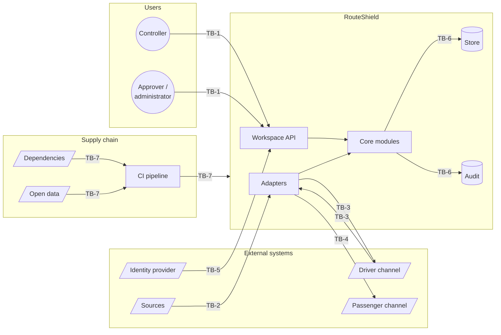

# Security Architecture

| | |
|---|---|
| **Phase** | D — Technology Architecture |
| **Document version** | 1.0 |
| **Status** | Baseline |

---

## 1. What is being protected

In order of consequence:

| # | Asset | Why it matters |
|---|---|---|
| 1 | **Integrity of service changes** | A forged or altered decision diverts real buses and strands real passengers. |
| 2 | **Integrity of the audit record** | If it can be altered, nothing that happened can be shown to have happened ([P-2](../../methodology/architecture-principles.md#p-2--every-decision-is-auditable)). |
| 3 | **Availability of the decision path** | The system is needed when the network is disrupted, which is when load is highest. |
| 4 | **Integrity of inputs** | A false incident report or spoofed position produces a wrong recommendation that looks right. |
| 5 | **Confidentiality of SEC and LINK data** | Incident-scene detail and anything that can be resolved to a person ([data flows §1](../phase-c-information-systems/data-architecture/data-flows.md#1-classification-scheme)). |
| 6 | **Integrity of passenger information** | A forged notice sends people away from a stop that is being served. |

Confidentiality ranks low because RouteShield holds little that is secret. Integrity dominates: the characteristic attack on this system is not theft but **causing it to do the wrong thing convincingly**.

## 2. Trust boundaries

Derived from the Phase C [landscape](../phase-c-information-systems/application-architecture/application-components.md#3-landscape) and [integration architecture](../phase-c-information-systems/application-architecture/integration-architecture.md).

| ID | Boundary | Crosses | Main threat |
|---|---|---|---|
| **TB-1** | Human → workspace | Commands from people | Unauthorised or impersonated decisions |
| **TB-2** | Sources → adapters | Positions, conditions, incidents | Spoofed or malformed input |
| **TB-3** | Driver channel ↔ adapters | Instructions out, responses in | Forged acknowledgement or refusal; instruction tampering |
| **TB-4** | Adapters → passenger channel | Public notices | Forged or suppressed notices |
| **TB-5** | Identity provider → workspace | Identity and role claims | Token forgery, role escalation |
| **TB-6** | Core → stores | All state | Direct modification bypassing module rules; audit tampering |
| **TB-7** | Supply chain → build → runtime | Code, dependencies, data | Compromised dependency or dataset |

## 3. Controls by boundary

### TB-1 · Human to workspace

| Control | Detail |
|---|---|
| Authentication | OIDC with MFA, from the operator's identity provider |
| Authorisation | Role plus **authority grant checked at decision time** ([INV-05](../phase-c-information-systems/data-architecture/logical-data-model.md#14-invariants)) — not at login, not at presentation |
| Session | Short-lived access tokens; re-authentication for approving contingency routes and changing grants |
| Separation of duties | The person who authors a contingency route cannot approve it; the person who holds the approver role cannot change autonomy thresholds ([autonomy §6](../../phase-b-business-architecture/autonomy-model.md#6-what-is-never-automatic)) |
| Request integrity | Idempotency keys; `presented_at` required on decisions; decisions on superseded recommendations rejected as `stale` |
| Transport | TLS only |

### TB-2 · Sources to adapters

| Control | Detail |
|---|---|
| Source authentication | Mutual TLS or signed feeds, per source |
| Authority by channel | A report is `authoritative` only if it arrived on a source configured as authoritative — never because it says so ([integration §4](../phase-c-information-systems/application-architecture/integration-architecture.md#4-anti-corruption)) |
| Schema validation | Malformed messages rejected at the edge, counted, never cached |
| Plausibility checks | Positions that jump impossibly, conditions contradicting other sources → `inconsistent` in DD-10, lowering confidence |
| Human confirmation | No detected disruption produces a service change without confirmation ([BR-005](../../phase-b-business-architecture/business-requirements.md#disruption-awareness)) — the strongest control against spoofed incidents |

That last row is worth stating plainly: **the human confirmation step is a security control**, not only a quality one. An attacker who can inject incident reports can make RouteShield raise candidates; they cannot make it divert buses.

### TB-3 · Driver channel

| Control | Detail |
|---|---|
| Message integrity | Instructions signed by the core; responses bound to instruction id and vehicle |
| Replay protection | Responses accepted once, before `respond_by` |
| Silence is not consent | `no_response` recorded; activation not assumed ([INV-09](../phase-c-information-systems/data-architecture/logical-data-model.md#14-invariants)) |

The driver channel is the least standardised interface and the one whose real security properties are least knowable ([A-005](../../../02-stage-two-reference-implementation/assumptions.md#a-005)).

### TB-4 · Passenger channel

| Control | Detail |
|---|---|
| Publication authority | Only AC-09, only for an existing activation |
| No cause detail | SEC data never published ([FR-D6](../phase-c-information-systems/data-architecture/data-flows.md#5-flow-rules)) |
| Output encoding | Notice text is templated, not free-form |

### TB-5 · Identity provider

| Control | Detail |
|---|---|
| Token validation | Signature, issuer, audience, expiry |
| Role mapping | Configuration in AC-14, not trust in claims |
| IdP outage | Existing sessions continue to expiry; declaration remains possible for authenticated controllers ([integration §5](../phase-c-information-systems/application-architecture/integration-architecture.md#5-failure-handling-at-the-boundary)) |

### TB-6 · Core to stores

| Control | Detail |
|---|---|
| Least privilege | One database credential per module, with rights only on its own schema |
| Audit append-only | Audit credential: insert and select only; no role in the application can update or delete |
| Tamper evidence | Hash-chained audit events; periodic chain verification; verification failure is an alert |
| Separate administration | Audit store administrators are not application or control-room staff ([governance §4](../phase-c-information-systems/data-architecture/data-lifecycle-and-governance.md#4-governance-roles)) |
| Encryption at rest | All stores and backups |

### TB-7 · Supply chain

| Control | Detail |
|---|---|
| Dependency pinning | Lock files committed; builds reproducible |
| Dependency scanning | Known-vulnerability scanning on every pull request |
| Static analysis | Code scanning on every pull request |
| Secret scanning | On every push |
| Data provenance | Open datasets fetched from their publisher over HTTPS; checksum and fetch date recorded in the build output |
| CI permissions | Least-privilege workflow tokens; deployment only from `main` |

## 4. Threat model

STRIDE, applied to the assets in §1. Only threats with a specific design response are listed.

| # | Threat | Category | Boundary | Response |
|---|---|---|---|---|
| **T-01** | Attacker injects a fake incident to trigger diversions | Spoofing | TB-2 | Authority by channel; human confirmation (BR-005) |
| **T-02** | Insider approves a harmful diversion | Elevation / Repudiation | TB-1 | Authority at decision time; attribution; audit; blast-radius limits on grants |
| **T-03** | Approver quietly broadens a contingency route so A2 fires more | Tampering | TB-1 | Separation of duties; expiry; usage review ([autonomy §5](../../phase-b-business-architecture/autonomy-model.md#5-governing-the-contingency-library)) |
| **T-04** | Someone alters the record of a decision afterwards | Tampering / Repudiation | TB-6 | Append-only permission; hash chain; separate custodian |
| **T-05** | Forged driver acknowledgement hides a refusal | Spoofing | TB-3 | Signed, bound, single-use responses |
| **T-06** | Forged passenger notice sends people away | Spoofing | TB-4 | Publication only for an existing activation |
| **T-07** | Flooding sources or the workspace during a disruption | Denial of service | TB-2, TB-1 | Rate limits at adapters; cache decouples decision path from sources; manual fallback |
| **T-08** | Spoofed positions make vehicles appear past a closure | Tampering | TB-2 | Plausibility checks; `inconsistent` lowers confidence; A2 disabled under low confidence |
| **T-09** | Incident-scene detail leaks through notices or exports | Information disclosure | TB-4, F9 | FR-D6; export scope rules |
| **T-10** | Analytics used to profile drivers | Information disclosure | TB-6 | Driver identity never in audit; analytics reads only audit ([BR-042](../../phase-b-business-architecture/business-requirements.md#accountability-and-learning)) |
| **T-11** | Compromised dependency alters recommendation logic | Tampering | TB-7 | Pinning, scanning, review; determinism allows replay comparison against known snapshots |
| **T-12** | Automation widens its own autonomy | Elevation | Internal | Thresholds changeable only by a human role distinct from approvers |

**T-01 and T-12 are the architecture's two most important threats.** T-01 because injecting false incidents is cheap and the consequence is physical. T-12 because it is not an attack at all — it is how a system drifts, one reasonable change at a time, into acting without people.

**T-11 has an unusual defence.** Because assessment is a pure function of a stored snapshot ([ADR-0004](../../../05-architecture-decisions/adr-0004-decisions-reference-immutable-input-snapshots.md)), a new build can be replayed against past snapshots and its recommendations compared with the recorded ones. Unexplained differences are a signal.

## 5. Secrets management

| Rule | |
|---|---|
| No secret in source control | Enforced by secret scanning |
| Configuration via environment | Every setting documented in `.env.example` with placeholders |
| Runtime secrets from a secret store | Operator profile: platform secret manager; never baked into images |
| Rotation | Source credentials and signing keys rotatable without redeploy |
| **Reference profile holds no secrets** | Everything is public and static. A secret in a browser bundle is not a secret. |

## 6. Reference profile — what is real and what is not

| Control | Status in the demonstrator |
|---|---|
| Authority check at decision time | **Real** logic, over simulated identities |
| Separation of duties rules | **Real** logic |
| Human confirmation gate | **Real** |
| Authority by channel | **Real** — simulators are configured sources |
| Schema validation at adapters | **Real** |
| Hash-chained audit and verification | **Real** |
| Append-only at permission level | **Not possible** — visitor controls local storage |
| Authentication | **Simulated** ([ADR-0012](../../../05-architecture-decisions/adr-0012-simulated-identity-in-demonstrator.md)) |
| TLS | Provided by the static host |
| Supply-chain controls | **Real**, in CI |
| Content Security Policy | **Real** — no third-party scripts at runtime |

The demonstrator cannot prove the operator profile secure. It can prove that the controls expressed as logic behave as designed, and CI can prove the supply-chain controls run.

## 7. Exit condition

| Check | |
|---|---|
| Every trust boundary identified from Phase C has controls | ✅ TB-1 → TB-7 |
| Every high-value asset has a threat with a response | ✅ Assets 1–6 → T-01 → T-12 |
