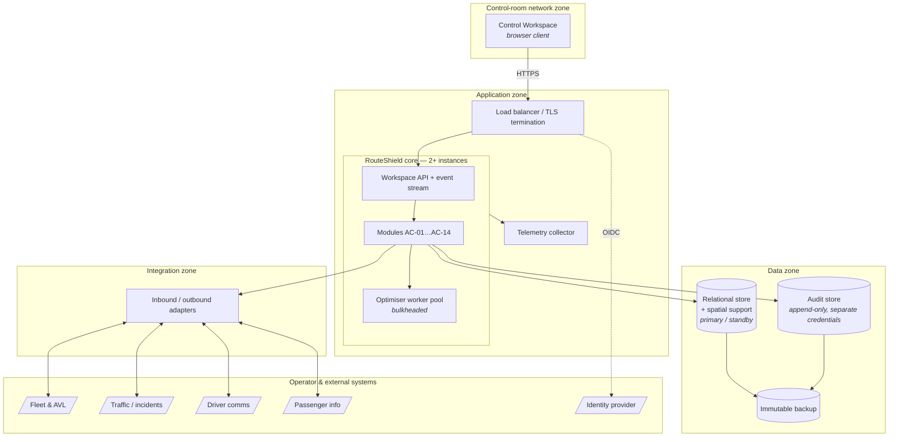
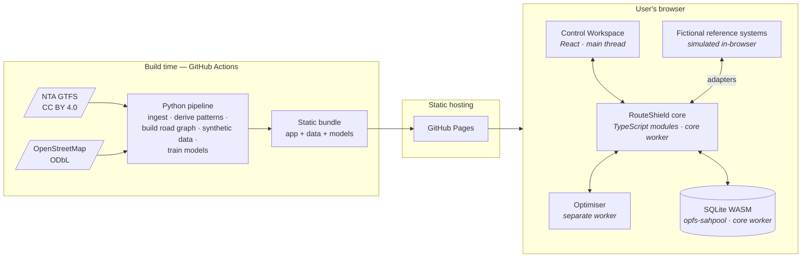

# Technology Architecture

| | |
|---|---|
| **Phase** | D — Technology Architecture |
| **Document version** | 1.0 |
| **Status** | Baseline |

---

## 1. Two deployment profiles

Stage One commits to no vendor. Phase D still has to say what the system runs on, and it has two honest answers, because there are two very different environments:

| | **Operator profile** | **Reference profile** |
|---|---|---|
| **What it is** | The technology architecture an operator would deploy | What this project actually builds and hosts |
| **Constraints** | Availability, security, integration with real systems | Zero cost ([C-2](../../00-project/project-charter.md#7-constraints)); one author; no real systems |
| **Specified as** | Technology categories and required properties | Named technologies, each chosen by ADR |
| **Stage** | Stage One | Stage Two |

The two profiles run **the same core** — the modular monolith of [ADR-0006](../../../05-architecture-decisions/adr-0006-modular-monolith-with-ports-and-adapters.md) — with different adapters and a different runtime host. Where the reference profile cannot provide something the operator profile requires, the gap is listed in §6 rather than removed from the operator profile.

> Keeping the operator profile intact while building the reference profile is [P-11](../../methodology/architecture-principles.md#p-11--architecture-changes-before-implementation-does) applied to infrastructure: the demonstrator's limits do not get to redefine the architecture.

## 2. Operator profile

### 2.1 Runtime

| Element | Required properties |
|---|---|
| **Core** | Stateless between requests; two or more instances; any instance can serve any request. Module state lives in the store. |
| **Leader for scheduled work** | Outbox publishing, clearance polling and deadline timers run on one instance at a time, via a store-backed lease. |
| **Optimiser pool** | Separate thread/process pool with CPU and memory caps and a per-job time budget ([ADR-0006](../../../05-architecture-decisions/adr-0006-modular-monolith-with-ports-and-adapters.md)). |
| **Relational store** | ACID transactions; spatial types and indexes; synchronous standby. Per-module schemas with per-module credentials. |
| **Audit store** | Append-only at the permission level — the application credential has insert and select only. Separate from the relational store's administrators. |
| **Backup** | Immutable (write-once) retention for the audit store; point-in-time recovery for the relational store. |
| **Event stream to workspace** | Server-push over HTTPS. |

### 2.2 Why not more

No message broker (ADR-0007), no cache tier (the sourced-data cache is a table), no service mesh, no container orchestrator required. Two application instances behind a load balancer and a replicated database meet the availability target below. Each additional component would be one more thing that can fail during a disruption — which is when load, and therefore failure probability, peaks ([P-10](../../methodology/architecture-principles.md#p-10--no-unnecessary-infrastructure)).

### 2.3 Availability

| Target | Value | Reasoning |
|---|---|---|
| Service availability | 99.9% monthly, measured during service hours | ~40 minutes a month. Beyond this, cost rises steeply and the manual fallback covers the gap. |
| Recovery time | ≤ 5 minutes | Instances are stateless; failover is to the standby store. |
| Recovery point | 0 for audit and decisions | Synchronous standby. A lost decision record defeats [P-2](../../methodology/architecture-principles.md#p-2--every-decision-is-auditable). |
| Recovery point | ≤ 1 minute for sourced cache | Re-ingested from sources on recovery. |

These are **design targets**, not commitments; none can be validated here.

### 2.4 Network

| Zone | Contains | Inbound from | Outbound to |
|---|---|---|---|
| Control-room | Workspace clients | — | Application zone (HTTPS) |
| Application | Core, load balancer, collector | Control-room | Data, integration, identity |
| Data | Stores, backups | Application only | Backup target |
| Integration | Adapters | Operator systems (where push) | Operator systems |

Only the application zone reaches the data zone. Adapters in the integration zone call the core's inbound ports; they do not touch the database.

## 3. Reference profile

### 3.1 Shape

Everything runs in the visitor's browser. The fictional reference systems — fleet, GPS, traffic, incidents, driver and passenger channels — are simulators behind the same ports an operator's systems would use.

| Element | Technology | Decision |
|---|---|---|
| Hosting | GitHub Pages (static) | [ADR-0008](../../../05-architecture-decisions/adr-0008-browser-hosted-static-demonstrator.md) |
| Core and UI language | TypeScript | [ADR-0009](../../../05-architecture-decisions/adr-0009-typescript-core-python-build-pipeline.md) |
| Build pipeline language | Python | [ADR-0009](../../../05-architecture-decisions/adr-0009-typescript-core-python-build-pipeline.md) |
| Store | SQLite (official WASM build), `opfs-sahpool` persistence, inside the core worker | [ADR-0010](../../../05-architecture-decisions/adr-0010-sqlite-wasm-as-embedded-store.md) |
| Network data | NTA GTFS + OpenStreetMap, processed at build time | [ADR-0011](../../../05-architecture-decisions/adr-0011-open-network-data-via-build-time-pipeline.md) |
| Identity | Simulated, clearly labelled | [ADR-0012](../../../05-architecture-decisions/adr-0012-simulated-identity-in-demonstrator.md) |
| Optimiser isolation | Web Worker with a time budget | ADR-0006, realised in-browser |
| Telemetry | In-browser, OpenTelemetry-shaped | [ADR-0013](../../../05-architecture-decisions/adr-0013-otel-shaped-telemetry-without-a-backend.md) |

### 3.2 Why the core survives the move to the browser

Nothing in Phase C assumed a server:

- The **modular monolith** is one bundle.
- **Synchronous audit** (FR-D3) is a single SQLite transaction.
- The **outbox** is a table; in-process events are in-page events.
- **Bulkheading** of the optimiser maps onto a Web Worker, which has its own thread and can be terminated when it exceeds its budget — a stronger isolation than a thread pool.
- **Ports and adapters** mean simulators and real systems are interchangeable.

That the Phase C architecture needed no change to run here is modest evidence that it was drawn at the right level.

### 3.3 Local development

| Need | Provision |
|---|---|
| Run the app | `npm` dev server |
| Run core tests | Node, with the core's storage port bound to Node's built-in SQLite |
| Run the pipeline | Python virtual environment, or the provided container |
| Reproduce CI | Container image with pinned Python and Node versions |

Docker is used for **reproducible tooling**, not for hosting.

## 4. Technology decisions by requirement

[P-10](../../methodology/architecture-principles.md#p-10--no-unnecessary-infrastructure) requires every technology to name what demands it.

| Technology | Required by |
|---|---|
| Transactional store | FR-D3, INV-01…INV-13 |
| Spatial capability | BR-006 → BR-008 (intersection of footprint with patterns) |
| Isolated worker for optimisation | BR-011, BR-045 |
| Server-push to workspace | BR-023 (queue), OBJ-1 (latency) |
| Append-only audit | BR-036, P-2 |
| Identity provider (operator) | BR-020, BR-022 |
| Build-time pipeline | ADR-0004 determinism; C-2 (no runtime server) |

## 5. Capacity assumptions

| Quantity | Design value | Basis |
|---|---|---|
| Stops | ~5,000 | Order of magnitude of a large city bus network |
| Patterns | ~1,000 | Several per route |
| Active vehicles at peak | ~1,000 | Order of magnitude |
| Concurrent controllers | 1–5 | [A-006](../../../02-stage-two-reference-implementation/assumptions.md#a-006) |
| Concurrent disruptions | ≤ 10 | [BS-5](../../phase-b-business-architecture/business-scenarios.md#bs-5--six-simultaneous-disruptions--the-load-case) with margin |
| Affected routes per assessment | ≤ 20 | [OBJ-2](../../phase-a-architecture-vision/objectives.md#obj-2--assess-impact-across-all-affected-services-concurrently) |

These are orders of magnitude, not measurements of any operator. The real Dublin network figures will be measured from the GTFS feed in Stage Two and recorded as facts with their source.

## 6. What the reference profile cannot provide

| Operator requirement | Reference profile | Consequence |
|---|---|---|
| Multi-user, shared state | Single browser, single user | Concurrency, escalation between people and queue bounding across controllers are simulated, not exercised |
| Real authentication | Simulated identity | Authority checks are real logic over fictional identities |
| Append-only at the permission level | Application-enforced only | The visitor owns the browser storage and can delete it; the hash chain makes tampering *evident*, not impossible |
| 99.9% availability, standby, backup | None | Not applicable to a demonstrator |
| Network zoning | None | Documented only |
| Server-side telemetry | In-browser only | Dashboards show the visitor's session only |
| Real integration | Simulators | The adapter boundary is real; what is behind it is not |

Each row is a limitation stated in the README, not an omission.
