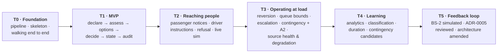

# MVP and Transition Architectures

| | |
|---|---|
| **Phase** | E — Opportunities & Solutions |
| **Document version** | 1.0 |
| **Status** | Baseline |

---

## 1. The MVP

### Business outcome

> **A controller can go from a declared disruption to an approved, recorded and reconstructable diversion, with the affected services and the cost of each option in front of them.**

That is a complete outcome for the controller (S-05), the duty manager (S-06) and anyone who later asks why (S-08, S-09). It is not a technical layer. It spans every layer thinly ([P-9](../../methodology/architecture-principles.md#p-9--build-the-smallest-thing-that-delivers-an-outcome)).

### Scope

The eight steps set for the MVP, mapped to what realises them:

| # | Step | Components | Requirements | Scenario |
|---|---|---|---|---|
| 1 | A disruption is created | AC-02, AC-13 | BR-002, BR-004, BR-005 | BS-1 |
| 2 | Affected routes, stops and vehicles are identified | AC-11 (snapshot), AC-04 | BR-006 → BR-009, BR-011 | BS-1 |
| 3 | Alternative routes are calculated | AC-05 | BR-012, BR-013, BR-018 | BS-1 |
| 4 | Alternatives are ranked | AC-05, AC-06 | BR-015, BR-019 | BS-1 |
| 5 | Stop loss is minimised | AC-05 | BR-015, BR-014 *(following-service coverage)* | BS-1 |
| 6 | A controller approves or rejects | AC-07, AC-13, AC-14 | BR-020, BR-021 | BS-1 |
| 7 | Route state is updated | AC-08 | BR-031 | BS-1 |
| 8 | The decision is logged for audit | AC-11 | BR-036 → BR-038 | BS-1 |

**Data:** real Dublin network (NTA GTFS + OSM). Synthetic, seeded vehicle positions and assignments generated once per scenario — not a moving simulation yet.

**Identity:** two personas — controller and duty manager — with real authority checks.

### Deliberately not in the MVP

| Excluded | Consequence | Arrives in |
|---|---|---|
| Driver instructions and refusal | Decisions change service state but reach no driver | T2 |
| Passenger notices | **BO-2 is not delivered by the MVP** | T2 |
| Live GPS and traffic simulation | Snapshots are of a static scene | T2 |
| Reversion | Disruptions are closed manually | T3 |
| Queue bounding, escalation | One controller, one disruption | T3 |
| Contingency library, A2 | Every decision is A1 | T3 |
| ML | Type is declared by the controller | T4 |

### The tension this MVP carries

The MVP delivers nothing to passengers. Phase A put passengers' interests second among the business outcomes *because* they are the stakeholders nothing else in the structure will carry, and the implementation-opportunity analysis ranked stop-level notices ahead of ranked options ([building blocks §3](building-blocks-and-candidates.md#3-implementation-opportunities)).

The MVP as scoped leads with routing anyway. It is kept, because it is the scope set for the project and because routing is the part whose feasibility is least certain — de-risking it early is legitimate. But the tension is recorded rather than smoothed over, and T2 brings passenger notices forward as its first deliverable.

**Recommendation for a real operator:** swap them. Ship impact view, decision record and stop-level notices first; add ranked options second. That order delivers more value sooner to the people with least say.

### MVP exit criteria

- BS-1 runs end to end from a clean checkout, reproducibly from its seed.
- Every step writes its audit event in the same transaction as its change.
- A decision can be reconstructed from the record alone, including source health at the time.
- An optimiser failure still leaves the impact view presented (BR-011).
- A persona without authority cannot approve.

## 2. Transition architectures

Each transition is coherent and demonstrable on its own. Each adds a complete business outcome, not a layer.

| | Transition | Business outcome added | Capabilities added | Scenarios passing |
|---|---|---|---|---|
| **T0** | Foundation | None yet — a thin end-to-end path proving the toolchain | Network model; skeleton of every core module | — |
| **T1** | MVP | Accountable, explained diversion decisions (BO-3, part of BO-1) | C1.1, C1.3, C1.4, C2.1–C2.3, C3.1–C3.4, C4.1, C4.2, C5.4, C7.1, C7.2 | BS-1 (to decision) |
| **T2** | Reaching people | Passengers and drivers informed (BO-2, BO-1) | C5.1, C5.2, C5.3, C2.4, C8.1 | BS-1 (full), BS-6 |
| **T3** | Operating at load | Safe under load and degradation; diversions end (BO-1) | C4.3, C4.4, C6.1–C6.3, C3.5, C8.2, C8.3 | BS-3, BS-4, BS-5, BS-7 |
| **T4** | Learning | Disruptions improve future response (BO-4) | C1.2, C7.3, C7.4, duration estimate | — |
| **T5** | Feedback loop | The architecture corrected by evidence (charter O-5) | Whatever ADR-0005's review decides | BS-2 |

T5 is placed last deliberately: the moving-disruption scenario needs live simulation (T2), confidence decay (T3), and enough of the system working that its failure is informative rather than incidental.

All seven scenarios pass by the end of T5. BS-7 (manual fallback) passes in the only sense available to a demonstrator: the system presents a clear unavailable state and the documented manual procedure.

## 3. Exit condition

| Check | |
|---|---|
| The MVP delivers a complete business outcome rather than a complete technical layer | ✅ Controller-to-recorded-decision, spanning every layer thinly |
| Every transition is coherent and adds an outcome | ✅ T1 → T5 |
| Every capability is delivered by some transition | ✅ All 32 by T4; C8.4 is organisational |
