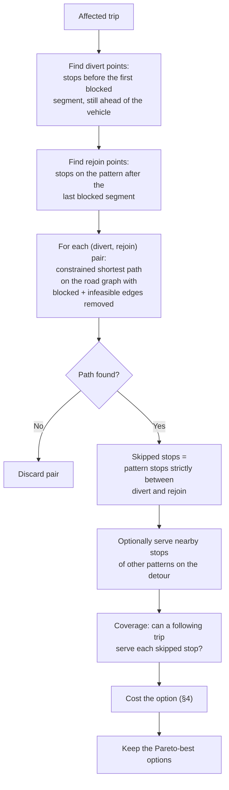

# Routing and Optimisation Design

| | |
|---|---|
| **Phase** | E — Opportunities & Solutions |
| **Document version** | 1.0 |
| **Status** | Baseline |

---

## 1. The problem, stated precisely

For each affected trip, find the response that loses the least service, where:

- the vehicle is at a known (or estimated) position on its pattern;
- a set of road segments is blocked;
- the vehicle must stay on roads it can physically use;
- a response is one of **reroute**, **hold**, **split** or **terminate** ([BR-018](../phase-b-business-architecture/business-requirements.md#response-options));
- "least service lost" is defined by the objective in §4, not by travel time ([P-6](../methodology/architecture-principles.md#p-6--minimise-service-loss-not-travel-time)).

This is not shortest path. Shortest path is a subroutine.

## 2. Generating reroute options



### Why divert/rejoin enumeration

A bus route is a sequence. The meaningful choices are **where to leave the pattern and where to return to it**. Enumerating those pairs converts the service question into a small number of shortest-path queries whose results map directly onto stops lost. Divert points close to the blockage lose fewer stops; rejoin points close to the blockage lose fewer stops; the path between them determines feasibility and added time.

Bounding the enumeration keeps it cheap: typically the last three stops before the blockage and the first three after, giving at most nine shortest-path queries per trip. Trips on the same pattern and direction share results.

### Constrained shortest path

- **Graph:** OSM-derived road graph, directed, edge weight = expected traversal time.
- **Removed edges:** blocked segments from the disruption footprint; edges violating a vehicle constraint (height, weight, length, bus ban).
- **Turn restrictions:** applied where known.
- **Algorithm:** A* with a straight-line-time heuristic ([ADR-0014](../../05-architecture-decisions/adr-0014-constrained-shortest-path-with-rejoin-enumeration.md)).
- **Feasibility tag:** `verified_open` when only open constraints were checked; `verified_operator` when operator constraint data covered every edge; `unverified` otherwise. The reference profile never reaches `verified_operator`.

## 3. Non-reroute options

| Option | When generated | What it costs |
|---|---|---|
| **Hold** | Always, when the disruption has an estimated end | Every remaining stop delayed by expected remaining duration |
| **Split** | Pattern crosses the blockage and has stops on both sides worth serving | Stops in the blocked section lost; trip continues as two short workings — requires a second vehicle or a turnaround point |
| **Terminate** | Always | Every remaining stop lost unless covered by a following service |

Hold and terminate are always generated so that a reroute is always compared with the do-less alternatives. A reroute that loses more than holding for ten minutes should say so.

## 4. The objective

Each option is costed on explicit terms, then scored. The terms are shown to the controller individually; the score only orders them.

| Term | Meaning |
|---|---|
| `L_u` | Stops lost and **not** covered by a following service within the coverage window |
| `L_c` | Stops lost but covered |
| `P` | Estimated passengers affected (waiting at lost stops + alighting at lost stops) |
| `D` | Delay imposed on stops still served, in passenger-minutes |
| `T` | Added vehicle minutes |
| `K` | Criticality-weighted loss — **always null**; see below |

Score, lower is better:

```
score = w_u·L_u + w_c·L_c + w_p·P + w_d·D + w_t·T
```

with **hard constraints** first: infeasible options are discarded, not penalised.

### Weight ordering

The weights encode [P-6](../methodology/architecture-principles.md#p-6--minimise-service-loss-not-travel-time). Their *ordering* is the design decision; their values are not:

```
w_u  ≫  w_c  >  w_p  >  w_d  ≫  w_t
```

- An uncovered lost stop is the worst outcome — someone is stranded.
- A covered lost stop is bad but managed.
- Passengers affected and delay matter in proportion.
- Vehicle time matters least; it is the cost the operator bears, not the passenger.

The reference profile uses **demonstration values** chosen to respect that ordering and labels them as such in the UI and in every recommendation. Values for an operator depend on its obligations and its passengers and cannot be set here ([ADR-0015](../../05-architecture-decisions/adr-0015-weighted-service-loss-objective.md)).

### What the objective does not do

`K`, the criticality-weighted loss required by [P-7](../methodology/architecture-principles.md#p-7--stop-skipping-is-not-neutral) and [BR-016](../phase-b-business-architecture/business-requirements.md#response-options), is present in the cost model and **always null**, because no data exists to fill it. Every recommendation displays "equity weighting unavailable". The objective therefore treats all stops as interchangeable, which the architecture says they are not. That is the most important known deficiency of the optimiser, and it is shown rather than hidden.

### Pareto set, not a single answer

The optimiser keeps options that are not dominated on (`L_u`, `L_c`, `P`, `T`), then orders them by score. Decision Support presents the top few with their terms. A controller who values something the score does not — local knowledge of a stop, an event nearby — can pick a different option and see exactly what it costs.

## 5. Following-service coverage

A skipped stop is **covered** if a later trip that serves it, on any pattern not itself affected, is scheduled to arrive there within the coverage window (a demonstration value, e.g. 15 minutes). Coverage is computed from the scheduled network in the snapshot. It is an estimate — the following trip may itself be delayed — and is labelled as scheduled coverage.

## 6. Performance budget

| Step | Budget | Basis |
|---|---|---|
| Snapshot write | ≤ 500 ms | ADR-0004 risk |
| Impact assessment | ≤ 1 s for ≤ 20 routes | OBJ-2 |
| Option generation | ≤ 3 s total, time-boxed | OBJ-1 |
| Ranking and composition | ≤ 200 ms | OBJ-1 |
| **Total machine time** | **≤ 5 s** | [OBJ-1](../phase-a-architecture-vision/objectives.md#obj-1--compress-the-time-from-disruption-confirmation-to-actionable-driver-instruction) |

On timeout, the optimiser returns what it has, marked incomplete. Hold and terminate are generated first so there is always something to present.

## 7. Worked example (illustrative)

| Option | L_u | L_c | P | D | T | Feasibility |
|---|---|---|---|---|---|---|
| Reroute via parallel street, rejoin next stop | 1 | 1 | 40 | 120 | 6 | verified_open |
| Reroute via wider loop, rejoin two stops later | 0 | 3 | 55 | 90 | 9 | verified_open |
| Hold 20 min | 0 | 0 | 0 | 900 | 20 | — |
| Terminate | 6 | 2 | 180 | 0 | −15 | — |

The second reroute loses more stops but strands nobody, so under the weight ordering it ranks first. Holding costs no stops but imposes a large delay. This is exactly the comparison a controller needs to see side by side — and it is a comparison a travel-time router would never produce. Figures are illustrative, not computed.
