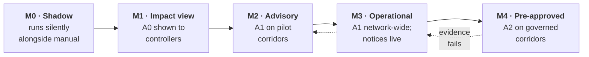

# Migration Strategy

| | |
|---|---|
| **Phase** | F — Migration Planning |
| **Document version** | 1.0 |
| **Status** | Baseline — for an operator; not exercised by this project |

---

## 1. What is being migrated

Nothing is replaced. The manual disruption process stays — it becomes the fallback ([C8.4](../phase-b-business-architecture/capability-map.md#c8--operational-resilience--cross-cutting)). Migration means introducing RouteShield **alongside** people who already handle disruptions competently, and earning each increase in its role with evidence.

The ordering principle: **observe before advising, advise before acting, act unattended only where a person already decided.** It mirrors the autonomy bands.

## 2. Stages

| Stage | What changes | Entry evidence | Exit evidence | Rollback |
|---|---|---|---|---|
| **M0 Shadow** | RouteShield ingests real feeds and computes impact and options for real disruptions; nobody sees them | Feeds integrated; audit store live | Impact completeness vs. what controllers actually did, over ≥ N disruptions; false-positive rate of detection | Switch off — no operational effect |
| **M1 Impact view** | Controllers see A0 impact alongside their normal process | M0 completeness acceptable | Controllers report the view as accurate; no missed affected services | Hide the view |
| **M2 Advisory** | A1 recommendations shown on selected corridors; controllers still act through existing channels | M1 accepted; objective weights agreed with operations | Deliberation times observed ([A-011](../../02-stage-two-reference-implementation/assumptions.md#a-011)); acceptance and override patterns; rubber-stamping indicator stable | Back to M1 |
| **M3 Operational** | Decisions made in RouteShield drive driver instructions and passenger notices | M2 evidence; driver channel agreed with drivers' representatives ([A-005](../../02-stage-two-reference-implementation/assumptions.md#a-005), SC-040); DPIA complete | Time-to-driver and time-to-passenger targets met; refusal patterns understood | Back to M2 — instructions return to radio |
| **M4 Pre-approved** | A2 enabled for specific corridors with approved contingency routes | Contingency governance operating; thresholds set from M2/M3 data | A2 activations reviewed; revocation rate low; A2 share stable | Revoke approvals — immediate return to A1 |

**N** and the thresholds in each row are for the operator to set; they depend on disruption frequency and risk appetite.

## 3. Principles of the migration

| Principle | |
|---|---|
| **Evidence gates each stage** | No stage begins on schedule alone |
| **Every stage is reversible in minutes** | Rollback is a configuration change, not a project |
| **The manual process is exercised throughout** | Scheduled drills, especially after M3, when disuse begins ([R-103](risk-register.md#2-solution-risks)) |
| **Controllers are involved from M0** | Their overrides in M2 are the best available evidence about the objective weights |
| **Drivers' representatives agree M3 before it starts** | Driver instruction changes are agreed, not imposed (SC-040) |
| **The authority is informed at M3 and M4** | Automated decision support over a public service is its concern (SC-031) |

## 4. Transition to the reference implementation

This project cannot perform M0–M4. Its releases rehearse the *capabilities* each stage needs:

| Migration stage | Rehearsed by |
|---|---|
| M0 | v1.2.0 impact assessment against scenarios |
| M1 | v1.2.0 A0 view |
| M2 | v1.3.0 recommendations and decisions |
| M3 | v1.4.0 driver and passenger channels |
| M4 | v1.5.0 contingency library and A2 |
