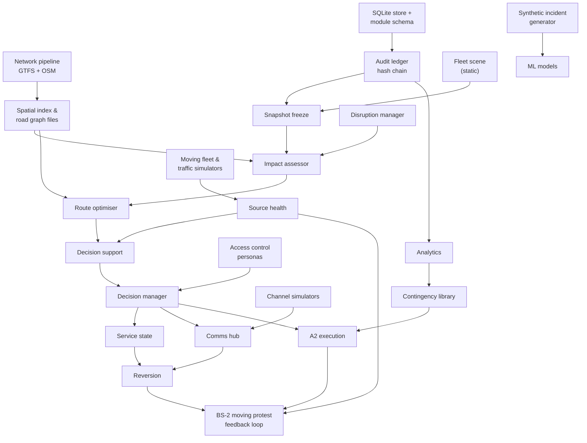

# Roadmap and Release Plan

| | |
|---|---|
| **Phase** | F — Migration Planning |
| **Document version** | 1.0 |
| **Status** | Baseline |

---

## 1. Roadmap

```mermaid
flowchart LR
    subgraph S1["Stage One — architecture"]
        v01["v0.1.0<br/>Foundation"] --> v02["v0.2.0<br/>Vision"] --> v03["v0.3.0<br/>Business"] --> v04["v0.4.0<br/>Info systems"] --> v05["v0.5.0<br/>Technology"] --> v06["v0.6.0<br/>Blueprint"] --> v10["<b>v1.0.0</b><br/>Stage One complete"]
    end
    subgraph S2["Stage Two — reference implementation"]
        v11["v1.1.0<br/>Foundation<br/><i>T0</i>"] --> v12["v1.2.0<br/>Disruption engine<br/>and first bypass<br/><i>T1 part</i>"] --> v13["v1.3.0<br/>Routing engine<br/><i>T1 = MVP</i>"] --> v14["v1.4.0<br/>Notifications<br/><i>T2</i>"] --> v15["v1.5.0<br/>Control dashboard<br/><i>T3</i>"] --> v16["v1.6.0<br/>ML prototype<br/><i>T4</i>"] --> v20["<b>v2.0.0</b><br/>Reference implementation<br/>complete · <i>T5</i>"]
    end
    v10 --> v11
```

## 2. Release plan

Each Stage Two release is a **vertical** increment: something a person can do at the end of it that they could not do before ([P-9](../methodology/architecture-principles.md#p-9--build-the-smallest-thing-that-delivers-an-outcome)).

| Release | Transition | A person can now… | Contents | Scenarios |
|---|---|---|---|---|
| **v1.1.0** Stage Two foundation | T0 | Open the site and see the real Dublin network; run one trivial disruption through every module | Python pipeline (GTFS + OSM → versioned files); core worker skeleton with all module shells; SQLite store; audit ledger with hash chain; CI skeleton | — |
| **v1.2.0** Disruption engine and first bypass | T1 (part) | Declare a disruption on the map; see every affected route, vehicle and stop; and see a suggested bypass for each affected pattern, drawn on the map and recommended for approval on the Disruptions card | AC-02, AC-04, snapshot freeze, static synthetic fleet scene, A0 impact view in workspace; first detour search in AC-05 (one divert and rejoin pair per pattern, [ADR-0014](../../05-architecture-decisions/adr-0014-constrained-shortest-path-with-rejoin-enumeration.md)) over the full road graph; AC-06 recommends the bypass or hold with stops lost; approve and reject on the Disruptions card | BS-1 to recommendation |
| **v1.3.0** Routing engine — **MVP** | T1 | Compare several ranked bypass options with their costs, approve one, and reconstruct the decision later | AC-05 in its own worker with a time budget: up to three divert and three rejoin stops per trip, ranked by the weighted service-loss objective ([ADR-0015](../../05-architecture-decisions/adr-0015-weighted-service-loss-objective.md)); AC-06 ranking and confidence; AC-07, AC-08, AC-14 personas; reconstruction view | BS-1 to decision |
| **v1.4.0** Notifications | T2 | See which stops show passenger notices; see drivers acknowledge or refuse | AC-09; passenger and driver channel simulators; refusal loop; moving fleet and traffic simulators; source health | BS-1 full, BS-6 |
| **v1.5.0** Control dashboard | T3 | Run several disruptions at once, lose a feed, revert, and use a pre-approved route | Network-wide view, degradation and confidence, reversion, queue bound and escalation, contingency library and A2, unavailable state | BS-3, BS-4, BS-5, BS-7 |
| **v1.6.0** ML prototype | T4 | See suggested type and duration, and corridor candidates for approval | Synthetic incident generator; M-1, M-2 with rule baselines; parity tests; AC-12 analytics; M-3 candidates | — |
| **v2.0.0** Reference implementation complete | T5 | See the moving-protest scenario, and read how it changed the architecture | BS-2 simulation; ADR-0005 review and outcome; operations documentation; all traceability evidence | BS-2, all |

### Departures from the originally suggested milestones

The project brief suggested v1.4.0 *Control Dashboard* before v1.5.0 *Notifications*. They are swapped here.

**Why:** [Phase E](../phase-e-opportunities-solutions/mvp-and-transition-architectures.md#the-tension-this-mvp-carries) records that the MVP delivers nothing to passengers, and commits T2 to bringing passenger notices forward. Leaving notifications until after the dashboard would defer the least-served stakeholder by another release for the benefit of the most-served one. The names are kept; the order follows the architecture.

The dashboard release also absorbs load handling, reversion and A2 — Transition T3 — rather than being a UI-only increment, so that it remains vertical.

**A first bypass brought forward to v1.2.0** (recorded 2026-09-18). The plan offered no route options until v1.3.0, so v1.2.0 would have shown what a disruption breaks and nothing about what to do. v1.2.0 now suggests one bypass per affected pattern and puts it, with its recommendation, on the Disruptions card for a person to approve or reject. v1.3.0 still delivers the full search: several ranked options with costs, the time-budgeted optimiser worker, and decision reconstruction. The first bypass is the same algorithm run once, so no work is thrown away.

**Deployment brought forward to v1.1.0** (recorded 2026-09-18). The plan deployed the site from v1.3.0, once there was an MVP worth showing. It now deploys from v1.1.0, so the walking skeleton has a live address from the first release. The site states on every screen what it does not yet do. This changes when the site is published, not what any release contains.

## 3. Engineering cadence alongside releases

| From | Practice |
|---|---|
| v1.0.0 | Traceability check, link check and secret scanning in CI (already running) |
| v1.1.0 | CI: lint, type-check, unit tests, dependency scanning on every pull request |
| v1.2.0 | Integration tests over the core worker with a real SQLite store |
| v1.3.0 | Scenario (system) tests driven by seeded scenarios |
| v1.1.0 | Deployment of the static site from `main`, with smoke test (brought forward from v1.3.0; see §2) |
| v1.4.0 | Resilience tests for each adapter failure |
| v1.5.0 | Performance tests against the Phase E budget |
| v1.6.0 | ML parity tests |

Tests are not deferred to a single "testing phase": each release carries the tests for what it adds.

## 4. Dependencies

**Critical path:** pipeline → spatial index → impact → optimiser. The network pipeline is the single largest technical risk in Stage Two (R-006), which is why it is the first thing built.

## 5. Stage Two execution phases

The project's eight-phase plan maps onto these releases:

| Project phase | Delivers | Releases |
|---|---|---|
| 3 · Fictional operating model | Full definition of the seven reference systems; assumptions register completed | Before v1.1.0 |
| 4 · Requirements and solution design | FR/NFR, backlog, user stories, detailed design | Before v1.1.0 |
| 5 · MVP | Working MVP | v1.1.0 → v1.3.0 |
| 6 · Tests and CI/CD | Full test pyramid, deployment pipeline | Built incrementally from v1.1.0; completed by v1.4.0 |
| 7 · ML and advanced | T3 and T4 | v1.5.0, v1.6.0 |
| 8 · Operations and final docs | Runbooks, dashboards, feedback loop | v2.0.0 |
