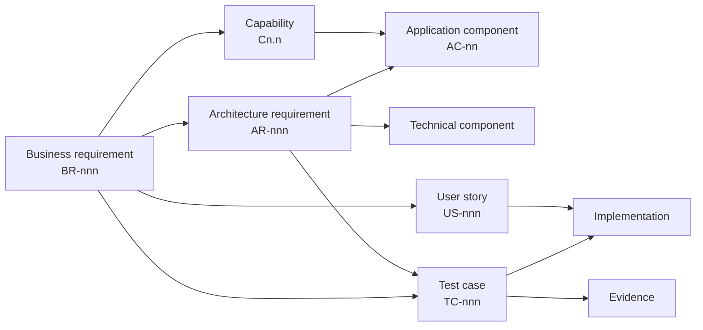

# Traceability Matrix

> **Generated** from [`architecture/models/traceability.toml`](../../../architecture/models/traceability.toml) by `tools/traceability/check.py --render`. Do not edit by hand.

## Summary

| Item | Count |
|---|---|
| Capabilities | 32 |
| Components | 13 |
| Business requirements | 47 |
| Architecture requirements | 32 |
| User stories | 0 |
| Test cases | 79 — 5 implemented, 74 planned |

## Chain

## Business requirements

| BR | Pri | Capabilities | Architecture requirements | Components | User stories | Tests | Test status |
|---|---|---|---|---|---|---|---|
| **BR-001** Become aware of a disruption from authoritative, inferred or declared sources | MUST | C1.1 | AR-015 | AC-01 | — | TC-001, TC-115 | planned |
| **BR-002** Accept a controller-declared disruption with no automated report | MUST | C1.1, C8.4 | AR-021 | AC-02, AC-13 | — | TC-002, TC-121 | planned |
| **BR-003** Determine the type of disruption | SHOULD | C1.2 | AR-023 | AC-02, AC-12 | — | TC-003, TC-123 | planned |
| **BR-004** Establish geographic extent and time window | MUST | C1.3 | AR-018 | AC-02, AC-07 | — | TC-004, TC-118 | planned |
| **BR-005** Require human confirmation before any service change is proposed | MUST | C1.4 | AR-027 | AC-02, AC-06 | — | TC-005, TC-127 | planned |
| **BR-006** Identify every route intersecting the disruption | MUST | C2.1 | AR-029 | AC-04 | — | TC-006, TC-129 | planned |
| **BR-007** Identify affected vehicles, distinguishing past from approaching | MUST | C2.2 | AR-029 | AC-04 | — | TC-007, TC-129 | planned |
| **BR-008** Identify every stop that becomes unservable | MUST | C2.3 | AR-029 | AC-04 | — | TC-008, TC-129 | planned |
| **BR-009** Assess all affected services concurrently; time does not scale with count | MUST | C2.1, C2.2, C2.3 | AR-029 | AC-04 | — | TC-009, TC-129 | planned |
| **BR-010** Estimate passengers affected | SHOULD | C2.4 | AR-029 | AC-04 | — | TC-010, TC-129 | planned |
| **BR-011** Produce an impact assessment even when no viable response exists | MUST | C8.3 | AR-004 | AC-04, AC-05, AC-06 | — | TC-011, TC-104 | planned |
| **BR-012** Generate candidate alternative paths | MUST | C3.1 | AR-016 | AC-05, AC-06 | — | TC-012, TC-116 | planned |
| **BR-013** Establish that a candidate path is physically usable | MUST | C3.2 | AR-016 | AC-05, AC-06 | — | TC-013, TC-116 | planned |
| **BR-014** Determine whether a skipped stop is served by a following service | SHOULD | C3.3 | AR-017 | AC-05 | — | TC-014, TC-117 | planned |
| **BR-015** Rank by service continuity, not travel time | MUST | C3.4 | AR-016 | AC-05, AC-06 | — | TC-015, TC-116 | planned |
| **BR-016** Account for dependency on a stop, not only volume | SHOULD | C3.4 | AR-032 | AC-05, AC-06 | — | TC-016, TC-132 | planned |
| **BR-017** Retrieve a matching pre-approved contingency route | SHOULD | C3.5 | AR-019 | AC-10 | — | TC-017, TC-119 | planned |
| **BR-018** Support hold, split and terminate as outcomes | MUST | C3.4, C4.1 | AR-016 | AC-05, AC-06 | — | TC-018, TC-116 | planned |
| **BR-019** Present rationale, cost and unknowns with each recommendation | MUST | C4.1 | AR-008 | AC-06 | — | TC-019, TC-108 | planned |
| **BR-020** Require identified approval before any novel change | MUST | C4.2 | AR-006 | AC-07, AC-14 | — | TC-020, TC-106 | implemented, planned |
| **BR-021** Support and record approve, reject and modify | MUST | C4.2 | AR-031 | AC-07 | — | TC-021, TC-131 | planned |
| **BR-022** Determine authority and escalate beyond it | SHOULD | C4.3 | AR-006, AR-010 | AC-06, AC-07, AC-14 | — | TC-022, TC-106, TC-110 | implemented, planned |
| **BR-023** Bound recommendations awaiting a decision | MUST | C4.4 | AR-010 | AC-06 | — | TC-023, TC-110 | planned |
| **BR-024** Detect approvals that indicate decisions are not being evaluated | SHOULD | C4.4 | AR-011 | AC-06, AC-13 | — | TC-024, TC-111 | planned |
| **BR-025** Permit unattended activation only for matching pre-approved routes | MUST | C3.5, C4.2 | AR-007, AR-019 | AC-07, AC-10, AC-14 | — | TC-025, TC-107, TC-119 | planned |
| **BR-026** Deliver revised sequences to all affected drivers concurrently, in time | MUST | C5.1 | AR-028 | AC-09 | — | TC-026, TC-128 | planned |
| **BR-027** Receive acknowledgement and refusal with reason | MUST | C5.2 | AR-012 | AC-07, AC-09 | — | TC-027, TC-112 | planned |
| **BR-028** Return refusals to the decision-maker | MUST | C5.2, C4.2 | AR-012 | AC-07, AC-09 | — | TC-028, TC-112 | planned |
| **BR-029** Publish stop-level information while alternatives exist | MUST | C5.3 | AR-020 | AC-09 | — | TC-029, TC-120 | planned |
| **BR-030** State the alternative available | SHOULD | C5.3 | AR-020 | AC-09 | — | TC-030, TC-120 | planned |
| **BR-031** Maintain an authoritative record of current service | MUST | C5.4 | AR-024 | AC-08 | — | TC-031, TC-124 | planned |
| **BR-032** Become aware that a disruption has ended | SHOULD | C6.1 | AR-025 | AC-02, AC-07 | — | TC-032, TC-125 | planned |
| **BR-033** Prompt a reversion decision on clearance | MUST | C6.2 | AR-025 | AC-02, AC-07 | — | TC-033, TC-125 | planned |
| **BR-034** Restore services and inform drivers and passengers | MUST | C6.3 | AR-013, AR-020 | AC-02, AC-08, AC-09 | — | TC-034, TC-113, TC-120 | planned |
| **BR-035** Prevent diversions persisting without an explicit decision | MUST | C6.2 | AR-013 | AC-02, AC-08 | — | TC-035, TC-113 | planned |
| **BR-036** Record every recommendation, decision, activation, refusal and reversion immutably | MUST | C7.1 | AR-002, AR-003 | AC-02, AC-04, AC-05, AC-06, AC-07, AC-08, AC-09, AC-10, AC-11, AC-14 | — | TC-036, TC-102, TC-103 | implemented, planned |
| **BR-037** Capture inputs as they stood, including stale or absent ones | MUST | C7.1 | AR-001 | AC-04, AC-11 | — | TC-037, TC-101 | implemented, planned |
| **BR-038** Reconstruct any decision from the record alone | MUST | C7.2 | AR-001, AR-003, AR-018, AR-023, AR-026 | AC-02, AC-04, AC-07, AC-11, AC-12 | — | TC-038, TC-101, TC-103, TC-118, TC-123, TC-126 | implemented, planned |
| **BR-039** Make the record interpretable outside the operator | SHOULD | C7.2 | AR-026 | AC-11 | — | TC-039, TC-126 | planned |
| **BR-040** Determine what resulted from a decision | COULD | C7.3 | AR-030 | AC-12 | — | TC-040, TC-130 | planned |
| **BR-041** Propose contingency candidates from recurring patterns | COULD | C7.4 | AR-019, AR-030 | AC-10, AC-12 | — | TC-041, TC-119, TC-130 | planned |
| **BR-042** Restrict analytics to service outcomes, not driver behaviour | SHOULD | C7.3 | AR-014 | AC-11, AC-12 | — | TC-042, TC-114 | planned |
| **BR-043** Know which inputs are healthy, stale or absent | MUST | C8.1 | AR-015, AR-022 | AC-01, AC-04, AC-06 | — | TC-043, TC-115, TC-122 | planned |
| **BR-044** Derive confidence and carry it to the recommendation | MUST | C8.2 | AR-008, AR-009 | AC-06 | — | TC-044, TC-108, TC-109 | planned |
| **BR-045** Operate with any single input absent | MUST | C8.3 | AR-004, AR-022 | AC-01, AC-04, AC-05, AC-06 | — | TC-045, TC-104, TC-122 | planned |
| **BR-046** Constrain automatic activation according to confidence | MUST | C8.2, C4.2 | AR-009 | AC-06 | — | TC-046, TC-109 | planned |
| **BR-047** Preserve the manual response as a usable fallback | MUST | C8.4 | AR-021 | AC-02, AC-13 | — | TC-047, TC-121 | planned |

## Architecture requirements

| AR | Statement | Sources | Components | Technical | Tests |
|---|---|---|---|---|---|
| **AR-001** | Assessment reads only an immutable, area-scoped snapshot persisted before it starts | BR-037, BR-038, ADR-0004 | AC-04, AC-11 | core-worker, sqlite-store | TC-101 |
| **AR-002** | Every state change and its audit event commit in one transaction | BR-036, ADR-0007 | AC-02, AC-04, AC-05, AC-06, AC-07, AC-08, AC-09, AC-10, AC-11, AC-14 | sqlite-store | TC-102 |
| **AR-003** | Audit events are append-only and hash-chained | BR-036, BR-038 | AC-11 | sqlite-store | TC-103 |
| **AR-004** | Impact is committed and presentable before optimisation; optimisation is time-boxed in an isolated worker | BR-011, BR-045, ADR-0006 | AC-04, AC-05, AC-06 | core-worker, optimiser-worker | TC-104 |
| **AR-005** | Each owned domain has exactly one writing component | P-8 | AC-01, AC-02, AC-04, AC-05, AC-06, AC-07, AC-08, AC-09, AC-10, AC-11, AC-12, AC-14 | core-worker, sqlite-store | TC-105 |
| **AR-006** | Authority is verified at decision time | BR-020, BR-022 | AC-07, AC-14 | core-worker, persona-switcher | TC-106 |
| **AR-007** | Pre-approved activation re-checks all six conditions at execution | BR-025, ADR-0017 | AC-07, AC-10, AC-14 | core-worker | TC-107 |
| **AR-008** | A recommendation carries rationale, cost terms, confidence and autonomy band | BR-019, BR-044 | AC-06 | core-worker, workspace-ui | TC-108 |
| **AR-009** | Confidence derives from snapshot health and footprint age, and gates pre-approved eligibility | BR-044, BR-046 | AC-06 | core-worker | TC-109 |
| **AR-010** | Pending recommendations per actor are bounded; overflow escalates | BR-022, BR-023 | AC-06 | core-worker | TC-110 |
| **AR-011** | Decisions carry presented_at; approval timing is aggregated per corridor and period | BR-024 | AC-06, AC-13 | core-worker, workspace-ui | TC-111 |
| **AR-012** | Driver refusal and non-response re-enter decision | BR-027, BR-028 | AC-07, AC-09 | core-worker, channel-simulators | TC-112 |
| **AR-013** | A disruption closes only when no ungoverned deviation remains | BR-034, BR-035 | AC-02, AC-08 | core-worker | TC-113 |
| **AR-014** | No LINK-classified field enters analytics; driver identity is absent from audit | BR-042 | AC-11, AC-12 | sqlite-store | TC-114 |
| **AR-015** | External systems are reached only through ports; authority is assigned by channel | BR-001, BR-043, ADR-0006 | AC-01 | core-worker, fleet-simulator, channel-simulators | TC-115 |
| **AR-016** | Options include hold and terminate; infeasible options are discarded; ranking is weighted service loss over the Pareto set | BR-012, BR-013, BR-015, BR-018, ADR-0014, ADR-0015 | AC-05, AC-06 | optimiser-worker, network-pipeline | TC-116 |
| **AR-017** | Following-service coverage is computed for skipped stops | BR-014 | AC-05 | optimiser-worker | TC-117 |
| **AR-018** | Disruption descriptions are versioned; decisions on superseded recommendations are rejected as stale | BR-004, BR-038, ADR-0005 | AC-02, AC-07 | core-worker | TC-118 |
| **AR-019** | Contingency approvals carry mandatory expiry and network version; candidates never self-approve | BR-017, BR-025, BR-041 | AC-10 | core-worker | TC-119 |
| **AR-020** | Passenger notices target stops, carry no cause detail, and are withdrawn on reversion | BR-029, BR-030, BR-034 | AC-09 | core-worker, channel-simulators | TC-120 |
| **AR-021** | The declaration path is available whenever the core runs, regardless of source health | BR-002, BR-047 | AC-02, AC-13 | core-worker, workspace-ui | TC-121 |
| **AR-022** | Each input has a defined degraded mode; readiness fails only when audit cannot be written | BR-043, BR-045 | AC-01, AC-04, AC-06 | core-worker, telemetry-sink | TC-122 |
| **AR-023** | Model outputs are versioned suggestions shown beside rule baselines | BR-003, BR-038, ADR-0016 | AC-02, AC-12 | tree-evaluator, network-pipeline | TC-123 |
| **AR-024** | Each trip's service state references its governing activation | BR-031 | AC-08 | core-worker | TC-124 |
| **AR-025** | Clearance prompts a reversion decision | BR-032, BR-033 | AC-02, AC-07 | core-worker | TC-125 |
| **AR-026** | Reconstruction and export are available, excluding LINK fields | BR-038, BR-039 | AC-11 | core-worker, workspace-ui | TC-126 |
| **AR-027** | Detection candidates require confirmation before any non-A0 recommendation | BR-005 | AC-02, AC-06 | core-worker | TC-127 |
| **AR-028** | Driver instructions are delivered concurrently, with deadlines, keyed idempotently | BR-026 | AC-09 | core-worker, channel-simulators | TC-128 |
| **AR-029** | Impact is computed in one operation across all affected routes, vehicles and stops | BR-006, BR-007, BR-008, BR-009, BR-010 | AC-04 | core-worker, network-pipeline | TC-129 |
| **AR-030** | Outcomes and corridor recurrence are derived from the audit record only | BR-040, BR-041 | AC-12 | core-worker | TC-130 |
| **AR-031** | Decisions record approve, modify, reject or escalate; a modification creates a new option | BR-021 | AC-07 | core-worker | TC-131 |
| **AR-032** | The cost model carries a criticality term, and its unavailability is displayed | BR-016, ADR-0015 | AC-05, AC-06 | optimiser-worker, workspace-ui | TC-132 |

## Capability realisation

| Capability | Components | Business requirements |
|---|---|---|
| **C1.1** Detection | AC-02 | BR-001, BR-002 |
| **C1.2** Classification | AC-02 | BR-003 |
| **C1.3** Characterisation | AC-02 | BR-004 |
| **C1.4** Confirmation | AC-02, AC-13 | BR-005 |
| **C2.1** Route impact | AC-04 | BR-006, BR-009 |
| **C2.2** Vehicle impact | AC-04 | BR-007, BR-009 |
| **C2.3** Stop impact | AC-04 | BR-008, BR-009 |
| **C2.4** Passenger impact | AC-04 | BR-010 |
| **C3.1** Alternative paths | AC-05 | BR-012 |
| **C3.2** Feasibility validation | AC-05 | BR-013 |
| **C3.3** Coverage analysis | AC-05 | BR-014 |
| **C3.4** Option ranking | AC-05, AC-06 | BR-015, BR-016, BR-018 |
| **C3.5** Contingency retrieval | AC-05, AC-10 | BR-017, BR-025 |
| **C4.1** Recommendation presentation | AC-06, AC-13 | BR-018, BR-019 |
| **C4.2** Decision capture | AC-07, AC-13 | BR-020, BR-021, BR-025, BR-028, BR-046 |
| **C4.3** Authority and escalation | AC-07, AC-14 | BR-022 |
| **C4.4** Decision load management | AC-06 | BR-023, BR-024 |
| **C5.1** Driver instruction | AC-09 | BR-026 |
| **C5.2** Acknowledgement and refusal | AC-07, AC-09 | BR-027, BR-028 |
| **C5.3** Passenger information | AC-09 | BR-029, BR-030 |
| **C5.4** Service state update | AC-08 | BR-031 |
| **C6.1** Clearance detection | AC-02 | BR-032 |
| **C6.2** Reversion decision | AC-07 | BR-033, BR-035 |
| **C6.3** Reversion activation | AC-09 | BR-034 |
| **C7.1** Decision recording | AC-11 | BR-036, BR-037 |
| **C7.2** Decision reconstruction | AC-11 | BR-038, BR-039 |
| **C7.3** Outcome analysis | AC-12 | BR-040, BR-042 |
| **C7.4** Contingency development | AC-10, AC-12 | BR-041 |
| **C8.1** Input health monitoring | AC-01 | BR-043 |
| **C8.2** Confidence determination | AC-06 | BR-044, BR-046 |
| **C8.3** Degraded operation | AC-02, AC-04, AC-05, AC-06, AC-07 | BR-011, BR-045 |
| **C8.4** Manual fallback | AC-13 | BR-002, BR-047 |

## Test cases

| Test | Verifies | Level | Status | Implementation | Evidence |
|---|---|---|---|---|---|
| TC-001 | BR-001 | system | planned | — | — |
| TC-002 | BR-002 | system | planned | — | — |
| TC-003 | BR-003 | unit | planned | — | — |
| TC-004 | BR-004 | unit | planned | — | — |
| TC-005 | BR-005 | system | planned | — | — |
| TC-006 | BR-006 | unit | planned | — | — |
| TC-007 | BR-007 | unit | planned | — | — |
| TC-008 | BR-008 | unit | planned | — | — |
| TC-009 | BR-009 | performance | planned | — | — |
| TC-010 | BR-010 | unit | planned | — | — |
| TC-011 | BR-011 | resilience | planned | — | — |
| TC-012 | BR-012 | unit | planned | — | — |
| TC-013 | BR-013 | unit | planned | — | — |
| TC-014 | BR-014 | unit | planned | — | — |
| TC-015 | BR-015 | unit | planned | — | — |
| TC-016 | BR-016 | inspection | planned | — | — |
| TC-017 | BR-017 | integration | planned | — | — |
| TC-018 | BR-018 | unit | planned | — | — |
| TC-019 | BR-019 | acceptance | planned | — | — |
| TC-020 | BR-020 | security | planned | — | — |
| TC-021 | BR-021 | integration | planned | — | — |
| TC-022 | BR-022 | security | planned | — | — |
| TC-023 | BR-023 | integration | planned | — | — |
| TC-024 | BR-024 | unit | planned | — | — |
| TC-025 | BR-025 | security | planned | — | — |
| TC-026 | BR-026 | system | planned | — | — |
| TC-027 | BR-027 | integration | planned | — | — |
| TC-028 | BR-028 | system | planned | — | — |
| TC-029 | BR-029 | system | planned | — | — |
| TC-030 | BR-030 | acceptance | planned | — | — |
| TC-031 | BR-031 | integration | planned | — | — |
| TC-032 | BR-032 | integration | planned | — | — |
| TC-033 | BR-033 | system | planned | — | — |
| TC-034 | BR-034 | system | planned | — | — |
| TC-035 | BR-035 | integration | planned | — | — |
| TC-036 | BR-036 | integration | planned | — | — |
| TC-037 | BR-037 | integration | planned | — | — |
| TC-038 | BR-038 | system | planned | — | — |
| TC-039 | BR-039 | acceptance | planned | — | — |
| TC-040 | BR-040 | integration | planned | — | — |
| TC-041 | BR-041 | integration | planned | — | — |
| TC-042 | BR-042 | inspection | planned | — | — |
| TC-043 | BR-043 | unit | planned | — | — |
| TC-044 | BR-044 | unit | planned | — | — |
| TC-045 | BR-045 | resilience | planned | — | — |
| TC-046 | BR-046 | security | planned | — | — |
| TC-047 | BR-047 | inspection | planned | — | — |
| TC-101 | AR-001 | integration | implemented | tests/core/walking-skeleton.test.ts | — |
| TC-102 | AR-002 | integration | implemented | tests/core/audit-ledger.test.ts | — |
| TC-103 | AR-003 | security | implemented | tests/core/audit-ledger.test.ts | — |
| TC-104 | AR-004 | resilience | planned | — | — |
| TC-105 | AR-005 | inspection | implemented | tools/architecture/check_boundaries.py | — |
| TC-106 | AR-006 | security | implemented | tests/core/walking-skeleton.test.ts | — |
| TC-107 | AR-007 | security | planned | — | — |
| TC-108 | AR-008 | unit | planned | — | — |
| TC-109 | AR-009 | unit | planned | — | — |
| TC-110 | AR-010 | integration | planned | — | — |
| TC-111 | AR-011 | unit | planned | — | — |
| TC-112 | AR-012 | system | planned | — | — |
| TC-113 | AR-013 | integration | planned | — | — |
| TC-114 | AR-014 | inspection | planned | — | — |
| TC-115 | AR-015 | security | planned | — | — |
| TC-116 | AR-016 | unit | planned | — | — |
| TC-117 | AR-017 | unit | planned | — | — |
| TC-118 | AR-018 | integration | planned | — | — |
| TC-119 | AR-019 | security | planned | — | — |
| TC-120 | AR-020 | integration | planned | — | — |
| TC-121 | AR-021 | resilience | planned | — | — |
| TC-122 | AR-022 | resilience | planned | — | — |
| TC-123 | AR-023 | integration | planned | — | — |
| TC-124 | AR-024 | unit | planned | — | — |
| TC-125 | AR-025 | system | planned | — | — |
| TC-126 | AR-026 | system | planned | — | — |
| TC-127 | AR-027 | security | planned | — | — |
| TC-128 | AR-028 | integration | planned | — | — |
| TC-129 | AR-029 | performance | planned | — | — |
| TC-130 | AR-030 | integration | planned | — | — |
| TC-131 | AR-031 | unit | planned | — | — |
| TC-132 | AR-032 | inspection | planned | — | — |
