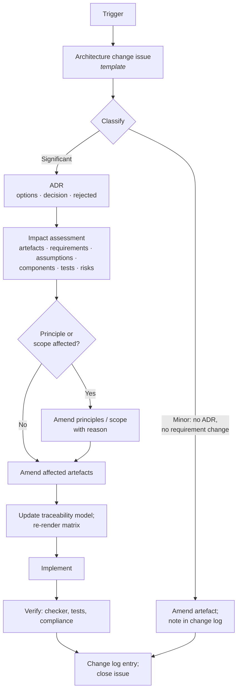

# Architecture Change Management

| | |
|---|---|
| **Phase** | H — Architecture Change Management |
| **Document version** | 1.0 |
| **Status** | Process baseline — worked example pending Stage Two |

---

## 1. Why this phase is different

Every other phase produces a design. Phase H produces a **process for being wrong**, and its exit condition cannot be met by writing: it requires the process to have been run on a real change that originated in implementation ([method §5](../methodology/architecture-method.md#phase-h--architecture-change-management)). At Stage One completion the process is defined and its subject is fixed in advance; the worked example is completed in Stage Two.

## 2. Sources of change

| Source | Example | Typical impact |
|---|---|---|
| **Implementation learning** | A design element does not survive being built | ADR + artefact amendment |
| **Assumption invalidated** | A registered assumption turns out false | Register update; possibly ADR |
| **Evidence from operation** | KPIs or scenario results contradict an objective | Objective or weight review |
| **Constraint change** | Hosting, licence or data source changes | Phase D/E ADR |
| **New requirement** | A later phase or stakeholder surfaces a need | BR/AR added; traceability |
| **Principle conflict** | Two principles collide in a new case | ADR recording which prevails |

## 3. Process

### Classification

| Class | Criteria | Record |
|---|---|---|
| **Minor** | Clarifies without changing meaning; no requirement, component boundary, ADR or principle affected | Change log |
| **Significant** | Changes a requirement, boundary, decision, data model or principle application | ADR + change log |
| **Fundamental** | Changes a principle, the scope, or a business outcome | ADR + charter/scope amendment + change log |

### Impact assessment checklist

For a significant change, the ADR's consequences section lists every affected item under:

- Phase documents (by path)
- Business and architecture requirements
- Assumptions (including whether any are invalidated)
- Components and contracts
- Data model entities and invariants
- Test cases
- Risks
- Released milestones whose claims are now inaccurate

The last item exists because an honest repository corrects its past claims rather than leaving them standing.

## 4. Architecture review

With a single author, review cannot be independent. It is made **scheduled and evidential** instead:

| When | Review |
|---|---|
| Every release tag | Milestone checks ([governance §7](../methodology/architecture-governance.md#7-review-points), [implementation governance §7](../phase-g-implementation-governance/implementation-governance.md#7-review-points)) |
| Every ADR review trigger that fires | Re-open the ADR; supersede or reaffirm, recording which |
| v2.0.0 | Full re-read of Stage One against Stage Two; every divergence resolved or recorded |

Reaffirming a decision is a legitimate outcome and is recorded: "reviewed after BS-2 simulation; no change" is a result, not an absence of one.

## 5. Continuous improvement

| Signal | Source | Leads to |
|---|---|---|
| Scenario failures | Scenario tests | Defect or architecture change |
| KPI behaviour | [Observability §3](../phase-d-technology-architecture/observability.md#3-service-kpis) | Objective or weight review |
| Refusal clusters | AC-12 | Feasibility data correction |
| Override patterns | AC-12 (aggregated) | Objective weight review |
| Assumption challenges | [Issue template](../../../.github/ISSUE_TEMPLATE/assumption-challenge.md) | Register update |
| Checker failures | CI | Traceability repair |

## 6. Evolution strategy

Directions the architecture is designed to accommodate, and what each would change:

| Direction | Accommodated by | Would change |
|---|---|---|
| Real operator integration (Option A) | Ports and adapters | Adapters only |
| Hosted, multi-user deployment | Operator profile | Store binding, identity adapter, telemetry exporter |
| Extracting a component as a service | Module boundaries; outbox | ADR-0006, ADR-0007 superseded for that component |
| Moving disruptions | Versioned footprints | Possibly the conceptual model — see §7 |
| Stop criticality data | Reserved `criticality` attribute and cost term | Objective weights; P-7 becomes achievable |
| Multimodal response | — | Scope, capability map, data domains; a fundamental change |

## 7. Designated worked example

| | |
|---|---|
| **Subject** | [ADR-0005](../../05-architecture-decisions/adr-0005-represent-disruptions-as-versioned-static-footprints.md) — versioned static footprints |
| **Assumption** | [A-007](../../02-stage-two-reference-implementation/assumptions.md#a-007) |
| **Scenario** | [BS-2](../phase-b-business-architecture/business-scenarios.md#bs-2--moving-protest--the-case-the-model-does-not-handle-well) — moving protest |
| **Trigger** | Simulation in v2.0.0 (T5) |
| **Question** | At realistic version intervals, are recommendations for a moving disruption useful more often than they are wrong? |
| **Chosen** | 2026-09-16, before any implementation |

The outcome will be recorded whichever way it falls, including "ADR-0005 holds". Fixing the subject in advance is what separates a found result from a staged one ([R-013](../phase-f-migration-planning/risk-register.md#1-project-risks)).
