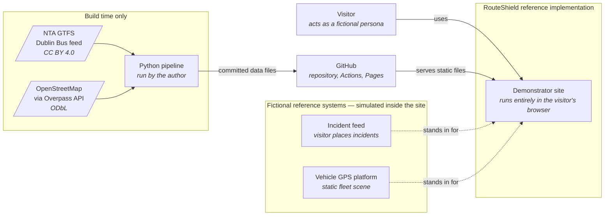
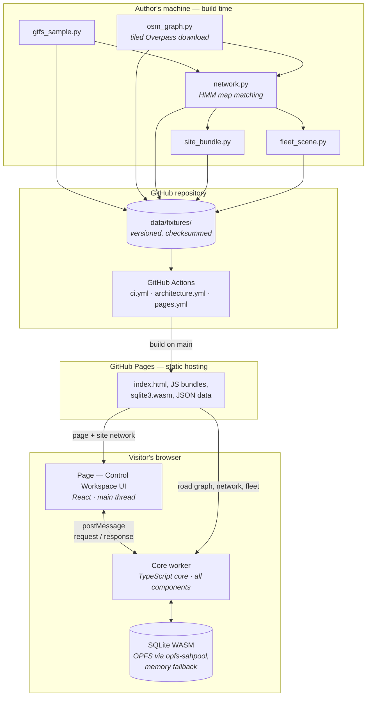
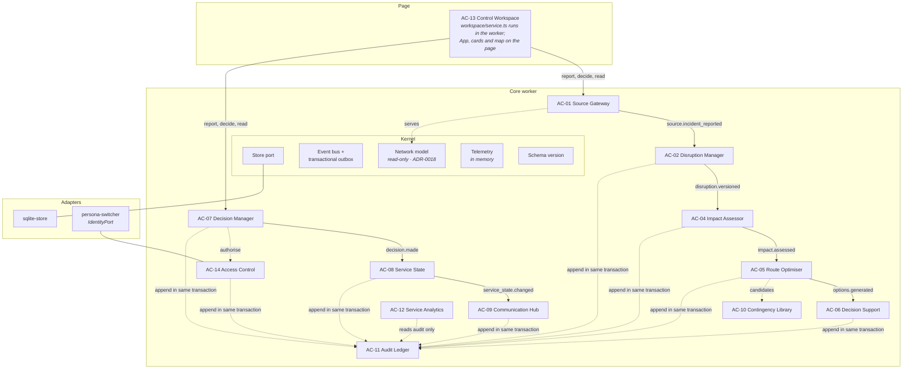
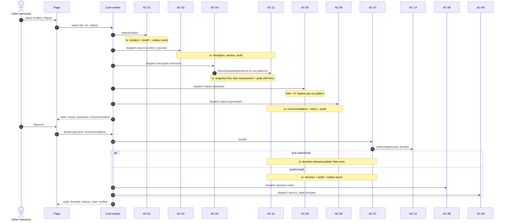
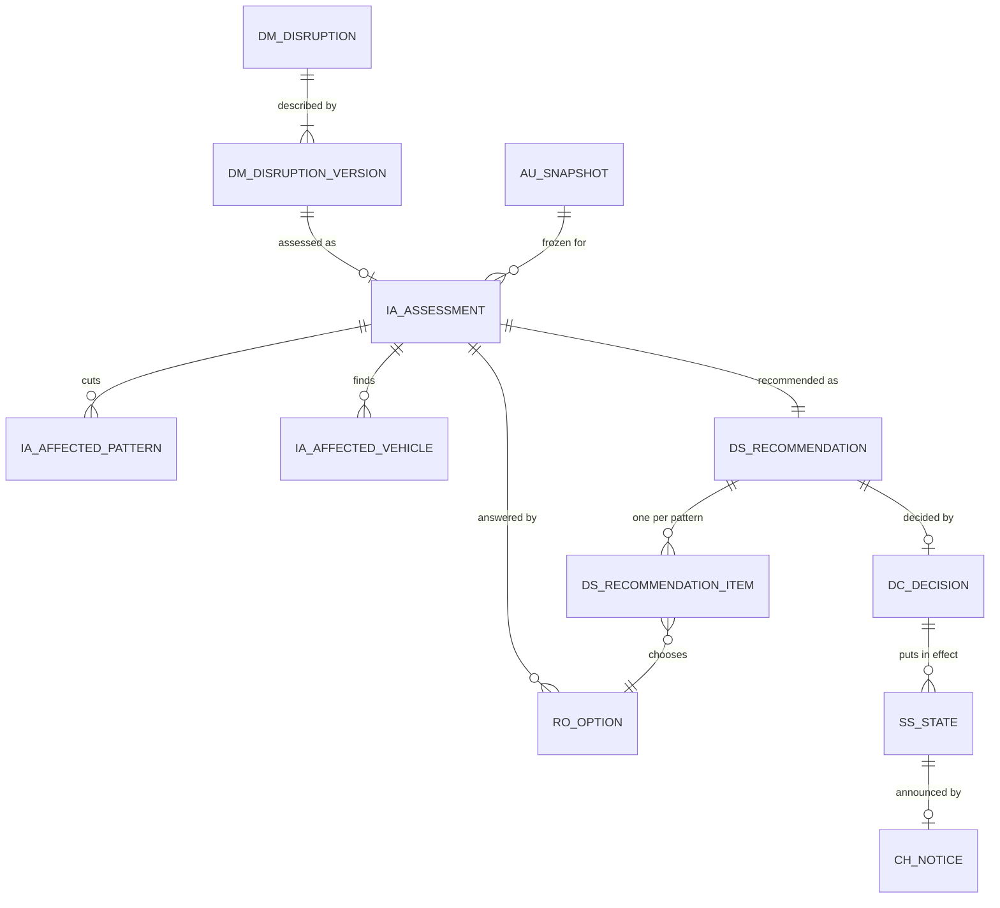

# Reference Implementation Architecture — v1.2.0 Baseline

| | |
|---|---|
| **Stage** | Two — fictional reference implementation |
| **Document version** | 1.0 |
| **Status** | Baseline at release `v1.2.0` |
| **Realises** | [Stage One target architecture](../../01-stage-one-architecture/) (reference profile, [technology architecture §3](../../01-stage-one-architecture/phase-d-technology-architecture/technology-architecture.md#3-reference-profile)) |
| **Decisions added** | [ADR-0018](../../05-architecture-decisions/adr-0018-network-as-shared-read-only-reference-model.md), [ADR-0019](../../05-architecture-decisions/adr-0019-assess-and-respond-per-pattern-in-v1-2.md), [ADR-0020](../../05-architecture-decisions/adr-0020-demonstrator-store-is-disposable.md) |

---

## 1. What this document is

Stage One describes the **target**: what RouteShield should be, independent of who builds it. This is the **second architecture**: the reference implementation as it stands at `v1.2.0`, with every place it departs from the target named and dispositioned.

It is a baseline, not a narrative. Each release that changes the shape of the system updates it, and each departure it records has a class and a record under the [change process](../../01-stage-one-architecture/phase-h-change-management/architecture-change-management.md). Where this document and the code disagree, the code is wrong or this document is out of date; either way it is a defect.

**Everything operational in it is fictional** ([fact vs assumption](../fact-vs-assumption-model.md)). The network is real published data; incidents, vehicles, decisions and notices are invented.

## 2. Scope at v1.2.0

A person can open the site and:

1. See the real Dublin sample network (11 routes, 33 route patterns) and a synthetic fleet of 162 vehicles placed from the timetable for Monday 21 September 2026, 08:00.
2. Place an incident on the map. The roads inside it close; every cut route pattern, stop on the closed stretch, and vehicle approaching, inside or past the closure is identified.
3. See one suggested bypass for each cut pattern, drawn on the map, with the stops it misses and the distance it adds.
4. Approve or reject the recommendation as a persona, with authority checked at the moment of decision.
5. Watch each affected bus number turn from yellow (bypass awaiting approval) to red (approved and in effect).
6. Read the audit trail and see its hash chain verified after every change.

Live: <https://emekamnwoke-glitch.github.io/routeshield/>.

## 3. System context

No external system is called at run time. The only network requests the site makes are for its own static files ([ADR-0008](../../05-architecture-decisions/adr-0008-browser-hosted-static-demonstrator.md), [ADR-0011](../../05-architecture-decisions/adr-0011-open-network-data-via-build-time-pipeline.md)).

## 4. Containers

| Container | Technology | Responsibility | Decision |
|---|---|---|---|
| Build pipeline | Python 3.12, standard library only | Cut the GTFS sample, build the road graph, match patterns onto it, bundle site data, place the fleet | [ADR-0009](../../05-architecture-decisions/adr-0009-typescript-core-python-build-pipeline.md), [ADR-0011](../../05-architecture-decisions/adr-0011-open-network-data-via-build-time-pipeline.md) |
| Committed data | JSON and GTFS text, each with a manifest or a staleness test | The contract between pipeline and site | ADR-0009 |
| CI / CD | GitHub Actions | Checks on every pull request; build, deploy and smoke test on `main` | §10 |
| Static host | GitHub Pages | Serves the site from `/routeshield/` | ADR-0008 |
| Page | React 19, TypeScript, Vite 8, canvas | AC-13 Control Workspace presentation; draws the map | ADR-0009 |
| Core worker | TypeScript in a module Web Worker | Hosts every core component; the only opener of the store | [ADR-0006](../../05-architecture-decisions/adr-0006-modular-monolith-with-ports-and-adapters.md), [ADR-0010](../../05-architecture-decisions/adr-0010-sqlite-wasm-as-embedded-store.md) |
| Store | SQLite 3.53 (official WASM build), `opfs-sahpool` VFS | Transactional state and the audit chain, persisted in the browser | ADR-0010, [ADR-0020](../../05-architecture-decisions/adr-0020-demonstrator-store-is-disposable.md) |

**What the target has that v1.2.0 does not:** the optimiser's own worker (arrives v1.3.0), and simulators behind adapters (a static fleet scene stands in until v1.4.0).

## 5. Components

Solid arrows are events delivered through the outbox; dotted arrows are synchronous calls through a component's `contract.ts`.

| Component | Owns (prefix) | Listens for | Raises | At v1.2.0 |
|---|---|---|---|---|
| AC-01 Source Gateway | `sg_` incidents, source health, vehicle positions | — | `source.incident_reported` | Real; serves the network (ADR-0018) and caches the fleet scene |
| AC-02 Disruption Manager | `dm_` disruptions, versions | `source.incident_reported` | `disruption.versioned` | Every incident becomes a disruption at version 1; no confirmation step yet |
| AC-04 Impact Assessor | `ia_` assessments, affected patterns, affected vehicles | `disruption.versioned` | `impact.assessed` | Real: closed edges, cut patterns, closed stops, vehicle relations from the snapshot |
| AC-05 Route Optimiser | `ro_` options | `impact.assessed` | `options.generated` | Hold plus one bypass per pattern (up to 3 × 3 divert/rejoin pairs); runs in the core worker |
| AC-06 Decision Support | `ds_` recommendations, items | `options.generated` | `recommendation.issued` | Per pattern: bypass if found, else hold; band A1, or A0 if nothing affected |
| AC-07 Decision Manager | `dc_` decisions | — (command) | `decision.made` | Approve or reject a whole recommendation; refusals audited |
| AC-08 Service State | `ss_` states | `decision.made` | `service_state.changed` | One state per pattern: `diverted` or `held` |
| AC-09 Communication Hub | `ch_` notices | `service_state.changed` | — | One passenger notice per pattern; idempotent |
| AC-10 Contingency Library | `cl_` routes | — | — | Empty library; contract in place |
| AC-11 Audit Ledger | `au_` events, snapshots | — | — | Real: hash chain, append-only triggers, snapshots in the chain |
| AC-12 Service Analytics | `an_` event counts | — | — | Counts derived from the audit record only |
| AC-14 Access Control | `ax_` grants | — | — | Real: persona grants, separation of duties, checked at decision time |
| Kernel | `kn_` outbox, deliveries, schema | — | — | Outbox with retries and dead letters; schema version |

Boundaries are enforced by `tools/architecture/check_boundaries.py` in CI: components import each other only through `contract.ts`, touch only their own prefixed tables, and the core imports no adapter or package ([TC-105](../../01-stage-one-architecture/phase-g-implementation-governance/traceability-matrix.md)).

## 6. Runtime: one disruption

Every state change and its audit event commit in one transaction ([ADR-0007](../../05-architecture-decisions/adr-0007-in-process-events-with-synchronous-audit.md), AR-002). A subscriber's work commits with its delivery record, so replaying the outbox never repeats work; a subscriber that fails three times is dead-lettered and the dead letter is audited.

## 7. Departures from the Stage One target

| # | Target says | v1.2.0 does | Class | Record | Resolution |
|---|---|---|---|---|---|
| 1 | Network is sourced data in AC-01's cache | Read-only in-memory model in the kernel, served by AC-01 | Significant | [ADR-0018](../../05-architecture-decisions/adr-0018-network-as-shared-read-only-reference-model.md) | Accepted |
| 2 | Impact, options and service state per **trip** | Per **route pattern**, with vehicles attached | Significant | [ADR-0019](../../05-architecture-decisions/adr-0019-assess-and-respond-per-pattern-in-v1-2.md) | Interim; decided before v1.3.0 |
| 3 | Audit is append-only | Append-only within a store; the demonstrator store may be deleted whole | Significant | [ADR-0020](../../05-architecture-decisions/adr-0020-demonstrator-store-is-disposable.md) | Accepted, reference profile only |
| 4 | Optimiser in its own time-boxed worker (ADR-0006) | Runs in the core worker, bounded by a length cap per search | Minor, time-boxed | [CH-007](../../01-stage-one-architecture/phase-h-change-management/change-log.md) | v1.3.0 |
| 5 | `ResponseOption` kinds reroute, hold, split, terminate; `OptionCost` terms | Hold and reroute only; costs are stops lost and extra metres | Minor, planned | Release plan v1.3.0 | v1.3.0 |
| 6 | `Recommendation.ranked_options`, rationale; decision may approve, modify, reject, escalate | One chosen option per pattern; approve or reject only | Minor, planned | Release plan v1.3.0 | v1.3.0 |
| 7 | `AffectedTrip.relation` includes `unknown` | Approaching, inside, past; no positions means no vehicles listed | Minor, planned | [BS-4](../../01-stage-one-architecture/phase-b-business-architecture/business-scenarios.md#bs-4--telemetry-outage-during-a-disruption--degraded-operation) | v1.5.0 |
| 8 | `DisruptionVersion` has type, origin, window end estimate, blocked segments | Footprint and start time; blocked edges held on the assessment | Minor, planned | — | v1.3.0 (duration), v1.6.0 (type) |
| 9 | Vehicle constraints (height, weight, length, bus bans) filter the graph | One-way and access rules only | Minor, known gap | BR-013 planned, [A-008](../assumptions.md#a-008) | Open |

Departures 1–3 were made in code before they were decided in writing, contrary to [P-11](../../01-stage-one-architecture/methodology/architecture-principles.md#p-11--architecture-changes-before-implementation-does). They are recorded retrospectively and the slip is logged as [CH-008](../../01-stage-one-architecture/phase-h-change-management/change-log.md).

## 8. Data

### 8.1 Build-time pipeline

| File | Built by | Class | Size (compressed) | Used by |
|---|---|---|---|---|
| `gtfs-sample/*.txt` | `gtfs_sample.py` from the NTA Dublin Bus feed | FACT | 8.9 MB | Pipeline and tests only |
| `osm-graph/road_graph.json` | `osm_graph.py` from OpenStreetMap | FACT (feasibility `verified_open`) | 5.9 MB (1.6 MB) | Core worker |
| `network/network.json` | `network.py` (HMM map matching) | FACT, derived | 0.84 MB (0.27 MB) | Core worker |
| `site/network.json` | `site_bundle.py` | FACT, derived | 0.30 MB (0.08 MB) | Page (drawing) |
| `scenario/fleet.json` | `fleet_scene.py` | SYNTHETIC | 24 KB (5 KB) | Core worker (AC-01) |

Each network file carries its sources' checksums; a test fails if any committed file no longer matches what its script produces. Fixture READMEs record the known gaps: service roads outside OSM's bus relations (route 40D at Blanchardstown), and the evidence against A-008.

### 8.2 Physical data model

22 tables and 7 triggers or indexes, all created by the components that own them. Table prefixes are enforced by the boundary check.

| Owner | Tables | Notes |
|---|---|---|
| Kernel | `kn_outbox`, `kn_delivery`, `kn_meta` | Outbox events; per-subscriber delivery status and attempts; schema version (`2`) |
| AC-01 | `sg_incident`, `sg_source_health`, `sg_vehicle_position` | The cache of what fictional sources said |
| AC-02 | `dm_disruption`, `dm_disruption_version` | Version holds the circular footprint and start time |
| AC-04 | `ia_assessment`, `ia_affected_pattern`, `ia_affected_vehicle` | Assessment names its snapshot, network version and blocked edges |
| AC-05 | `ro_option` | Kind, pattern, divert and rejoin stops, stops lost, extra metres, bypass edges |
| AC-06 | `ds_recommendation`, `ds_recommendation_item` | Band, confidence, and one option per pattern |
| AC-07 | `dc_decision` | One per recommendation; actor is a persona |
| AC-08 | `ss_state` | One per decision and pattern |
| AC-09 | `ch_notice` | Unique idempotency key per state change |
| AC-10 | `cl_route` | Empty at v1.2.0 |
| AC-11 | `au_event`, `au_snapshot` | Hash-chained; triggers refuse update and delete |
| AC-12 | `an_event_count` | Rebuilt from `au_event` |
| AC-14 | `ax_grant` | Persona, action, granted and revoked times |

No table has a column that can hold a driver's identity (INV-12): actors are personas or system components, and vehicles carry invented fleet numbers.

The relations are logical: identifiers cross component boundaries, and each component reads another's data only through its contract.

## 9. Interfaces

### 9.1 Page ↔ core worker

One message protocol, typed in `frontend/src/workspace/service.ts`. The page sends `{ id, req }`; the worker answers `{ id, res }`.

| Request | Effect | Response |
|---|---|---|
| `state` | Read only | Current workspace state |
| `report` | Incident reported; events dispatched; analytics refreshed | State and a notice ("n route patterns affected") |
| `decide` | Decision attempted as the given persona | State and a notice (approved, rejected, or refused with reason) |
| `reset` | Store closed, deleted and reopened (ADR-0020) | Empty state |

The workspace state carries the network version, every disruption with its impact, recommendation, decision, service states and notices, every vehicle with its relation, the last 40 audit events, the chain verification result, and the components that have recorded events. The worker returns errors as responses; it does not throw across the boundary.

### 9.2 Component contracts

Each component's `contract.ts` is its whole public surface: an interface, its event names and payload types, and its errors (`AuthorityError`, `DecisionRefused`). The Control Workspace reads everything through these, including three lookups added for it: `DisruptionManager.list`, `DecisionSupport.forDisruption` and `DecisionManager.forRecommendation`.

### 9.3 Events

| Event | Raised by | Handled by | Payload |
|---|---|---|---|
| `source.incident_reported` | AC-01 | AC-02 | incident id |
| `disruption.versioned` | AC-02 | AC-04 | disruption, version id, version number |
| `impact.assessed` | AC-04 | AC-05 | assessment, disruption, version |
| `options.generated` | AC-05 | AC-06 | assessment, disruption, option count |
| `recommendation.issued` | AC-06 | — (read by the workspace) | recommendation, disruption, band |
| `decision.made` | AC-07 | AC-08 | decision, verdict, option per pattern |
| `service_state.changed` | AC-08 | AC-09 | state, decision, pattern, state kind |

## 10. Deployment and quality

| Workflow | Runs on | Does |
|---|---|---|
| `ci.yml` | Every pull request, push to `main` | TypeScript type check, ESLint, 47 Vitest tests over SQLite WASM, site build; Python ruff, strict mypy, 66 pytest tests; boundary check; `npm audit` |
| `architecture.yml` | Every pull request, push to `main` | Traceability model against the architecture documents; Markdown links; secret scan |
| `pages.yml` | Push to `main` | Build, deploy to GitHub Pages, then smoke-test the live URL: page, scripts, core worker, SQLite WASM, and all four data files |

Releases are tags on merge commits to `main` (`v1.1.0`, `v1.2.0`). Test cases implemented against the traceability model: TC-006, TC-007, TC-008, TC-012 (impact and bypass), TC-101, TC-102, TC-103, TC-105, TC-106 (snapshots, atomic audit, hash chain, boundaries, authority).

## 11. Security, as far as a browser allows

- **No authentication.** Personas are switched, not signed in, and the page says so wherever a persona appears ([ADR-0012](../../05-architecture-decisions/adr-0012-simulated-identity-in-demonstrator.md)).
- **Authorisation is real.** Grants, separation of duties (the administrator can grant but not decide) and the check at decision time run as they would with real identities.
- **No secrets.** Nothing in the site or the repository needs a key; CI runs a secret scan.
- **Data stays in the browser.** The store never leaves the visitor's machine; no telemetry is sent.

What the reference profile cannot provide (transport security between services, credential storage, a tamper-resistant audit store outside the user's control) is listed in [technology architecture §6](../../01-stage-one-architecture/phase-d-technology-architecture/technology-architecture.md#6-what-the-reference-profile-cannot-provide). The security design document remains to be written.

## 12. Change history

| Release | Changed the architecture by |
|---|---|
| `v1.1.0` | Build pipeline and fixtures; modular core with all component shells; SQLite WASM store; hash-chained audit ledger; outbox; site shell with a core worker on OPFS; CI and GitHub Pages deployment |
| `v1.2.0` | Synthetic fleet scene; read-only network model (ADR-0018); real impact assessment; first bypass search; per-pattern recommendations, states and notices (ADR-0019); schema version and disposable store (ADR-0020); Disruptions and route status cards |

## 13. Towards v1.3.0

v1.3.0 ranks several options with their costs ([ADR-0015](../../05-architecture-decisions/adr-0015-weighted-service-loss-objective.md)) and moves the search to its own worker. Before it starts, six decisions are open: where passenger numbers come from (A-010), how a disruption's expected end is entered, how following-service coverage is computed, how vehicle time is estimated, whether the unit becomes the trip (ADR-0019), and whether split is in scope. Each will be recorded here and, where significant, in an ADR, before the code changes.
